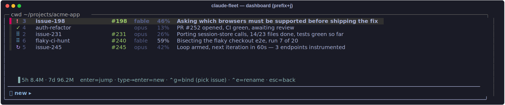
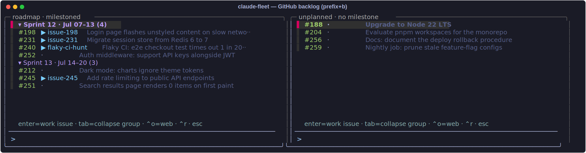

# claude-fleet

Run a **fleet of parallel Claude Code sessions** in one tmux session — one
window per task, each in its own git worktree, with **GitHub issues as the
backlog** and the tmux status bar as a live attention monitor.

Born from driving ~7 concurrent Claude sessions (including long-running
`/loop`s) against a production monorepo from a single always-on Mac mini.




<sub>Screenshots are the real UI captured from a live tmux server, staged with
demo repo data.</sub>

## What you get

- **Attention signals in the window list.** Claude Code hooks stamp each
  window's state the instant it changes: a **cyan braille spinner** pulses
  while a session works, **indigo** while a `/loop` waits between iterations,
  **green ✓** when a turn finishes, **red ! + bell** when a session is blocked
  on your answer. No polling lag — colors flip on the hook, not on the
  status-interval timer.

- **Urgency-sorted windows.** Windows re-slot themselves so position 1 is
  always the session that needs you most (needs > done > working > looping >
  idle). Your view never jumps — the sorter restores focus after every move.
  `prefix+a` hops to the neediest window.

- **A mission-control dashboard** (`prefix+j`): an fzf panel listing every
  session with state glyph, bound issue, model, and context %. `Enter` jumps.
  **Type a task and press Enter** —
  it files a GitHub issue and spawns a new worktree session bound to it.
  `Ctrl-G` binds a window to an existing issue, `Ctrl-E` renames.



- **GitHub backlog panel** (`prefix+b`): open issues grouped by milestone
  (roadmap | unplanned panes). `Enter` on an issue creates a worktree
  `issue-<N>` off your base branch and starts `claude` seeded to read, claim,
  and implement it. Issues being worked show `▶ <window>`. Manage issues
  without leaving tmux: a live **preview pane** shows the highlighted issue's
  body, labels, milestone, assignees, and recent comments (`Ctrl-P` toggles
  it); `Ctrl-X` closes (triages) an issue after a y/n confirm; `Ctrl-O` opens
  it on the web.

- **Background collectors** keep it all instant: a 45-second daemon caches
  git status per worktree, the repo's PR/CI map, open issues, per-session
  context tokens, and a local 5h/7d token-usage proxy. The dashboard only
  ever reads caches — zero inline git/gh/LLM calls.

- **Worktree lifecycle**: `cw <branch>` spawns a worktree + Claude window;
  an hourly janitor removes worktrees that are merged + clean + not attached
  to any live pane (and never anything else).

## Architecture

```
Claude Code hooks (PreToolUse/PostToolUse/Stop/Notification)
      │  instant, semantic-blind
      ▼
@claude_state on the tmux window ──► spinner daemon (0.12s frames, single
      ▲                               writer, change-detected) ──► window list
      │  slow, semantic                                            colors/glyphs
LLM classifier (haiku, ~5min, change-gated)                        + urgency sort
      
collector daemon (60s) ──► cache files ──► fzf dashboard / backlog panels
  git · gh PRs+issues ·                     (read-only producers, render instantly)
  ctx tokens · usage proxy
```

Design rules that made it work:

- **Hooks are fast but blind; the LLM is smart but slow.** Hooks give the
  instant working/done/needs signal; a change-gated haiku classifier later
  corrects what hooks can't know (e.g. "done" that's actually a `/loop`
  between iterations). Both write the same `@claude_state`.
- **One writer per surface.** A single spinner daemon owns all window styling
  (one `tmux source-file` per frame = one repaint); a single collector owns
  every cache file; producers are read-only.
- **Loud/quiet hierarchy.** Only "needs you" is loud (red, bold, bell).
  Everything else is quiet fg-color text — 7 spinning windows shouldn't shout.
- **Change-gate every LLM call.** Summaries/classifications only fire when a
  pane's content checksum changed; a parked session costs zero tokens.
- **Every session is bound to a GitHub issue.** New work enters through the
  backlog (typed tasks auto-file an issue), so nothing runs untracked.

Deeper reference: **[docs/TERMS.md](docs/TERMS.md)** defines every term (what
the collector/steward/dash actually are), and **[docs/ARCHITECTURE.md](docs/ARCHITECTURE.md)**
covers the shared-vs-per-fleet split and the path to running **many fleets on
one machine** (one tmux session per repo).

## Install

The installer is Claude itself — `CLAUDE.md` in this repo is the playbook:

```sh
git clone https://github.com/verkyyi/claude-fleet.git
cd claude-fleet
claude "install claude-fleet on this machine"
```

Claude will check dependencies, copy the scripts to `~/.claude/fleet/`, write
your `fleet.conf` (backlog repo, main checkout, base branch), append one
source line to `~/.tmux.conf`, merge five hook entries into
`~/.claude/settings.json`, install the daemons (launchd on macOS, the
`systemd/` user units on Linux), and verify each piece — asking before it
touches anything.

Prefer manual? Every step is in [CLAUDE.md](CLAUDE.md); the pieces are plain
shell scripts with no hidden state.

### Dependencies

tmux ≥ 3.2 · [fzf](https://github.com/junegunn/fzf) ≥ 0.45 (the dashboard binds
use `transform`) · [gh](https://cli.github.com/) (authed) · python3 ·
[Claude Code](https://claude.com/claude-code) (the `claude` CLI; also used by
the two optional LLM daemons). Soft: perl `Time::HiRes` (sharper dash spinner).

Run [`bin/fleet-doctor.sh`](bin/fleet-doctor.sh) to check all of these at once.
(No standalone `jq` — the collector only uses `gh --jq`, which is built in.)

## Keybindings (prefix defaults to your tmux prefix)

| Key | Action |
|---|---|
| `prefix a` | jump to the next window that needs you (red first, then green) |
| `prefix j` | dashboard — jump / new task / bind issue / rename |
| `prefix b` | backlog modal — near-fullscreen popup; enter spawns the issue session |
| `prefix c` | config modal — view/edit `FLEET_*` by friendly label, grouped + collapsible; identity keys locked, global-only vs per-fleet scoped; `⌃s` toggles the write layer, `?` reveals raw keys, enter edits |
| `prefix r` | reload tmux config |

## Configuration

One file, `~/.claude/fleet/fleet.conf` (see
[fleet.conf.example](fleet.conf.example)):

```sh
FLEET_REPO="you/your-repo"            # backlog + PR/CI source
FLEET_MAIN="$HOME/projects/your-repo" # worktrees are created as its siblings
FLEET_BASE_BRANCH="main"
FLEET_PROTECTED_RE="^(master|main|develop|test)$"
FLEET_CTX_WINDOW=200000               # 1000000 if you run 1M-context models
FLEET_GLOBAL_MAX_SESSIONS=8          # system-wide cap on live Claude sessions; 0 = off
```

## Multiple fleets on one machine

A **fleet ≡ a tmux session ≡ one repo**. Run several at once — each pinned to a
different repo with its own checkout — and they share one collector without
clobbering each other (see [docs/ARCHITECTURE.md](docs/ARCHITECTURE.md)).

```sh
cf                                         # from inside a checkout: infer the repo, reuse this worktree
bin/fleet-up.sh you/webapp                 # clone-or-reuse ~/projects/webapp, open a 'webapp' session
bin/fleet-up.sh you/infra ~/src/infra      # explicit checkout dir
bin/fleet-list.sh                          # ● live / ○ down · name · repo · checkout
tmux attach -t webapp
bin/fleet-down.sh webapp --purge           # kill session (+ drop its conf/cache); checkout stays
```

`cf` (from `shell/cw.zsh`) is a shorthand for `fleet-up.sh` that forwards all
args; with none, it infers the repo from the current checkout's `origin` and
reuses that worktree — no clone.

Each fleet writes `~/.config/claude-fleet/<session>.conf` (overlays the global
`fleet.conf`). The single global `fleet.conf` above still works as a one-fleet
default. Every fleet gets a steward pane in its `plan` hub; set
`FLEET_STEWARD_CMD` (global or per-fleet conf) to override the command it runs.

## Multiple subscription accounts (auto-failover)

A busy fleet drains one subscription's rolling 5-hour window quickly. Register
**several Claude subscriptions** and the fleet **fails over to a fresh one** the
moment a session hits its limit — new work keeps flowing instead of parking.

Each account is a `claude setup-token` OAuth token dropped in a file (name =
label, `chmod 600`); the launcher exports `CLAUDE_CODE_OAUTH_TOKEN` per session,
and the collector rotates the active account when it spots a
`You've hit your … limit` banner. Off by default — no token files, no change.

```sh
mkdir -p ~/.config/claude-fleet/accounts
printf '%s\n' "$(claude setup-token)" > ~/.config/claude-fleet/accounts/work   # per account
chmod 600 ~/.config/claude-fleet/accounts/*
bin/fleet-account.sh list          # pool · ● active · limited state
```

Works on macOS and Linux (a token env var, not `CLAUDE_CONFIG_DIR` — which the
macOS Keychain ignores). One caveat: an **already-running** session can't
hot-swap accounts; only newly-spawned ones pick the fresh subscription. Full
design, setup, and limits: **[docs/MULTI-ACCOUNT.md](docs/MULTI-ACCOUNT.md)**.

## Fleet commands (`/skill`s)

Optional repo-shipped Claude Code slash commands that operate on the current
fleet (its `$FLEET_REPO` only), installed by appending `commands/*.md` into
`~/.claude/commands/`. Each declares an owner seat (`worker` / `steward`) and
refuses from the wrong one. Live so far:

- **`/fleet-land`** (steward) — land one worker PR: verify it's genuinely mergeable
  (update-branch + re-check CI if merely behind, never merge red), squash-merge,
  fast-forward the fleet's base checkout, clean up the merged worktree + window.
  Fleet-agnostic — the general finish work only.
- **`/fleet-land-train`** (steward) — the batch complement to `/fleet-land`: a serial
  single-writer *land train* that merges a batch of green PRs one at a time
  (update-branch → wait green → merge → next), so each PR is CI-tested once
  against the master it lands on (O(N), not the O(N²) thundering herd) and one
  bad PR ejects instead of blocking the rest, then base-pulls once and cleans up
  per merged PR. A client-side stand-in for a merge queue under `strict:true`
  branch protection.
- **`/fleet-sync-install`** (steward, tooling-fleet only) — after claude-fleet's
  own PRs land, re-applies them to the live install (`~/.claude/fleet`): pull +
  reload changed daemons + re-merge the hooks delta + install changed commands.
  Refuses on any other fleet. See [`commands/README.md`](commands/README.md).

## Opening links over SSH

`--web`-style commands open a browser on the *remote* host — useless over
SSH. Everything here routes URLs through `bin/open-url.sh` instead:

1. **Tunnel mode (recommended)** — on your laptop, add to `~/.ssh/config`:

   ```
   Host your-remote
     RemoteForward 2226 127.0.0.1:2226
   ```

   and keep `extras/laptop-url-opener.sh` running (ad hoc, or as a login
   item). URLs sent by the remote host then open instantly in your local
   browser, riding the existing SSH connection — nothing else exposed.

2. **Fallback (zero setup)** — without the tunnel, you get a tmux popup with
   the URL (cmd-clickable in iTerm) already OSC52-copied to your local
   clipboard (`set-clipboard on` is in the shipped tmux conf).

## Assumptions & limitations

- **One tmux session ↔ one GitHub repo.** The PR/issue map is one repo-wide
  `gh` call. Multi-repo fleets would need per-window repo detection.
- Windows named `dash`, `plan`, or `backlog` are treated as panels, not
  Claude sessions.
- Window **numbers are not stable** (the urgency sorter re-slots them). The
  lowest-indexed window is pinned — keep your dashboard there. Navigate by
  name/position; slot 1 is always the most urgent.
- The `Notification` hook (red/bell) can lag a question by up to ~1 min
  (Claude Code's idle threshold); the classifier corrects stragglers.
- The token-usage figures are a **local proxy** — the official rate-limit %
  isn't exposed by any API. Weights: output×1 + input×0.25 + cache-write×0.25
  + cache-read×0.02 over rolling 5h/7d windows.
- The classifier spends real (haiku-sized, change-gated) tokens. It is
  optional; everything else works without it.
- Daemon units ship for both macOS launchd (`launchd/`) and Linux systemd
  user units (`systemd/` — one always-on service + `.timer`/`.service` pairs,
  `__HOME__`-templated; see `systemd/README.md`).

## Safety notes for parallel fleets

Things that bit us and are worth adding on top (not included here because
they're environment-specific): a `PreToolUse` guard hook that blocks
dangerous commands (force-push to main, prod-database writes, destructive
`kubectl`), a lease file so only one session at a time deploys to a shared
test environment, and "claim the issue before working it" as convention.
The issue-per-session binding in this repo is the foundation for all three.

## Contributing

Shell scripts follow a small `set -u` / `pipefail` policy and are linted by
`shellcheck` in CI — see [CONTRIBUTING.md](CONTRIBUTING.md) before sending a PR.

## License

MIT
