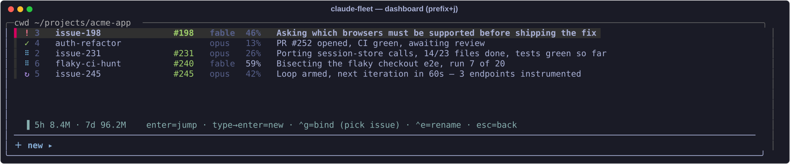
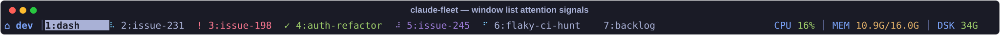
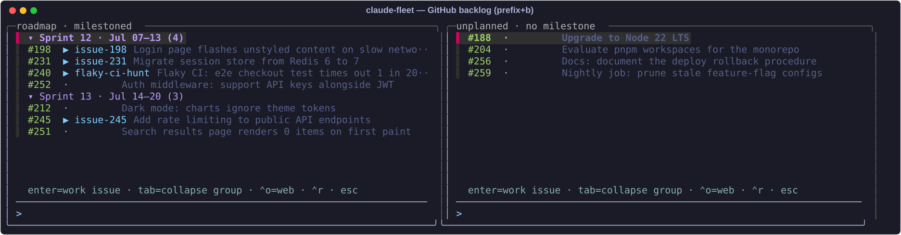

# claude-fleet

**English** | [简体中文](README.zh-CN.md)

**Use your AI subscriptions to move a small team's development tasks forward
in parallel.**

claude-fleet organizes **Claude Code and Codex CLI sessions** in tmux: one
window and one isolated git worktree per task, **GitHub Issues as the backlog**,
and PRs as the delivery path. Run features, fixes, tests and documentation
alongside each other; use one dashboard to follow progress and handle blockers.

The core workflow uses the CLIs' **subscription sign-in**, with no separate model
API key required. Optional **Claude subscription account pools and quota-aware
routing** assign new work by available 5-hour / 7-day headroom and resume tasks
on another account when needed. Codex shares the task workflow; its account
rotation and quota management are not wired yet. See the
[agent capability table](#agents-claude-code-and-codex).

Built from daily use on an always-on Mac mini. A local transcript audit found a
**historical peak of 25 Claude main sessions processing tasks in parallel,
across 25 independent worktrees**, on September 1, 2026. A separate interval
held at least **15 concurrent task directories for 14.46 minutes**. These count
overlapping CLI processing turns, not simultaneous server-side token generation
or a throughput multiplier. [Evidence and counting method](docs/USAGE-EVIDENCE.md).




<sub>Screenshots are the real UI captured from a live tmux server, staged with
demo repo data.</sub>

## What you get

- **Subscription-driven parallel work for small teams.** Give independent tasks
  their own sessions and worktrees, follow them from a shared dashboard, and
  bring the results together through PRs. Worktrees separate uncommitted changes;
  related tasks still need an agreed merge order and may have conflicts.

- **Attention signals in the window list.** Claude Code hooks stamp each
  window's state the instant it changes: a **cyan braille spinner** pulses
  while a session works, **indigo** while a `/loop` waits between iterations,
  **green ✓** when a turn finishes, **red ! + bell** when a session is blocked
  on your answer. No polling lag — colors flip on the hook, not on the
  status-interval timer.

- **Urgency-sorted windows.** Windows re-slot themselves so position 1 is
  always the session that needs you most (needs > done > working > looping >
  idle). Your view never jumps — the sorter restores focus after every move.
  `prefix+a` hops to the neediest window.

- **A mission-control dashboard** (`prefix+g`): an fzf panel listing every
  session with state glyph, bound issue, model, and context %. It lives as an
  embedded pane in the `plan` hub, which holds the dash and nothing else;
  `prefix+g` focuses it and, pressed again, zooms it fullscreen — as does
 `F9`. `Enter` jumps. The prompt line at the bottom is the quick-scratch box:
  **type a name and press Enter** — it spawns a scratch session (own
  writable `scratch-N` worktree, no issue) **named after that text**, with the
  full text prefilled in the first input as an **unsent, editable draft**.
  Chinese and spaces are fine (the window title is capped at 24 columns — 12 CJK
  glyphs; the draft is not clipped). The prompt label is the fleet's
  default agent for a new session (`claude ▸` / `codex ▸`); `Ctrl-V` flips it,
  persisted to the fleet's conf — that key (or `prefix+c`) is how you pick the
  agent; typed text supplies the name and draft. `Ctrl-N` is the issue-bound path: it files a
  GitHub issue and spawns a worker session bound to it. (Every dash `Ctrl-` key
  is checked against your tmux prefix at launch and moved to its `Alt-` twin
  when it collides — tmux would eat it otherwise; `?` shows the real key.)
  `Ctrl-S` opens the same raw scratch under its auto `scratch-N` name (plain
  `claude`, no issue — but
  in its own writable `scratch-N` worktree, so an experiment can push a branch and
  open a PR like any worker). Once a scratch has talked its way to a real
  requirement it can **become** the worker for it, in place: filing with
  `fleet-issue-file.sh --title "…" --bind` (or `fleet-bind.sh <N>` for an existing
  issue) renames its branch `scratch-N` → `issue-N`, binds the window and claims
  the issue — no second session re-grounding from zero (#520). Set `FLEET_SCRATCH_POOL=1` to keep one pre-started and
  ready: `⌃s` then hands you a session you can type into immediately (0.46s to
  the window, 0.30s to the first keystroke) instead of one that spends ~7s
  booting — the last second of which paints a `❯` box that silently swallows
  whatever you type.



- **GitHub backlog panel** (`prefix+b`): open issues grouped by milestone
  (roadmap | unplanned panes). `Enter` on an issue creates a worktree
  `issue-<N>` off your base branch and starts `claude` seeded to read, claim,
  and implement it. Issues being worked show `▶ <window>`. Manage issues
  without leaving tmux: the modal is **list-only by default**, and `Space`
  toggles a **preview pane** showing the highlighted issue's body,
  labels, milestone, assignees, and recent comments — word-wrapped to the pane
  so nothing splits mid-word. `/` turns on type-to-filter; `Ctrl-X` closes
  (triages) an issue after a y/n confirm; `Ctrl-O` opens it on the web.
  **Priority** shows as a `p0`/`p1`/`p2` tag on each row and orders issues within
  a milestone; `Ctrl-Y` cycles a highlighted issue's priority (none→p2→p1→p0).
  `Ctrl-N` files a **one-line issue** fast.

- **Background collectors** keep it all instant: a 45-second daemon caches
  each worktree's branch, the repo's PR/CI map, open issues, per-session
  context tokens, and a local 5h/7d token-usage proxy. The dashboard only
  ever reads caches — zero inline git/gh/LLM calls.

- **Subscription-aware scheduling.** Pool Claude subscription accounts, choose
  where new sessions start, and move existing sessions with their transcripts
  when an account needs a break. With [TokenLedger](https://github.com/verkyyi/tokenledger)
  (`ccquota`), use account-wide 5h/7d readings to warn before a limit, rotate
  early, stagger window starts, and optionally pause autofill. See
  [subscription and quota management](#subscription-accounts-and-quota-management).

- **Worktree lifecycle**: `cw <branch>` spawns a worktree + Claude window;
  an hourly janitor removes worktrees that are merged + clean + not attached
  to any live pane (and never anything else).

- **Optional Claude Code status line** (`conf/statusline.sh`): a context-window
  mini-bar (green → yellow → red), shortened cwd, git branch + dirty star, and
  model name. Opt-in at install time by pointing `settings.json`'s `statusLine`
  at the live-install path, so it improves through `land → /fleet-sync-install`;
  jq-gated (blank without it). Never auto-wired.

## Architecture

```
Claude Code hooks (PreToolUse/PostToolUse/Stop/Notification)
      │  instant, semantic-blind
      ▼
@claude_state on the tmux window ──► spinner daemon (0.12s frames, single
      ▲                               writer, change-detected) ──► dash glyphs
      │  slow, semantic                                            + needs tally
LLM classifier (haiku, ~5min, change-gated)
      
collector daemon (60s) ──► cache files ──► fzf dashboard / backlog panels
  git · gh PRs+issues ·                     (read-only producers, render instantly)
  ctx tokens · usage proxy
```

Design rules that made it work:

- **Hooks are fast but blind; the LLM is smart but slow.** Hooks give the
  instant working/done/needs signal; a change-gated haiku classifier later
  corrects what hooks can't know (e.g. "done" that's actually a `/loop`
  between iterations). Both write the same `@claude_state`.
- **One writer per surface.** A single spinner daemon owns all window styling
  (one `tmux source-file` per frame = one repaint); a single collector owns
  every cache file; producers are read-only.
- **Loud/quiet hierarchy.** Only "needs you" is loud (red, bold, bell).
  Everything else is quiet fg-color text — 7 spinning windows shouldn't shout.
- **Change-gate every LLM call.** Summaries/classifications only fire when a
  pane's content checksum changed; a parked session costs zero tokens.
- **Every session is bound to a GitHub issue.** New work enters through the
  backlog (typed tasks auto-file an issue), so nothing runs untracked.

Deeper reference: **[docs/TERMS.md](docs/TERMS.md)** defines every term (what
the collector/hub/dash actually are), **[docs/ARCHITECTURE.md](docs/ARCHITECTURE.md)**
covers the shared-vs-per-fleet split and the path to running **many fleets on
one machine** (one tmux session per repo), and **[docs/STATE.md](docs/STATE.md)**
traces how each window's Claude state (`working`/`done`/`needs`/`looping`) is set,
rendered, and corrected. **[docs/EMIT.md](docs/EMIT.md)** covers the optional,
off-by-default emitter that POSTs session lifecycle facts (session → issue → PR)
so an external ledger can join what a week of agent work **cost** to what it
**produced** — including the exact list of what does, and does not, leave the
machine.

## Install

The installer is Claude itself — [`docs/INSTALL.md`](docs/INSTALL.md) is the playbook:

```sh
git clone https://github.com/verkyyi/claude-fleet.git
cd claude-fleet
claude "install claude-fleet on this machine"
```

Claude will check dependencies, copy the scripts to `~/.claude/fleet/`, write
your `fleet.conf` (backlog repo, main checkout, base branch), append one
source line to `~/.tmux.conf`, merge five hook entries into
`~/.claude/settings.json`, install the daemons (launchd on macOS, the
`systemd/` user units on Linux), and verify each piece — asking before it
touches anything.

Prefer manual? Every step is in [docs/INSTALL.md](docs/INSTALL.md); the pieces are
plain shell scripts with no hidden state.

### The Claude-Code side ships as a plugin

The fleet's slash commands, the base `skills/` tree and the hook table also
install as a **Claude Code plugin**, served by a marketplace in this same repo:

```sh
claude plugin marketplace add verkyyi/claude-fleet
claude plugin install fleet@claude-fleet --scope user --yes
```

That replaces the copy-and-merge passes above for those three, and
`/plugin update fleet` keeps them current — so on a second machine, or a
teammate's, nobody has to remember `/fleet-sync-install` for them. Plugin
commands are namespaced (`/fleet:fleet-claim`); the fleet detects which install
path a machine has and seeds the form that resolves, so spawns work either way.

It does **not** replace the playbook: `bin/`, `conf/`, the tmux layer and the
daemons are machine-level and stay at `~/.claude/fleet`. A plugin's install path
is version-scoped and moves on every update, so nothing with a stable absolute
path — a launchd unit, a tmux bind, a hook command — can point into it.

### Dependencies

tmux ≥ 3.2 · [fzf](https://github.com/junegunn/fzf) ≥ 0.45 (the dashboard binds
use `transform`) · [gh](https://cli.github.com/) (authed) · python3 ·
[Claude Code](https://claude.com/claude-code) (the `claude` CLI; also used by
the two optional LLM daemons). Soft: perl `Time::HiRes` (sharper dash spinner).

Run [`bin/fleet-doctor.sh`](bin/fleet-doctor.sh) to check all of these at once.
Its `install` line also answers *"is this machine's live install current?"* — the
`~/.claude/fleet` half is a hand-run `git pull` per machine, so it goes stale in
silence (see [`bin/fleet-install-version.sh`](bin/fleet-install-version.sh)).
(No standalone `jq` for the core — the collector only uses `gh --jq`, which is
built in; `jq` is a soft dep only for the optional `conf/statusline.sh` status
line, which exits silently without it.)

## Keybindings (prefix defaults to your tmux prefix)

| Key | Action |
|---|---|
| `prefix a` | jump to the next window that needs you (red first, then green) |
| `prefix g` | focus the hub's dash pane (jump / new task); press again to zoom it fullscreen. If your personal `~/.tmux.conf` binds `g` and is sourced after the fleet conf, your bind shadows this (tmux is last-write-wins) — rebind or drop it |
| `prefix e` | show/hide the compact task sidebar in workers; remembers the preference for this fleet |
| `prefix E` | browse the sidebar: ↑↓ choose, Enter jump, ←→ fold, Esc return, q hide; a single click on a row jumps directly |
| `prefix b` | backlog modal — near-fullscreen popup; enter spawns the issue session |
| `prefix c` | config modal — view/edit `FLEET_*` by friendly label, grouped + collapsible; identity keys locked, global-only vs per-fleet scoped; `⌃s` toggles the write layer, `?` reveals raw keys, enter edits |
| `prefix ?` | keymap cheatsheet — a popup listing **every** fleet shortcut (tmux prefix · dash · backlog · config modal), each with a one-line description; `q`/`esc` closes it (also reachable via `?` in the dash and the backlog) |
| `F9` | (no prefix) jump back to this session's hub |

The shortcut surface was pruned in #289 (one keyboard home per action): raw
scratch sessions live on the dash's `⌃s`, and the usage / account controls (once
`prefix u` / `prefix A`) merged into one modal reachable by clicking the footer
usage stat. `prefix n` / `prefix r` are back to tmux's
stock `next-window` / `refresh-client`.

The dash (`prefix g`) and backlog (`prefix b`) each list their own fzf binds
in a header; `prefix ?` is the one place that shows **all** of them together.

Worker and scratch windows show a **30-column task list on the left** on wide
screens. It shares the hub's live statuses, pins and parent/child grouping,
highlights the current worker, and keeps that worker visible even in a folded
group. The current task has a cyan highlight and `▶` marker. The worker's top
border shows **INPUT** when typing goes to the worker; `prefix E` highlights
**TASKS · FOCUS** while the arrow keys browse tasks, and Esc returns input to
the worker. Clicking a task goes straight to its input pane. `prefix e` saves the
on/off preference as `FLEET_SIDEBAR`; `FLEET_SIDEBAR_WIDTH` sets the width (24–60).
Below sidebar width + 81 columns (111 by default), the list hides automatically
to leave 80 columns for the worker, then returns when space permits. `prefix z`
still zooms the worker for focused work. Only the visible worker owns a sidebar;
background windows and detached fleets do not run sidebar refresh loops.

Mouse mode is shipped **on** by the fleet baseline (see below), so the footer is
clickable too: the **`⌂` hub icon** (leftmost) is a consistent **home** tap — it
always lands on this fleet's hub, unzoomed
(never a pane zoom, unlike `F9`) — the **fleet name** (`#S`) opens a picker of running
fleets and switches to the chosen one, the red **`● N` needs badge** cycles to the
next window that needs you, and the **usage stat** opens the consolidated
**usage + account modal** (usage/limit detail on top, the account pool as a
selectable body below). (Comment out `set -g mouse on` in
`conf/tmux-attention.conf` to keep native select-to-copy.)

To zoom a pane fullscreen, double-click it (or its border), or use stock tmux
`prefix z`; `F9` and `prefix g` both jump to the hub's dash and toggle its
zoom (press again to restore). On iPad / Termius the double-tap
doesn't always reach tmux over touch and `prefix z` is a chord on a soft keyboard,
so the reliable single-tap footer ranges are the `⌂` hub icon and the `● N` needs
badge above — not a pane zoom.

The status-left also carries the **cross-fleet** cue: when you're attached to one
fleet and a **different** live fleet has needy windows, a second **`● N` dot in
orange** appears — `N` = how many needy *windows* are waiting across all *other*
fleets (the same dot and unit as the local red `●`, color alone saying
"elsewhere"). It's its own clickable range that **one-tap jumps** to the waiting
fleet: exactly one fleet waiting detaches-and-reattaches straight to it; several
open the fleet-picker scoped to just the waiting fleets. Orange `●` means "another
fleet needs you"; the red `●` means "*this* fleet needs you." The signal is
produced by the spinner daemon, which already reads every live fleet's state
across sockets.

### tmux baseline

`conf/tmux-attention.conf` also carries an opinionated **fleet baseline** the UX
assumes so a clean install behaves consistently: `mouse on` (the clickable
footer + dashboard mouse), truecolor (`default-terminal` + a `Tc`
`terminal-overrides` so the theme's hex colors render), `escape-time 10` (snappy
ESC in the Claude TUI), `history-limit 50000`, `allow-rename`/`automatic-rename`
off (the fleet navigates by explicit window names), and the Tokyo-Night status /
pane / message theme. Every line is documented inline and easy to override —
put your own settings in `~/.tmux.conf` *after* the `source-file` line (later
wins) or comment the baseline out. Truly personal bits (prefix remaps, personal
binds) are intentionally left in your `~/.tmux.conf`.

## Configuration

One file, `~/.claude/fleet/fleet.conf` (see
[fleet.conf.example](fleet.conf.example)):

```sh
FLEET_REPO="you/your-repo"            # backlog + PR/CI source
FLEET_MAIN="$HOME/projects/your-repo" # worktrees are created as its siblings
FLEET_BASE_BRANCH="main"
FLEET_PROTECTED_RE="^(master|main|develop|test)$"
FLEET_CTX_WINDOW=200000               # 1000000 if you run 1M-context models
FLEET_GLOBAL_MAX_SESSIONS=8          # system-wide cap on live Claude sessions; 0 = off
FLEET_AGENT="claude"                  # or "codex" — see the capability matrix below
```

## Multiple fleets on one machine

A **fleet ≡ a tmux session ≡ one repo**. Run several at once — each pinned to a
different repo with its own checkout — and they share one collector without
clobbering each other (see [docs/ARCHITECTURE.md](docs/ARCHITECTURE.md)).

```sh
cf                                         # already running? (re)attach fast. else: infer the repo + bring it up
bin/fleet-up.sh you/webapp                 # clone-or-reuse ~/projects/webapp, open a 'webapp' session
bin/fleet-up.sh you/infra ~/src/infra      # explicit checkout dir
bin/fleet-list.sh                          # ● live / ○ down · name · repo · checkout
tmux attach -t webapp
bin/fleet-down.sh webapp --purge           # kill session (+ drop its conf/cache); checkout stays
```

`cf` (from `shell/cw.zsh`) is your one-key way to a fleet. With **no args** it
first tries to (re)attach to an already-running fleet (`bin/fleet-attach.sh`,
issue #212): one live fleet → straight in; several → the switch picker; already
inside the only one → a no-op. Crossing from another fleet is a detach+reattach
(each fleet is its own tmux server, issue #159), not a `switch-client`. Only when
**nothing** is running does it fall through to `fleet-up.sh` — inferring the repo
from the current checkout's `origin` and reusing that worktree (no clone). With
args it forwards them straight to `fleet-up.sh` to bring a named fleet up.

Each fleet keeps its durable state in **one directory per fleet** —
`~/.config/claude-fleet/fleets/<session>/` (its `conf` overlay, restore map,
issue-bridge state), so `ls ~/.config/claude-fleet/fleets/` is the list of
running fleets (issue #181). The `conf` overlays the global `fleet.conf`, which
still works as a one-fleet default. Every fleet gets a **`plan` hub** window holding
the **dash alone**. The hub used to split a persistent `claude` in below it, but
that pane rebuilt itself on every ⌂ tap, `F9`, fresh fleet and crash recovery —
closing it never stuck — so it is gone, along with the `FLEET_HUB_CMD` knob that
configured it. Run your own `claude` in whatever window you like: that is where
you file, triage, spawn workers, hand work back and land whatever a worker
couldn't (workers land their own PRs on green, #441). There is no resident
orchestrator agent, and nothing spawns a Claude session for you.
The base checkout stays edit-read-only for every pane (`hooks/base-readonly-guard.py`),
so the hub can drive the fleet without ever committing to it.
Upgrading from the old flat layout is automatic — `/fleet-sync-install` runs
`bin/fleet-migrate-layout.sh` once (idempotent; readers dual-read both layouts).

<a id="multiple-subscription-accounts-auto-failover"></a>

## Subscription accounts and quota management

The fleet manages **which Claude subscription each session uses**, as well as
its task. The account pool is machine-wide, shared across fleets; it is optional
and off when no token files are registered. Without a pool, your existing login
continues to work. These capabilities apply to **Claude Code**; the Codex adapter
has no equivalent quota or account-migration integration yet.

There are two layers: a token pool handles limit banners and session recovery;
adding [TokenLedger](https://github.com/verkyyi/tokenledger) supplies account-wide
quota readings for decisions **before** a subscription is exhausted. TokenLedger
is the product name; its executable and settings are still `ccquota` and
`CCQUOTA_*`. Its CLI and hub are separate dependencies, covered in
[the install playbook](docs/INSTALL.md).

| Capability | What happens | Requires |
|---|---|---|
| Account pool and reactive failover | A subscription-limit banner benches that account until its parsed reset time, with a configured duration as fallback. New sessions choose an eligible account; affected live sessions can follow via restart + resume. | Account token pool |
| Live-session migration | Reopen the same worktree and Claude transcript on another account, preserving task bindings. The manual account picker moves idle windows; automatic limit handling moves affected windows. | Account token pool |
| Per-model fallback | Distinguish one model's cap from the account's overall limit. Switch affected sessions to `FLEET_MODEL_FALLBACK` in place when possible; otherwise restart + resume. | Account token pool; available fallback model |
| Quota-aware account selection | Rank eligible accounts using `5h headroom × 2 + 7d headroom`, with hysteresis to avoid needless switching. Both windows must be below the account ceiling. | Pool + ccquota hub readings |
| Early warning and rotation | At 70% utilization, warn sessions; at 85%, bench the account and migrate its sessions to a readable account below the ceiling. Thresholds use the higher of 5h and 7d usage and are configurable. | Pool + ccquota hub readings |
| 5-hour window staggering | Plan when idle accounts first open their next window, so windows need not all reset together. Automatic replanning is opt-in. | Pool + ccquota hub readings |
| Autofill quota gate | Optionally stop automatic task dispatch near the selected subscription's ceiling (90% by default). Manual spawns and running sessions are unaffected by this gate. | ccquota hub; `FLEET_QUOTA_GATE=1` |
| Quota-watch health | Surface stale readings and repeated empty fetches in the status bar and doctor, so missing data is visible. | Configured pool + ccquota hub |

### Register accounts and see which one a session uses

Run `claude setup-token` under each subscription's login. Create the accounts
directory if needed, then save **only the returned OAuth token** in
`~/.config/claude-fleet/accounts/<label>`, one file per account
(for example `work` and `personal`), and restrict each file to mode `600`:

```sh
chmod 600 ~/.config/claude-fleet/accounts/work
~/.claude/fleet/bin/fleet-account.sh list
```

Full setup, optional account subsets and per-account fallback reset durations
are in [docs/MULTI-ACCOUNT.md](docs/MULTI-ACCOUNT.md#setup). Tokens stay outside
the repository. Account choice is per launch through `CLAUDE_CODE_OAUTH_TOKEN`;
settings, hooks and transcripts continue to use the shared Claude configuration.

Click the footer usage stat to open the **usage + account modal**. Selecting an
account changes the starting choice and migrates this fleet's idle Claude
windows; working and looping windows are left alone by this manual path. A new
spawn can reselect an account using the quota policy, so the selection is not a
permanent pin. From inside a fleet pane, check that session's actual account:

```sh
~/.claude/fleet/bin/fleet-account.sh whoami
```

**Account changes require a restart.** A live Claude process cannot hot-swap its
token; the fleet closes it and resumes the same transcript in the same worktree
under the new account. That preserves conversation history, not the original
process or its background agents. When no suitable migration destination exists,
the fleet leaves the sessions in place instead of repeatedly restarting them
onto another exhausted account.

### Add account-wide quota readings and early rotation

Configure the `ccquota` CLI, its hub and viewer credential as described in the
[install playbook](docs/INSTALL.md), then set the hub URL in `fleet.conf` so the
background services inherit it. The remaining values below are the defaults:

```sh
export CCQUOTA_HUB_URL="https://your-ccquota-hub.example"
FLEET_ACCOUNT_WARN_PCT=70
FLEET_ACCOUNT_CEILING=85
FLEET_ACCOUNT_PICK=5h
FLEET_ACCOUNT_PHASE_AUTO=0
```

The viewer credential can live in `~/.ccquota/viewer-token`. Match each ccquota
account name to its fleet label, or set `CCQUOTA_ACCOUNT=<uuid>` in the label's
companion `<label>.conf` file. Unreadable or unmapped accounts have **no quota
reading**, rather than a misleading 0%; they are not destinations for a
quota-triggered migration.

The quota watch has its own roughly 60-second daemon, with a collector fallback.
It reads each account's 5h/7d utilization and reset times across devices, sends a
warning at the configured threshold, then rotates and migrates at the ceiling.
Warnings and ceiling actions are deduplicated per account/reset window. With
no usable quota data, the proactive policy falls back to banner-based handling;
work is not blocked just because the optional hub is unavailable.

For optional window staggering, inspect a plan before applying it:

```sh
~/.claude/fleet/bin/fleet-account.sh phase --plan
~/.claude/fleet/bin/fleet-account.sh phase --plan --apply
```

This schedules the first use of idle accounts; it does not change the provider's
reset clock or hold an account already mid-window. A phase hold is relaxed when
needed to keep an account available for a spawn. Set `FLEET_ACCOUNT_PHASE_AUTO=1`
to replan automatically, or `FLEET_ACCOUNT_PHASE=0` to ignore a written plan.

The **autofill gate is separate from account rotation** and off by default:

```sh
# In fleet.conf; choose the subscription the gate should judge.
FLEET_QUOTA_GATE=1
FLEET_QUOTA_CEILING=90
# FLEET_QUOTA_ACCOUNT="<subscription-uuid>"  # or "all"; unset uses ccquota's default
```

It gates only the dispatcher's automatic spawns. Missing ccquota, an unreachable
hub or an unreadable limit leaves the gate open; it is not a hard spending cap.

### Model caps and operational checks

A cap on one model need not exhaust the account's other models. The fleet tracks
caps per `(account, model)` and, where a usable fallback exists, keeps the account
in service. It tries an in-place `/model` switch, preserving the process and
context; an unverifiable switch falls back to restart + resume. New sessions use
`FLEET_MODEL_FALLBACK` (default `opus`) while the cap holds and return to
`FLEET_MODEL` after reset. Existing sessions stay on their fallback model.

Use these commands to inspect the policy and data:

```sh
~/.claude/fleet/bin/fleet-account.sh quota --refresh
~/.claude/fleet/bin/fleet-quotawatch.sh --status
~/.claude/fleet/bin/fleet-quotawatch.sh --dry-run
~/.claude/fleet/bin/fleet-quotaguard.sh --status
sh ~/.claude/fleet/bin/fleet-doctor.sh
```

`--status` distinguishes `off`, `never`, `fresh`, `stale` and `blind`. By default,
readings older than 600 seconds raise `quota stale`; three consecutive empty
fetches raise `quota blind` even if the fetch timestamp is recent. The status
bar and doctor expose both failures. Full policies and recovery commands:
[docs/MULTI-ACCOUNT.md](docs/MULTI-ACCOUNT.md).

## Fleet commands (`/skill`s)

Optional repo-shipped Claude Code slash commands that operate on the current
fleet (its `$FLEET_REPO` only), installed either as [the plugin](#the-claude-code-side-ships-as-a-plugin)
(typed `/fleet:fleet-claim`) or by appending `commands/*.md` into
`~/.claude/commands/` (typed `/fleet-claim`). Each declares an owner seat
(`worker` / `hub` / `either`) and refuses from the wrong one. Live so far:

- **`/fleet-claim`** (worker) — the whole worker lifecycle, and the one skill a
  freshly-spawned worker runs. Its whole preamble is ONE call
  (`bin/fleet-claim-brief.sh`, issue #458): fleet + seat + the bound issue read
  once (thread, comments and the **assignee** that IS the claim) + the layered
  worker charter + this fleet's implementation directive, in a single `gh`
  round-trip — atomic, so no half of it can be skipped. Then ground in the issue +
  code and implement under a standing contract that ends by **opening a PR and
  landing it** once the gate reads green (`bin/fleet-pr-verdict.sh` → `READY`);
  the cleanup daemon reaps afterwards (see [docs/CLEANUP.md](docs/CLEANUP.md)).
- **`/fleet-history`** (hub) — browse & resume closed sessions (landed + unlanded,
  workers **and** `scratch-<N>` sessions) from the history ledger, reconstructing a
  reaped worktree off the recorded SHA so `claude --resume` still works.
- **`/fleet-handoff`** (either) — bridge long-running work across a context-window
  boundary: write a durable handoff, then `/clear` and pick it up clean.
- **`/fleet-sync-install`** (either, any fleet) — after claude-fleet's
  own PRs land, re-applies them to the shared live install (`~/.claude/fleet`): pull +
  reload changed daemons + re-merge the hooks delta + install changed commands.
  Maintains machine-global tooling, so it runs from any fleet; refuses only if
  `~/.claude/fleet` isn't a git checkout. See [`commands/README.md`](commands/README.md).

## Opening links over SSH

`--web`-style commands open a browser on the *remote* host — useless over
SSH. Everything here routes URLs through `bin/open-url.sh` instead:

1. **Tunnel mode (recommended)** — on your laptop, add to `~/.ssh/config`:

   ```
   Host your-remote
     RemoteForward 2226 127.0.0.1:2226
   ```

   and keep `extras/laptop-url-opener.sh` running (ad hoc, or as a login
   item). URLs sent by the remote host then open instantly in your local
   browser, riding the existing SSH connection — nothing else exposed.

2. **Fallback (zero setup)** — without the tunnel, you get a tmux popup with
   the URL (cmd-clickable in iTerm) already OSC52-copied to your local
   clipboard (`set-clipboard on` is in the shipped tmux conf).

## Agents: Claude Code and Codex

A fleet spawns **Claude Code** by default and can spawn **OpenAI Codex CLI**
instead (`FLEET_AGENT=codex`, or `⌃v` on the dash to flip it for that fleet).
Two agents, not thirty — which is what makes it honest to print the grading in
full, gaps included.

To hand **one existing Claude session** to Codex, run `/fleet-handoff --to codex`
in that Claude conversation (`/fleet:fleet-handoff --to codex` for plugin installs).
The skill writes task notes and arms a switch after its turn ends. From another
pane or terminal, use
`bin/fleet-transfer.sh --session <fleet> --window b3 --to codex --dry-run`, then
repeat without `--dry-run`. The same window and worktree continue with a local
handoff packet that tells Codex the source agent, session ID and original
transcript path, plus a frozen copy for later lookup. Optional `--handoff` notes
carry the exact next action. See [single-session transfer](docs/SESSION-TRANSFER.md)
for prerequisites, export-only mode and failure recovery.

**Why the gaps are published.** A feature table that lists only ticks tells you
nothing about whether the second agent is usable for *your* work. Every ❌ below
says which kind of gap it is — **Codex has no such mechanism**, or **the
mechanism exists and the fleet has not adapted it** — because those are different
promises about the roadmap.

**Why these two agents.** The hardest part of an agent-neutral layer is the live
state signal, and Codex's hook system *is* Claude Code's schema: same event
names, same stdin JSON, `exit 2` blocks, `$TMUX_PANE` inherited (measured on
codex-cli 0.154). So the dash colours a Codex worker off real hooks instead of
degrading to a pane-content heuristic.

<!-- codex-matrix:begin -->
| Capability | Claude Code | Codex | Why |
|---|:--:|:--:|---|
| worktree per task · `@issue` binding · claim-at-spawn · PR/CI map · cleanup · session caps | ✅ | ✅ | Not agent code at all — `git`, `gh` and tmux window options. The whole worker path is agent-agnostic. |
| hook state signals → dash colours (busy / working / done) | ✅ | ✅ | Codex's hook system *is* Claude Code's schema — same event names, same stdin JSON, `exit 2` blocks, `$TMUX_PANE` inherited (measured on codex-cli 0.154). This launcher inlines the fleet's own hooks as `-c hooks.<Event>=[…]`. |
| bypass-permissions guardrails (bash-guard · base-checkout read-only) | ✅ | ✅ | `--dangerously-bypass-approvals-and-sandbox` + `--dangerously-bypass-hook-trust`; the base-checkout guard matches `apply_patch` on Codex where Claude matches Edit/Write/MultiEdit. |
| session keeps ONE language (non-English sessions stay non-English) | ✅ | ✅ | `bin/fleet-claim-brief.sh` ends every worker's preamble with the seed rule, and every text the fleet injects later (resume nudge, quota warning, child report, auto-handoff directive) carries its own — one English sentence per injection point instead of a translated nudge per language (issue #620, `bin/fleet-lang.sh`). Codex additionally has the rule in `conf/codex-preamble.md`, where it originated. |
| project instructions file | `CLAUDE.md` | `AGENTS.md` | `-c project_doc_fallback_filenames=["CLAUDE.md"]` makes a Codex worker read this repo's `CLAUDE.md` when it has no `AGENTS.md`. |
| worker model pinned at spawn | `FLEET_MODEL` | `FLEET_CODEX_MODEL` | Two knobs on purpose: Codex model names are not Claude aliases, so `FLEET_MODEL` never reaches a Codex pane. |
| transferred recurring loop | native `/loop` | Fleet adapter | `fleet-transfer.sh --loop spec.json` preserves the task/cadence, binds the exact Codex thread, and wakes it through a private per-pane app server. Idle-only delivery; owner can defer/stop. TUI exit stops the timer; calendar cron is not converted. |
| slash-command seed (`/fleet-claim`) | native | translated | Codex has no slash commands — it takes a positional prompt, so the launcher expands `conf/codex-preamble.md` + `commands/<name>.md` into prose. The lifecycle text stays single-sourced in `commands/`. |
| per-repo trust prompt | pre-granted | one manual Yes | `bin/fleet-trust.sh` pre-answers Claude's dialog. Codex persists trust in `~/.codex/config.toml` and no flag or `-c` override satisfies it, so the base checkout needs one manual Yes; the launcher pre-reads it and turns the pane red rather than letting the first spawn stall silently. |
| red `needs` + bell when a session is blocked on you | ✅ | ✅ | The private-server monitor reads native waitingOnUserInput/waitingOnApproval flags and marks the exact launcher/thread. No Notification hook is needed. Resolved native attention clears only its own subtype; explicit worker blockers survive. |
| `AskUserQuestion` + the dash’s answer key | ✅ | ✅ | Codex has native request_user_input. The dashboard replies to the replayed server request, including choices and free text; exact launcher/thread/request fingerprints prevent stale answers. Esc sends nothing; native resolution confirms completion. |
| permission prompts readable + refusable from the dash | ✅ | ✅ | Native command/file/additional-permission and MCP requests are readable. fleet-permission.sh --deny sends only the native refusal, requires the displayed request token and the existing opt-in. Default bypass posture normally suppresses command/file prompts; no approval is automated. |
| close the window when the operator exits the agent | ✅ | ✅ | The Codex launcher waits for a successful CLI exit, then calls the shared close-on-exit policy. Dirty/unmerged work survives, hubs/panels are excluded, and the global `FLEET_CLOSE_ON_EXIT=0` opt-out applies. Failed launches stay visible; thread `SessionEnd(reason=other)` never closes a window. |
| session lifecycle events | ✅ | ✅ | Both agents emit `session.start` and `session.end` through the shared hook table. Codex thread lifecycle events are separate from process-exit window cleanup. |
| `/fleet-handoff` + the auto-handoff nudge | ✅ | ✅ | Codex runs `fleet-transfer.sh --to codex --handoff NOTES --after-turn` directly. The same clean-Stop, typing hold, lease and source-identity checks preserve notes, exact rollout, account home and worktree before a fresh conversation. `FLEET_AUTO_HANDOFF_PCT` nudges this native path. |
| `/fleet-context` + the dash's ctx % | ✅ | ✅ | Run `fleet-context.sh` directly on Codex. SessionStart binds the exact root UUID, launcher lifetime and CODEX_HOME; rollout token telemetry supplies the current model/window. Missing data stays unknown; no Claude transcript or default denominator is reused. |
| peer messages + child reports | ✅ | ✅ | Fleet pane launches give each worker a private local app-server. `codex queue` reaches that exact endpoint, UUID and CODEX_HOME; failed delivery is never stamped as success. A guardian shuts down the owned server even if the launcher is killed. `FLEET_CODEX_SERVER=0` opts back into embedded mode without live queue delivery. |
| Stop classifier (haiku) | ✅ | ✅ | The shared optional helper now uses an agent-aware rubric, including Codex placeholders. Codex Stop invokes it; exact native attention and explicit worker blockers outrank screen inference. Slow verdicts cannot replace a newer launcher or hook state. |
| `--resume` paths (restore · migrate · `/fleet-history`) | ✅ | ✅ | Crash snapshots and history retain the exact Codex UUID, CODEX_HOME and rollout. Native resume/fork stays in that home; account migration uses a durable packet to start fresh in a different home with source recovery preserved. |
| multi-account rotation + native quota collector | ✅ | ✅ | Register independent CODEX_HOME directories and select fresh launches by native quota headroom. Windows/reset times are reported by Codex. Unknown data stays unknown; gating and idle-only protected account migration are separate opt-ins. |
| per-model cap fallback (in-pane `/model` switch) | ✅ | ❌ | Keyed to Claude's per-model subscription caps and typed into a Claude dialog. `FLEET_CODEX_MODEL → -m` is fixed at launch. |
| MCP servers + subagent model | ✅ | ✅ | `FLEET_MCP_CONFIG` translates stdio/HTTP allowlists; `FLEET_CODEX_MCP_CONFIG` also accepts native JSON/TOML. Strict policies disable inherited servers and apps. Codex subagent model/effort use separate native knobs; explicit caller overrides win. Both TUI and private server receive the policy. |
| warm scratch pool | ✅ | ✅ | A Codex-specific stable-screen probe checks the current launcher, echoes and clears one unsubmitted character, and never makes a model request. Claims require the matching agent, account home, dimensions and age; startup/trust failures use the cold path. |
<!-- codex-matrix:end -->

That table is **generated** from the `MATRIX` block in
[`bin/fleet-codex.sh`](bin/fleet-codex.sh)'s header — one source of truth, sitting
next to the code it grades. `bin/codex-matrix.sh --check` fails on any drift and
runs in CI, so a row cannot be edited in one file and forgotten in the other.

Codex context tracking, recovery/history, handoff, messaging, startup policy,
warm pools, native account quotas and dashboard answers are implemented in
[the Codex runtime adapter](docs/CODEX-RUNTIME.md). Account homes must be
registered separately; quota gating and automatic idle migration are opt-in.
The shared optional screen classifier still uses a Claude helper. Native
attention and replies require the private worker server, enabled by default.

Codex needs one manual setup step: it asks "Do you trust the contents of this
directory?" once per project and no flag or `-c` override satisfies it, so answer
Yes once in your base checkout (run `codex` in `$FLEET_MAIN`). Worktrees inherit
it. The launcher pre-reads that trust and turns the first Codex pane red with the
instruction in it, rather than letting a spawn stall on a prompt nobody is
watching.

## Assumptions & limitations

- **One tmux session ↔ one GitHub repo.** The PR/issue map is one repo-wide
  `gh` call. Multi-repo fleets would need per-window repo detection.
- Windows named `dash`, `plan`, or `backlog` are treated as panels, not
  Claude sessions.
- The dashboard/hub sits at the lowest index (slot 1), placed once at spawn.
  Window **numbers still shift** when a window closes (`renumber-windows on`),
  so navigate by name — not a memorized index.
- The `Notification` hook (red/bell) can lag a question by up to ~1 min
  (Claude Code's idle threshold); the classifier corrects stragglers.
- Local transcript token counters are a **usage proxy**, aggregated across
  accounts, not a subscription quota or bill. Weights: output×1 + input×0.25 +
  cache-write×0.25 + cache-read×0.02 over rolling 5h/7d windows. With TokenLedger
  configured, the account pool additionally uses **account-wide quota readings**
  from ccquota; these are separate from that local estimate. Click the footer
  usage stat for usage/limit details and the account pool.
- The classifier spends real (haiku-sized, change-gated) tokens. It is
  optional; everything else works without it.
- Daemon units ship for both macOS launchd (`launchd/`) and Linux systemd
  user units (`systemd/` — one always-on service + `.timer`/`.service` pairs,
  `__HOME__`-templated; see `systemd/README.md`).

## Safety notes for parallel fleets

Things that bit us and are worth adding on top (not included here because
they're environment-specific): a `PreToolUse` guard hook that blocks
dangerous commands (force-push to main, prod-database writes, destructive
`kubectl`), a lease file so only one session at a time deploys to a shared
test environment, and "claim the issue before working it" as convention.
The issue-per-session binding in this repo is the foundation for all three.

## Contributing

Shell scripts follow a small `set -u` / `pipefail` policy and are linted by
`shellcheck` in CI — see [CONTRIBUTING.md](CONTRIBUTING.md) before sending a PR.

## License

MIT
