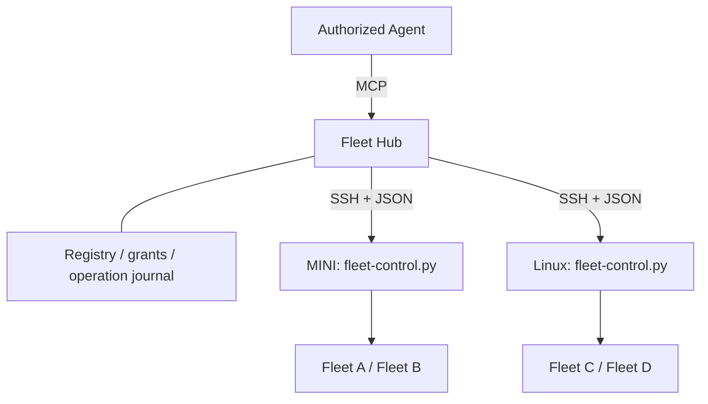

# Fleet Hub: one MCP endpoint for registered machines

Fleet Hub is an optional control service for managing several machines' Fleets
through one MCP connection. It keeps a machine/Fleet registry, expiring caller
grants, an operation journal and an audit trail. Each machine continues running
its own workers. The Hub invokes a fixed JSON control entry point over SSH;
nodes do not need a new network listener or the MCP SDK.

This first implementation supports discovery, status, issue-worker starts and
three explicitly allowed configuration keys. It is opt-in: installing the files
does not start a service, register machines or grant anyone access.

Here, **Fleet Hub** means the cross-machine control service. The existing `plan`
hub window remains the per-Fleet dashboard; it is not this service.



## Interfaces and identity

`bin/fleet-hub.py` provides the administrator CLI and the MCP server.
`bin/fleet-control.py rpc` handles one JSON request on stdin and returns one JSON
response on stdout. Diagnostics must never be written into either protocol's
stdout. `fleet-control-read.sh` adapts the existing Fleet helpers.

Each node persists a random machine UUID in
`$FLEET_CONF_DIR/control/state.sqlite3`. Its Fleet IDs are UUIDs derived from that
machine UUID, the configured session name, repository and checkout. Restarting
the Hub or a tmux server preserves IDs. Changing a Fleet's name, repository or
checkout produces a new ID and requires a new grant. Copying a node's control
database to a different machine is not a supported enrollment procedure.

Names such as `MINI` are display names. MCP operations use a Fleet UUID, never a
hostname supplied by an Agent. SSH aliases and local configuration directories
are administrator-owned registry data. Registration pins the node UUID; later
responses from a different node identity are refused. OpenSSH host-key checking
is required independently of this application-level identity check.

Worker window IDs and short Fleet handles are returned as observations only.
They are not durable cross-machine addresses. Stop, message, recovery and
transfer tools require stronger worker-lifecycle identity and are deferred.

## First-version tools

| MCP tool | Behavior | Required grant |
|---|---|---|
| `fleet_list(refresh=true)` | Discover changes on the caller's registered nodes; return only granted Fleets | `fleet:read` |
| `fleet_status(fleet_id)` | Read current workers on the named socket | `fleet:read` on that Fleet |
| `config_get(fleet_id)` | Read managed values and the Fleet-overlay revision | `fleet:read` on that Fleet |
| `worker_start(fleet_id, issue, idempotency_key, agent?)` | Start an existing Issue through the headless Fleet launcher | `worker:start` on that Fleet |
| `config_set(fleet_id, key, value, expected_revision, idempotency_key)` | Compare-and-set one allowed configuration key | `config:write` plus an explicit key grant |
| `operation_get(operation_id)` | Reconcile a caller's own operation with its node | `fleet:read` on the target Fleet |

All callers need `fleet:read`. Tools do not expose shell commands, raw tmux
commands, arbitrary paths, environment overrides, `--force`, registration or
grant administration. A visible tool is not an authorization decision: the Hub
checks the live grant on every call. HTTP access-token scopes further restrict
the grant; they cannot enlarge it.

Writes return an `operation_id`. Read it with `operation_get` until it reaches a
confirmed terminal state. Submission is not proof that a worker has started.
`fleet_list` is an inventory, not a worker-health check: its `fresh` availability
means the node recently answered discovery. Use `fleet_status` for live workers.

## Registering machines

Update the Fleet installation on each participating machine using
[the installation procedure](INSTALL.md). The controller and its Python helper
files must be installed alongside the other `bin/` files. Nodes need Python 3
and their existing Fleet/tmux/GitHub/provider setup; they do not need an MCP
package. The default SSH command is fixed:

```sh
export PATH="$HOME/.local/bin:/opt/homebrew/bin:/usr/local/bin:/usr/bin:/bin:/usr/sbin:/sbin"
exec python3 "$HOME/.claude/fleet/bin/fleet-control.py" rpc
```

On the Hub machine, use the existing SSH aliases and trusted host keys:

```sh
python3 ~/.claude/fleet/bin/fleet-hub.py register MINI --ssh MINI
python3 ~/.claude/fleet/bin/fleet-hub.py register BUILD --ssh build
python3 ~/.claude/fleet/bin/fleet-hub.py nodes
python3 ~/.claude/fleet/bin/fleet-hub.py sync
```

For a Fleet on the Hub's own machine, use `register MINI --local` instead.
`--conf-dir /absolute/path` is available for a local registration with a
nondefault Fleet configuration directory. Remote registrations use the remote
account's normal configuration directory. Registration discovers configured
Fleets even when their tmux sessions are down; it does not start them.
`register NAME --ssh ALIAS --ssh-config /absolute/path` uses a dedicated OpenSSH
configuration, allowing a controller-only key and a separately pinned known-hosts
file without modifying the operator's general SSH setup.

The Hub's default state directory is `~/.config/claude-fleet/hub`.
`--state-dir /absolute/path` before the subcommand selects another registry.
Directories are private and databases contain no SSH private keys or provider
credentials. The Hub relies on the administrator's SSH configuration/agent and
each node's local provider login. Hub access tokens are not forwarded to nodes.

## Local stdio access

Only the Hub's `serve` command needs the optional SDK. Install it into a dedicated
Python 3.10+ environment:

```sh
python3 -m venv ~/.claude/fleet-mcp-venv
~/.claude/fleet-mcp-venv/bin/python -m pip install -r ~/.claude/fleet/requirements-mcp.txt
```

Create a grant using a Fleet UUID from registration:

```sh
python3 ~/.claude/fleet/bin/fleet-hub.py grant scheduler \
  --fleet '<fleet UUID>' --scope worker:start \
  --scope config:write --config-key FLEET_MAX_SESSIONS --ttl-hours 24
```

The result includes a `principal_id` and a token, printed once. Store the token
in the MCP client's private environment as `FLEET_HUB_TOKEN`. Configure the
client to run the venv's Python with arguments:

```text
/absolute/path/to/.claude/fleet/bin/fleet-hub.py serve --transport stdio
```

The token is checked on every tool call, including after initialization. Its
hash, permitted Fleet IDs, scopes, writable keys and expiry are stored in the
Hub database. Remove a grant immediately with:

```sh
python3 ~/.claude/fleet/bin/fleet-hub.py revoke '<principal UUID>'
python3 ~/.claude/fleet/bin/fleet-hub.py audit
```

Revocation prevents subsequent calls; an already accepted operation may still
complete. Tokens do not isolate callers that independently have the same OS
user's shell/database access. Use a separate service account and appropriate OS
permissions when that boundary matters.

## Persistent private HTTP service on a Mac mini

For a private deployment, the Hub can accept the same pre-issued grants through
HTTP Authorization headers. This explicit `--auth grant-token` mode requires a
loopback listener and an HTTPS reverse proxy. It does not advertise an OAuth
authorization server or offer automatic client consent. Each Agent receives its
own expiring, revocable grant through the administrator CLI above.

Install a launchd service after installing the optional SDK:

```sh
python3 ~/.claude/fleet/bin/fleet-hub-service.py install \
  --python ~/.claude/fleet-mcp-venv/bin/python \
  --resource-url https://macmini.example.ts.net:8450/mcp --port 8766
```

The installer creates `~/Library/LaunchAgents/com.claude-fleet.hub.plist`, backs
up an existing changed plist, and bootstraps only that service. `RunAtLoad` and
`KeepAlive` start it at login and restart it after an exit. It listens on
`127.0.0.1:8766`. The plist has explicit interpreter/tool paths and contains no
access tokens. Registry and grants persist in the state directory across
restarts. Logs live in `<state-dir>/logs/`.

For an existing Tailscale installation, inspect the current Serve configuration
and choose an unused HTTPS port before adding the route:

```sh
tailscale serve status --json
tailscale serve --bg --https=8450 http://127.0.0.1:8766
```

Use the machine's actual tailnet DNS name in the resource URL. Tailscale Serve
makes the HTTPS endpoint available inside the tailnet; this setup does not use
Funnel. Existing routes should be preserved. Any other trusted HTTPS reverse
proxy that preserves the public Host header is also supported.

Configure the MCP client with that `/mcp` URL and
`Authorization: Bearer <issued grant token>`. Keep the credential in a private
client configuration or secret store. Requests without an active token return
401; grants are checked again for every tool action. Revoke by principal UUID
as with stdio. Registration and granting remain administrator CLI actions.

```sh
python3 ~/.claude/fleet/bin/fleet-hub-service.py status
python3 ~/.claude/fleet/bin/fleet-hub-service.py restart
python3 ~/.claude/fleet/bin/fleet-hub-service.py stop
```

`stop` unloads the running job and leaves its plist available for a later
bootstrap/login. For permanent removal, unload it and remove that specific
plist; remove only the Hub's HTTPS route (`tailscale serve --https=8450 off`)
and revoke its client grants. The Fleet workers and other Serve routes have
independent lifecycles.

## OAuth HTTP endpoint

The Hub also supports Streamable HTTP as an OAuth resource server. Token
issuance, user consent and MCP-compatible client authorization belong to an
existing authorization server. Configure its HTTPS issuer, JWKS endpoint and
the Hub's public HTTPS resource URL. Access tokens must have a verified
RS256/ES256 signature and valid `iss`, `aud`, `exp`, `iat`, `sub`, `client_id` and
space-separated `scope` claims. The audience must include the Hub resource URL.

First map the issuer/subject/client combination to a Fleet grant:

```sh
python3 ~/.claude/fleet/bin/fleet-hub.py grant remote-scheduler \
  --fleet '<fleet UUID>' --scope worker:start \
  --oauth-issuer https://login.example.com \
  --oauth-subject '<operator subject>' --oauth-client '<Agent client ID>'
```

Then start the Hub behind a TLS reverse proxy on its default loopback listener:

```sh
~/.claude/fleet-mcp-venv/bin/python ~/.claude/fleet/bin/fleet-hub.py serve \
  --transport streamable-http \
  --issuer https://login.example.com \
  --jwks-url https://login.example.com/.well-known/jwks.json \
  --resource-url https://fleet.example.com/mcp
```

The client connects to `https://fleet.example.com/mcp`. The proxy must preserve
the public Host header. Host and Origin checks are enabled; requests without an
Origin are allowed, and a supplied Origin must match the public origin. The
listener defaults to `127.0.0.1:8765`; the application itself does not terminate
TLS. No unauthenticated HTTP mode is provided. The OAuth mode never falls back
to local grant tokens. Private pre-authorized
tokens require selecting `--auth grant-token` explicitly as described above.
Configure the OAuth client to request `fleet:read` and whichever of
`worker:start` / `config:write` it needs. A Hub grant alone does not add scopes to
an issuer's access token. Automatic incremental scope consent is not implemented.

The SDK handles protocol negotiation, tool schemas and protected-resource
metadata. Domain authorization remains in the shared Hub operation layer.
OAuth tokens expire according to the issuer; revoking the Fleet grant is
checked immediately on subsequent requests. This implementation accepts JWT
access tokens; opaque-token introspection is not implemented.

## Writes, concurrency and disconnected machines

The Hub stores a write before sending it. Each node independently stores the
same operation ID before starting a detached, bounded executor. A repeated ID
with the same request returns its existing record; a changed request is refused.
Idempotency keys are scoped to the caller and persist across Hub restarts.

The operation states are `pending` (Hub), `accepted`, `running`, `succeeded`,
`failed` and `unknown`. Lost acknowledgements, interrupted executors and
unconfirmed side effects stay unknown. Reading an operation attempts to recover
the node's record. A failed connection never becomes a successful empty result,
and it never automatically replays a write. A crash between recording acceptance
and launching its executor can leave an operation unexecuted/unknown; it needs
operator reconciliation. The journal does not claim exactly-once execution
across SQLite, tmux, Git and GitHub.

Inventory refresh retains the last successful snapshot and its timestamp when
a node is unreachable. An offline Fleet is not removed or treated as idle.
There is no automatic write queue for disconnected nodes. Nodes continue
running their existing workers if the Hub goes down.

Worker starts reuse `dash-issue-session.sh` with an explicit target session and
provider. They preserve its capacity and Issue-claim checks; the bridge also
checks disk and configured provider quota gates. Existing fail-open quota/claim
policies remain as configured in Fleet. GitHub's claim check is not a distributed
mutex. Requests with different idempotency keys are separate operations;
cross-node Issue leases and per-principal aggregate worker budgets are future
work. Existing machine/Fleet capacity limits still apply.

Remote configuration writes are limited to:

| Key | Accepted integer values | Effect |
|---|---|---|
| `FLEET_MAX_SESSIONS` | 0–256 | Per-Fleet launch cap; 0 retains Fleet's unlimited-per-Fleet meaning, subject to the machine cap |
| `FLEET_AUTOFILL` | 0 or 1 | Enable/disable dispatch for eligible labelled Issues |
| `FLEET_AUTOFILL_MAX_PER_TICK` | 1–16 | Bound one Fleet's autofill batch |

A key needs an explicit caller grant as well as `config:write`. Enabling
autofill delegates future automatic launches according to the Fleet's labels
and local caps. Global settings, credentials, launch prompts, executable paths
and authorization policy are not writable through MCP.

`expected_revision` hashes the Fleet overlay, not the inherited global config.
The dashboard and controller use the same kernel-held lock and atomic writer;
one wins and a stale compare-and-set fails without changing the file. Backups
remain at `<conf>.bak`. Effective values include current inherited defaults.
Arbitrary external file editors do not participate in this lock. Changes affect
future scheduling decisions and do not terminate existing workers.

## Validation and next increments

Run the hermetic regression suite through the normal shadow-root gate:

```sh
bin/run-selftests.sh fleet-hub tmux-config dash-agent-toggle
```

The stdlib tests use temporary registries, fake SSH/spawn endpoints and real
SQLite/config writers. When tmux is installed, an isolated server also verifies
worker metadata under the non-UTF-8 locale common in SSH forced commands.
With the optional SDK on Python's path, the same suite
also starts a real stdio MCP subprocess and exercises the HTTP authentication
boundary in process. No test contacts a real SSH host, changes a live Fleet or
starts a model session.

Next increments, in order: add cross-node scheduling reservations and caller
budgets; introduce durable
worker identities for messaging/stop/recovery; add outbound node connections
for machines unreachable by SSH. High availability and automatic routing to the
best machine are outside this first version.

Protocol references: [official Python SDK](https://github.com/modelcontextprotocol/python-sdk),
[MCP authorization](https://modelcontextprotocol.io/specification/2025-11-25/basic/authorization),
[MCP transports](https://modelcontextprotocol.io/specification/2025-11-25/basic/transports).
