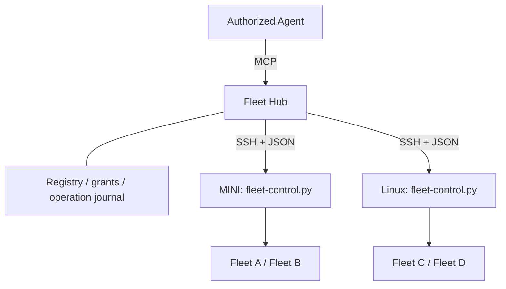

# Fleet Hub: one MCP endpoint for registered machines

Fleet Hub is an optional control service for managing several machines' Fleets
through one MCP connection. It keeps a machine/Fleet registry, expiring caller
grants, an operation journal and an audit trail. Each machine continues running
its own workers. The Hub invokes a fixed JSON control entry point over SSH;
nodes do not need a new network listener or the MCP SDK.

The Hub supports discovery, status, issue-worker starts, three explicitly
allowed configuration keys, and — on a durable worker identity — messaging,
graceful stop and resume. It is opt-in: installing the files does not start a
service, register machines or grant anyone access.

> **Single machine / offline use.** For several machines, use the cloud hub
> instead: `ccquota hub` with `CCQUOTA_FLEET=1` (`tokenledger/`, issue #1409)
> keeps the same registry, fleet UUIDs and worker_ids (derived by the same rules,
> checked value for value), fed by each machine's own outbound control channel
> rather than by SSH from the hub — and serves `fleet_list` / `fleet_status` /
> `config_get` / `operation_get` (plus `fleet_sessions`) over its MCP endpoint,
> and every write tool below with the same journal semantics (issue #1410). Its
> `worker_start` can also omit `fleet_id`: `node=auto` places the start on the
> caller's least-loaded machine with account headroom, under a per-person cap
> per machine (`fleet.node_cap.<machine>`, m4 = 6), and journals why.
> This Python hub is kept as is for one machine, or when the cloud hub is out of
> reach. See `tokenledger/README.md`, "Sessions on every machine".

Here, **Fleet Hub** means the cross-machine control service. The existing `plan`
hub window remains the per-Fleet dashboard; it is not this service.


```mermaid
flowchart TD
    Agent[Authorized Agent] -->|MCP| Hub[Fleet Hub]
    Hub --- Registry[Registry / grants / operation journal]
    Hub -->|SSH + JSON| Mini[MINI: fleet-control.py]
    Hub -->|SSH + JSON| Linux[Linux: fleet-control.py]
    Mini --> A[Fleet A / Fleet B]
    Linux --> B[Fleet C / Fleet D]
```

## Interfaces and identity

`bin/fleet-hub.py` provides the administrator CLI and the MCP server.
`bin/fleet-control.py rpc` handles one JSON request on stdin and returns one JSON
response on stdout. Diagnostics must never be written into either protocol's
stdout. `fleet-control-read.sh` adapts the existing Fleet helpers.

Each node persists a random machine UUID in
`$FLEET_CONF_DIR/control/state.sqlite3`. Its Fleet IDs are UUIDs derived from that
machine UUID, the configured session name, repository and checkout. Restarting
the Hub or a tmux server preserves IDs. Changing a Fleet's name, repository or
checkout produces a new ID and requires a new grant. Copying a node's control
database to a different machine is not a supported enrollment procedure.

Names such as `MINI` are display names. MCP operations use a Fleet UUID, never a
hostname supplied by an Agent. SSH aliases and local configuration directories
are administrator-owned registry data. Registration pins the node UUID; later
responses from a different node identity are refused. OpenSSH host-key checking
is required independently of this application-level identity check.

### Worker identity

`fleet_status` returns two kinds of value per worker, side by side:

- `worker_id` — the **durable identity**: `<fleet UUID>/issue-<N>` for a worker
  bound to an Issue, `<fleet UUID>/scratch-<N>` for a raw scratch session. It is
  built from the binding the fleet itself keys every `/fleet-history` row and
  ledger-watch snapshot on (`@issue`, or the scratch worktree slug), so it
  survives a `/fleet-handoff` (same window, new native session), an account
  migration (new window, `@issue` re-bound), `renumber-windows` and a tmux server
  restart. A window whose scratch worktree cannot be resolved has `worker_id`
  `null` and cannot be addressed. In a fleet hosting **two or more repos** the key
  carries the window's repo slug — `<fleet UUID>/<owner-name>:issue-<N>` (issue
  #1018; the `<slug>:issue-<N>` spelling of #789) — because two hosted repos can
  both have an issue-12; each worker also reports its `repo`. A window whose repo
  is unknown there gets `worker_id` `null`, never a guessed one. A one-repo
  fleet's keys stay bare. A bare `issue-<N>` sent to a multi-repo fleet matches
  every repo's window and is refused as `AMBIGUOUS` when more than one holds it.
- `window_id`, `handle` — **observations** of where that identity lives right
  now. They are re-minted by every migration, restore and warm-pool claim and are
  never accepted as a target.

`worker_message`, `worker_stop` and `worker_resume` take the `worker_id`. The
node re-resolves it against the fleet's live windows at the moment it acts and
refuses (`NOT_FOUND`, `AMBIGUOUS`) unless exactly one window holds it — a window
that merely has the number a caller last saw is never touched. `lifecycle`
reports hibernation (`awake`, `preparing`, `sleeping`, `waking`, `failed`); a
sleeping worker is refused (`INVALID_STATE`) rather than typed at, because the
sleep controller owns its pane. Transfer between machines is still deferred.

**Inside a fleet** (issue #1420) the same identity is the cross-machine address.
`fleet_worker_locate` (`bin/fleet-lib.sh`) answers `local <window> <sess>`,
`remote <node>` or `unknown` for a `worker_id` (or a bare key, meaning this
fleet); `fleet_uuid` mints the same fleet UUID as the controller, read-only.
`fleet-peer-send.sh`, `fleet-await.sh` and `fleet-answer.sh` take a
`wid:<worker_id>` target, and every spawn stamps the parent's worker_id as
`@origin_wid` beside `@origin` for `fleet-report-parent.sh`. A local hit runs the
existing path unchanged; `remote` and `unknown` refuse with the reason and never
fall back to a local window that shares the number. Only with `CCQUOTA_FLEET=1`
does a miss consult the hub, and then only through the local cache
`$FLEET_CONF_DIR/control/hub-workers.tsv` (`<worker_id>\t<node>`, fresh for
`FLEET_HUB_CACHE_SECS`, 30 s, refreshed by `FLEET_HUB_STATUS_CMD`); with no fresh
cache the fleet behaves as a one-machine fleet and says so on stderr.

**Across machines** (issue #1421, EPIC #1419 C2) the cloud hub carries what the
remote branches above used to refuse. Nothing in `bin/` dials the network: the
ccquota agent's control channel is this machine's only door to the hub.

- **The map.** After heartbeats the hub pushes each relay-capable node its owner's
  worker map — every worker on every machine, with its machine (`m4`, or `m4:lost`)
  and its parent's worker_id (the inventory's `@origin_wid` column, #1423) — and the
  agent writes it as `hub-workers.tsv` (`<worker_id>\t<node>\t<parent wid>`).
- **The outbox.** `fleet-report-parent.sh` (a parent elsewhere) and
  `fleet-peer-send.sh` (`wid:` of a worker elsewhere) drop a relay —
  `{id, kind, from, to, payload}`, id = `<sender worker_id>#<n>` — in
  `$FLEET_CONF_DIR/control/hub-outbox/` (`fleet_hub_put`). The agent sends it as a
  control-channel `relay`; the hub checks the sender's fleet is that node's and the
  target's belongs to the same owner, STORES it (the id is the key: a resend is a
  no-op) and acks, and the agent deletes the file. A refusal is kept in `refused/`.
- **Delivery.** The hub pushes the relay down the target node's channel — at once,
  or when that node reconnects (pending relays expire after 7 days) — and that
  agent runs `bin/fleet-hub-node.sh deliver`: a `child_report` is appended to the
  parent's ledger there with `node` + `rid` (one row however often it arrives) and
  delivered like a local report (tier, batch mode, `children_send`); a `message`
  goes to the worker through `fleet-peer-send.sh`, prefixed `[from <key> on <node>]`.
- **Waiting and holding.** `fleet-await.sh wid:<child elsewhere>` (a child whose
  parent is you) waits on your ledger, which the hub feeds, and calls it GONE when
  the map drops it. `fleet-children.sh` lists a remote child as `m4 remote` (or
  `gone · m4`), and `fleet_window_waiting_children` — the reaper's
  `retained:children` — counts a remote child until its MERGED report arrives,
  skipping a lost node and any map older than `FLEET_HUB_RETAIN_SECS` (600 s).

Switch it on with `CCQUOTA_FLEET=1` in the fleet's conf (the agent needs the same
variable, which it already has when it reports to a fleet hub). Off, or with no
running agent, every script behaves as it did before.

**The sidebar sees every machine** (issue #1423). With `CCQUOTA_FLEET=1` and
`CCQUOTA_HUB_URL` set, the collector keeps `bin/fleet-hub-sessions.sh` refreshing
the hub's `fleet_sessions` every 10 s into `global/remote_<sess>` (and the
`control/hub-workers.tsv` cache above). `tmux-dashboard-rows.sh` only reads that
file: your sessions on other machines — your login, a `worker_id`, a fleet that is
not this machine's — render mixed in with the local windows, nested by
`@origin_wid` (or the issue's sub-issue parent), and **look exactly like the
local rows** (issue #1475, the operator's call: no `[m4]` prefix, no machine
tag — the machine is the row menu's title, `侧边栏 · 在 m4`, and the status line
on top). Their window id is `wid:<worker_id>`, so reap, rename, pin and fold
find no window: remote rows are read-only; Enter (or the menu's `e`) opens the
proxy window below. Their red `?` / `⊘` (asking you, waiting for a
permission) is the local one: the inventory's column 12 carries `@claude_needs`.
The **machine status line** heads the sidebar (and the hub list):
`● m5 22 · ● m4 3` — one entry per machine, `●` online / `○` lost with
`N 分钟没联系`, and your session count there; the local count is the frame's own
rows, the others come from the cache's `#node` lines (the hub's `nodes` list,
derived from the sessions on an older hub). A machine the hub calls lost, or a
cache older than `FLEET_HUB_SESSIONS_STALE` (60 s), keeps its rows — dimmed,
un-nested, in their own group at the foot under a `─ m4 失联 3 分钟 ─` heading —
never vanishes. Machine labels come from `FLEET_NODE_ALIASES`
(`macmini=m5 mini2=m4`). To feed the nesting, the controller's worker inventory
carries each window's `name`, `origin_wid` and `needs` (columns 10–12 of
`fleet-control-read.sh workers`, optional).

**Who the hub shows you** (issue #1475). `fleet-hub-sessions.sh` asks as **you**:
your connection certificate (`~/.ssh/fleet-cert` + `-cert.pub`, from
`fleet login`, `FLEET_CERT` to name another) signs `fleet-sessions <ts>` under
`fleet-sessions@claude-fleet` — the `/v1/fleet/routes` protocol of #1414 — and
POSTs it to `/v1/fleet/fleet_sessions`, which now sits outside the viewer gate
(`handleFleetSessions`) and admits a certificate the way the routes do; the
holder is then a fleet principal, scoped by `FleetScope` to the machines of their
ACTIVE accounts. So a colleague's sidebar fills in right after `fleet login`, no
token anywhere. No certificate, or one past its validity (`ssh-keygen -L`'s
window, checked locally), falls back to the viewer token (the operator's); a
certificate the hub refuses (401) falls back too; neither ⇒ nothing is fetched,
no remote row, and `fleet-doctor`'s `hub` line WARNs.
`fleet-hub-sessions.sh --identity` prints which it is. The hub URL is
`CCQUOTA_HUB_URL`, else `FLEET_HUB_URL`, else `hub.json`'s `url`.

**…and steps into them** (issue #1424, EPIC #1419 C5). Enter on a remote row (the
dash's `dash-enter.sh`, the sidebar's `jump`) runs `bin/fleet-remote-view.sh open`:
a **proxy window** `⇄m4 <name>` (its pane header carries the same `⇄m4`, so a
glance says the keys go elsewhere; issue #1475), marked `@remote=<node>:<worker_id>`, whose pane
is `ssh -tt <host> fleet-remote-view.sh attach <worker_id>` — on the other machine
that resolves the worker through `fleet_worker_locate`, selects its window and
attaches to its fleet session. It is a plain **client** of that session, never a
grouped or linked session of its own: a second session holding the window would
list it twice in every `list-windows -a`, and `fleet-peer-send` would call the
worker AMBIGUOUS while the proxy is open. So there is **one proxy window per
machine** — Enter on another row of the same machine retargets it. While the proxy
is the session's only client it turns that session's status line and prefix off
(saved in `@remote_view_saved`, restored when it leaves, and by a
`client-attached[77]` hook the moment anyone attaches at that machine). Closing
the window only drops the connection; a drop reconnects (backing off, and
alternating with the hub relay `fleet connect --proxy` when one is configured).
The ssh host is the machine label unless `FLEET_REMOTE_SSH` (`m4=m4-lan`) maps it.
It is also marked `@remote_view_solo`, which that machine's sidebar
(`fleet-sidebar.py sync`) reads as "draw no list": the proxy is drawn INSIDE the
viewer's own sidebar (issue #1475) — the local sidebar treats a window with
`@remote` as a task window, so Enter on a remote row lands in the proxy window
with the list still on the left and the other machine's pane on the right, one
list, never the whole window gone remote. ↑↓ in the list leave it like any task;
`prefix h` returns to the last local window. Someone attached AT the remote end
changes nothing there — they keep their status line, prefix and sidebar, and the
proxy then shows their sidebar beside the local one (two lists: the price of a
shared screen). Every local rail skips a proxy window: no dash row (the remote
row stands for it), no session in either cap tally, no fleet-restore row, no
sleep, failover or rate-limit scrape. **fleet-open from the remote session** cannot reach the
operator's iTerm2 directly (it trusts this machine's secret only), so the remote
side registers the proxy's client tty under `$FLEET_CONF_DIR/remote-views/`;
`fleet-open.sh` there sees its newest client is a view, drops the request in the
view's spool and prints `sent:proxy`, and a second ssh session on the proxy's own
connection (ControlMaster) streams it back here, where the local `fleet-open.sh`
re-issues it — a url as is, a page on that machine's loopback through an
`ssh -O forward` on the same connection.

**One issue, one machine** (issue #1422, EPIC #1419 C3). With `CCQUOTA_FLEET=1`,
`dash-issue-session.sh` takes the cloud hub's lease on `(repo, issue)` before its
GitHub claim check (`fleet_hub_lease`, through `FLEET_HUB_LEASE_CMD`, default
`ccquota lease`). Held elsewhere → exit 3 and `已被 <node> 认领` on stderr; a
refusal after the grant gives the lease back; `--force` takes it and the hub
records the takeover. The lease is keyed by the session's worker_id, renewed by
the node's heartbeats while the window lives, released when it goes, and lapses
30 minutes after its node goes silent — released, not re-dispatched. A hub that
cannot be asked leaves one stderr note and the spawn runs exactly as without one.

**A session moves with its lease** (issue #1426, EPIC #1419 C7).
`fleet-move.sh --via hub --to <machine>` (and `--rebalance`) moves an idle
session through the cloud hub: the transcript is uploaded there, the hub hands
the issue's lease to the target fleet's worker and journals a `worker_move_in`
on it, the target's agent downloads the transcript and `fleet-move-remote.sh
movein` lands the branch and resumes the session; only then is the source window
closed. A failed move gives the lease back. A `working` session is never moved.

**Where a new session opens, and which machines are READY** (issue #1475).
`FLEET_SPAWN_NODE=auto|local|<machine>` (global, default `auto`) is what every
spawn on the login follows when nothing names a machine — `dash-issue-session.sh`
reads it in place of its old bare `auto`; `FLEET_AUTOFILL_NODE` stays auto-fill's
own override and the operator's `FLEET_HUB_PLACE_CMD` pin is no longer needed.
`local` never asks the hub. The node's heartbeat carries `ready` + `not_ready`
(`control.Heartbeat`): `fleet-control.py`'s `ready` method →
`fleet-control-read.sh ready` — a gh login, a usable Claude/Codex credential (a
pool token, a pool account's hub credential, Claude Code's own credential file
or keychain item, Codex's `auth.json`), every hosted repo's checkout — re-asked
by the agent at most once a minute. `pickNode` marks a node that says `false`
`not ready: <what is missing>` for an `auto` placement; `--node <name>` still
sends work there (you asked by name), and an agent older than #1475 says nothing
and is treated as ready.

## Tools

| MCP tool | Behavior | Required grant |
|---|---|---|
| `fleet_list(refresh=true)` | Discover changes on the caller's registered nodes; return only granted Fleets | `fleet:read` |
| `fleet_status(fleet_id)` | Read current workers on the named socket, each with its durable `worker_id` | `fleet:read` on that Fleet |
| `config_get(fleet_id)` | Read managed values and the Fleet-overlay revision | `fleet:read` on that Fleet |
| `worker_start(fleet_id, issue, idempotency_key, agent?, repo?)` | Start an existing Issue through the headless Fleet launcher; `repo` (owner/name or a hosted repo's name) is REQUIRED when the Fleet hosts several repos, and an unhosted one fails `INVALID_ARGUMENT` before any gate runs (#984) | `worker:start` on that Fleet |
| `worker_message(worker_id, text, idempotency_key)` | Post `text` as the worker's next turn through the fleet's issue bridge (a `--to-worker` comment on its Issue; never keystrokes) | `worker:message` on the worker's Fleet |
| `worker_stop(worker_id, idempotency_key)` | Graceful `/exit` of the live session; the fleet's own exit policy closes the window and records the `/fleet-history` row | `worker:stop` on the worker's Fleet |
| `worker_resume(worker_id, idempotency_key)` | Reopen a stopped worker from its `/fleet-history` row in a new window (`dash-restore-session.sh`) | `worker:resume` on the worker's Fleet |
| `config_set(fleet_id, key, value, expected_revision, idempotency_key)` | Compare-and-set one allowed configuration key | `config:write` plus an explicit key grant |
| `operation_get(operation_id)` | Reconcile a caller's own operation with its node | `fleet:read` on the target Fleet |
| `gh_issue_view(fleet_id, number, repo?, fields?)` | One Issue through the node's `fleet-gh.sh`: the daemons' local copy when fresh, else `gh`, else REST — the `gh --json` fields plus `_source` (`cache`/`gh`/`rest`) and `_age` seconds (#1274) | `gh:read` on that Fleet |
| `gh_pr_view(fleet_id, number, repo?, fields?)` | One PR, same path and shape | `gh:read` on that Fleet |
| `gh_pr_checks(fleet_id, number, repo?, fields?)` | A PR's CI rollup `bucket`; `fields` (e.g. `name,state`) adds per-check rows, which the cache does not hold | `gh:read` on that Fleet |
| `gh_comment(fleet_id, issue, body, idempotency_key, repo?)` | Post a **record-only** comment (`fleet-comment.sh --note --from hub`) through the per-token write queue (#1264); a live worker on that issue does NOT see it — `worker_message` is the channel for that. No merge, close or label tool exists | `gh:comment` on that Fleet |

All callers need `fleet:read`. Each lifecycle tool has its own scope; none of
them is implied by `worker:start`. Tools do not expose shell commands, raw tmux
commands, arbitrary paths, environment overrides, `--force`, registration or
grant administration. A visible tool is not an authorization decision: the Hub
checks the live grant on every call. HTTP access-token scopes further restrict
the grant; they cannot enlarge it.

Writes return an `operation_id`. Read it with `operation_get` until it reaches a
confirmed terminal state. Submission is not proof that a worker has started.
`fleet_list` is an inventory, not a worker-health check: its `fresh` availability
means the node recently answered discovery. Use `fleet_status` for live workers.

## Registering machines

Update the Fleet installation on each participating machine using
[the installation procedure](INSTALL.md). The controller and its Python helper
files must be installed alongside the other `bin/` files. Nodes need Python 3
and their existing Fleet/tmux/GitHub/provider setup; they do not need an MCP
package. The default SSH command is fixed:

```sh
export PATH="$HOME/.local/bin:/opt/homebrew/bin:/usr/local/bin:/usr/bin:/bin:/usr/sbin:/sbin"
exec python3 "$HOME/.claude/fleet/bin/fleet-control.py" rpc
```

`fleet-control.py rpc` completes its own PATH with the same dirs (issue #1460),
so a caller that inherits launchd's default `/usr/bin:/bin:/usr/sbin:/sbin` — the
ccquota agent reading `fleet_status` for its heartbeat — still finds a Homebrew
tmux. A fleet it cannot read is reported `state: unknown`, never as 0 windows,
with the adapter's own error in the fault; the agent logs that reason once per
distinct failure.

On the Hub machine, use the existing SSH aliases and trusted host keys:

```sh
python3 ~/.claude/fleet/bin/fleet-hub.py register MINI --ssh MINI
python3 ~/.claude/fleet/bin/fleet-hub.py register BUILD --ssh build
python3 ~/.claude/fleet/bin/fleet-hub.py nodes
python3 ~/.claude/fleet/bin/fleet-hub.py sync
```

For a Fleet on the Hub's own machine, use `register MINI --local` instead.
`--conf-dir /absolute/path` is available for a local registration with a
nondefault Fleet configuration directory. Remote registrations use the remote
account's normal configuration directory. Registration discovers configured
Fleets even when their tmux sessions are down; it does not start them.
`register NAME --ssh ALIAS --ssh-config /absolute/path` uses a dedicated OpenSSH
configuration, allowing a controller-only key and a separately pinned known-hosts
file without modifying the operator's general SSH setup.

The Hub's default state directory is `~/.config/claude-fleet/hub`.
`--state-dir /absolute/path` before the subcommand selects another registry.
Directories are private and databases contain no SSH private keys or provider
credentials. The Hub relies on the administrator's SSH configuration/agent and
each node's local provider login. Hub access tokens are not forwarded to nodes.

## Local stdio access

Only the Hub's `serve` command needs the optional SDK. Install it into a dedicated
Python 3.10+ environment:

```sh
python3 -m venv ~/.claude/fleet-mcp-venv
~/.claude/fleet-mcp-venv/bin/python -m pip install -r ~/.claude/fleet/requirements-mcp.txt
```

Create a grant using a Fleet UUID from registration. Without `--scope` a grant
is read-only (`fleet:read`), and without `--ttl-hours` it expires in 24 hours;
every write scope, key and longer life is added explicitly:

```sh
python3 ~/.claude/fleet/bin/fleet-hub.py grant scheduler \
  --fleet '<fleet UUID>' --scope worker:start \
  --scope config:write --config-key FLEET_MAX_SESSIONS --ttl-hours 24
```

Lifecycle scopes are granted the same way and separately — `--scope
worker:message`, `--scope worker:stop`, `--scope worker:resume` — so a caller
that may nudge workers need not be able to end them.

GitHub access is the same: `--scope gh:read` for the three read tools,
`--scope gh:comment` for `gh_comment` (issue #1274). `fleet:read` alone reads
no Issue or PR. The node answers with ITS `gh` login, through its local copy,
rate-limit fallback and write queue — so a claude.ai or desktop session on an
iPad gets the same rails a worker does, without the official GitHub connector.
`repo` must be one the Fleet hosts, and is required when it hosts several.

The result includes a `principal_id` and a token, printed once. Store the token
in the MCP client's private environment as `FLEET_HUB_TOKEN`. One grant serves
one Agent for one purpose; see [Grants](#grants-one-per-agent-one-per-purpose)
before issuing a second one. Configure the client to run the venv's Python with
arguments:

```text
/absolute/path/to/.claude/fleet/bin/fleet-hub.py serve --transport stdio
```

The token is checked on every tool call, including after initialization. Its
hash, permitted Fleet IDs, scopes, writable keys and expiry are stored in the
Hub database. Remove a grant immediately with:

```sh
python3 ~/.claude/fleet/bin/fleet-hub.py revoke '<principal UUID>'
python3 ~/.claude/fleet/bin/fleet-hub.py audit
python3 ~/.claude/fleet/bin/fleet-hub.py principals
```

Revocation prevents subsequent calls; an already accepted operation may still
complete. Tokens do not isolate callers that independently have the same OS
user's shell/database access. Use a separate service account and appropriate OS
permissions when that boundary matters.

## Grants: one per Agent, one per purpose

A grant is the Hub's only notion of a caller. The audit trail and the operation
journal record the principal UUID, `revoke` acts on one principal, and every
tool call is checked against one policy. Two Agents that share a token are
therefore one caller: the audit trail cannot tell their actions apart, they can
only be revoked together, and each holds whatever scope the wider one needed.
Issue one grant per Agent and per purpose, and never place one token in two
client configurations. A read-only inventory client and a scheduler that starts
workers are two grants even when the same person runs both.

**Naming.** The grant name is the only human-readable handle `principals`
shows, so name the holder and the job, not the scope list:
`<machine>-<agent>-<purpose>`, for example `macbook-claude-read`,
`macbook-claude-start` or `ci-nightly-config`. Names match
`[A-Za-z0-9][A-Za-z0-9_.-]{0,127}`.

**Minimum scope.** Every grant carries `fleet:read`; the CLI adds it and grants
nothing else by default. Add `--scope worker:start` only for a caller that
starts workers, `--scope config:write --config-key KEY` only for the exact keys
it changes, and `--fleet` only for the Fleets it operates. A grant that covers
every Fleet with every scope is a break-glass credential: issue it for hours,
not months, and revoke it when the task ends.

**Expiry.** The default is 24 hours and the maximum is one year. An interactive
or one-off caller gets a day. An unattended Agent that must keep working gets
at most 30 days (`--ttl-hours 720`) and is renewed; a year-long grant outlives
the reason it was issued and the person who remembers it. An expired grant is
refused on its next request, and `principals` keeps listing it as `expired`
until it is revoked, so an abandoned caller stays visible.

**Renewal is a new grant, not an extension.** Issue the replacement with the
same minimum policy, store its token in the client, confirm with `principals`
that the new principal shows calls and the old one shows none since the swap,
then revoke the old one. A short overlap is fine; a token that lives on after
its replacement is not.

**Leaked or suspected leaked token.** Revoke it first, by principal UUID; the
refusal takes effect on the next request, while an already accepted operation
may still complete. Then read `audit` for that actor since the suspected time
and check the journal for writes it made. Issue a replacement with the minimum
scope, and treat any other secret kept in the same client store as exposed.

**Reviewing grants.** List every grant, its policy and its usage:

```sh
python3 ~/.claude/fleet/bin/fleet-hub.py principals        # active and expired
python3 ~/.claude/fleet/bin/fleet-hub.py principals --all  # also revoked
```

Each row gives `principal_id`, `name`, `state` (`active`, `expired` or
`revoked`), `auth` (`token` or `oauth`), `scopes`, `config_keys`, `fleets` (a
count) with `fleet_ids`, `expires_at`, `calls` and `last_call_at` (UTC, from the
audit trail; `null` for a grant that has never called). Neither the token nor
its hash is listed. Rows are ordered by expiry, so the grants about to lapse
come first. Revoke a grant that is `active` with `calls: 0` long after it was
issued, or whose `last_call_at` is older than its purpose warrants.

## Persistent private HTTP service on a Mac mini

For a private deployment, the Hub can accept the same pre-issued grants through
HTTP Authorization headers. This explicit `--auth grant-token` mode requires a
loopback listener and an HTTPS reverse proxy. It does not advertise an OAuth
authorization server or offer automatic client consent. Each Agent receives its
own expiring, revocable grant through the administrator CLI, following
[Grants](#grants-one-per-agent-one-per-purpose) above.

Install a launchd service after installing the optional SDK:

```sh
python3 ~/.claude/fleet/bin/fleet-hub-service.py install \
  --python ~/.claude/fleet-mcp-venv/bin/python \
  --resource-url https://macmini.example.ts.net:8450/mcp --port 8766
```

The installer creates `~/Library/LaunchAgents/com.claude-fleet.hub.plist`, backs
up an existing changed plist, and bootstraps only that service. `RunAtLoad` and
`KeepAlive` start it at login and restart it after an exit. It listens on
`127.0.0.1:8766`. The plist has explicit interpreter/tool paths and contains no
access tokens. Registry and grants persist in the state directory across
restarts. Logs live in `<state-dir>/logs/`.

For an existing Tailscale installation, inspect the current Serve configuration
and choose an unused HTTPS port before adding the route:

```sh
tailscale serve status --json
tailscale serve --bg --https=8450 http://127.0.0.1:8766
```

Use the machine's actual tailnet DNS name in the resource URL. Tailscale Serve
makes the HTTPS endpoint available inside the tailnet; this setup does not use
Funnel. Existing routes should be preserved. Any other trusted HTTPS reverse
proxy that preserves the public Host header is also supported.

Configure the MCP client with that `/mcp` URL and
`Authorization: Bearer <issued grant token>`. Keep the credential in a private
client configuration or secret store. Requests without an active token return
401; grants are checked again for every tool action. Revoke by principal UUID
as with stdio. Registration and granting remain administrator CLI actions.

```sh
python3 ~/.claude/fleet/bin/fleet-hub-service.py status
python3 ~/.claude/fleet/bin/fleet-hub-service.py restart
python3 ~/.claude/fleet/bin/fleet-hub-service.py stop
```

`stop` unloads the running job and leaves its plist available for a later
bootstrap/login. For permanent removal, unload it and remove that specific
plist; remove only the Hub's HTTPS route (`tailscale serve --https=8450 off`)
and revoke its client grants. The Fleet workers and other Serve routes have
independent lifecycles.

## OAuth HTTP endpoint

The Hub also supports Streamable HTTP as an OAuth resource server. Token
issuance, user consent and MCP-compatible client authorization belong to an
existing authorization server. Configure its HTTPS issuer, JWKS endpoint and
the Hub's public HTTPS resource URL. Access tokens must have a verified
RS256/ES256 signature and valid `iss`, `aud`, `exp`, `iat`, `sub`, `client_id` and
space-separated `scope` claims. The audience must include the Hub resource URL.

First map the issuer/subject/client combination to a Fleet grant:

```sh
python3 ~/.claude/fleet/bin/fleet-hub.py grant remote-scheduler \
  --fleet '<fleet UUID>' --scope worker:start \
  --oauth-issuer https://login.example.com \
  --oauth-subject '<operator subject>' --oauth-client '<Agent client ID>'
```

Then start the Hub behind a TLS reverse proxy on its default loopback listener:

```sh
~/.claude/fleet-mcp-venv/bin/python ~/.claude/fleet/bin/fleet-hub.py serve \
  --transport streamable-http \
  --issuer https://login.example.com \
  --jwks-url https://login.example.com/.well-known/jwks.json \
  --resource-url https://fleet.example.com/mcp
```

The client connects to `https://fleet.example.com/mcp`. The proxy must preserve
the public Host header. Host and Origin checks are enabled; requests without an
Origin are allowed, and a supplied Origin must match the public origin. The
listener defaults to `127.0.0.1:8765`; the application itself does not terminate
TLS. No unauthenticated HTTP mode is provided. The OAuth mode never falls back
to local grant tokens. Private pre-authorized
tokens require selecting `--auth grant-token` explicitly as described above.
Configure the OAuth client to request `fleet:read` and whichever of
`worker:start` / `config:write` it needs. A Hub grant alone does not add scopes to
an issuer's access token. Automatic incremental scope consent is not implemented.

The SDK handles protocol negotiation, tool schemas and protected-resource
metadata. Domain authorization remains in the shared Hub operation layer.
OAuth tokens expire according to the issuer; revoking the Fleet grant is
checked immediately on subsequent requests. This implementation accepts JWT
access tokens; opaque-token introspection is not implemented.

## Writes, concurrency and disconnected machines

The Hub stores a write before sending it. Each node independently stores the
same operation ID before starting a detached, bounded executor. A repeated ID
with the same request returns its existing record; a changed request is refused.
Idempotency keys are scoped to the caller and persist across Hub restarts.

The operation states are `pending` (Hub), `accepted`, `running`, `succeeded`,
`failed` and `unknown`. Lost acknowledgements, interrupted executors and
unconfirmed side effects stay unknown. Reading an operation attempts to recover
the node's record. A failed connection never becomes a successful empty result,
and it never automatically replays a write. A crash between recording acceptance
and launching its executor can leave an operation unexecuted/unknown; it needs
operator reconciliation. The journal does not claim exactly-once execution
across SQLite, tmux, Git and GitHub.

Inventory refresh retains the last successful snapshot and its timestamp when
a node is unreachable. An offline Fleet is not removed or treated as idle.
There is no automatic write queue for disconnected nodes. Nodes continue
running their existing workers if the Hub goes down.

### Worker lifecycle tools

The three lifecycle writes go through the same journal — recorded on the Hub
and on the node before anything runs, deduplicated per caller by idempotency
key, `unknown` when the outcome could not be confirmed — and each refuses
before acting when its precondition does not hold, which is a plain `failed`
with a code, never `unknown`:

- `worker_message` requires a live worker and a fleet that has opted into the
  issue bridge (`FLEET_ISSUE_BRIDGE=1`); otherwise `NOT_FOUND` / `UNAVAILABLE`,
  and nothing is posted. It posts through `fleet-comment.sh --to-worker --from
  hub`, so the comment is both the audit record and the delivery: the bridge
  relays it as the worker's next idle turn (subject to the bridge's association
  gate), typically within its ~15 s tick. A scratch session has no Issue and
  cannot be messaged. Text is limited to 4000 characters and may not contain
  HTML comments or control characters — a forged `<!-- fleet:… -->` marker
  could suppress or misattribute the relay. A confirmed post is `succeeded`
  with the comment URL; a post whose `gh` call failed after it was attempted is
  `unknown`.
- `worker_stop` is what the operator's own `/exit` does, from the outside
  (`fleet-worker-stop.sh`): Escape, `/exit`, Enter — the only keys ever typed —
  then wait for the agent process to be gone, then let the SessionEnd hook close
  the window and record the closed-unlanded `/fleet-history` row. The stop runs
  no git command: the worktree, branch and Issue are left exactly as they were
  and the session is resumable. The hook applies the fleet's ordinary exit
  policy to the worktree (it removes one only when its branch is already merged
  or a strict ancestor of base; uncommitted or unmerged work is always kept) —
  a stop is not exempt from that policy, and it is not a reap. When no hook
  closes the window (`FLEET_CLOSE_ON_EXIT=0`, or a pane already sitting at a
  bare shell) the script records the row itself and closes the shell-only
  window. An agent that does not exit within `FLEET_STOP_EXIT_WAIT` (30 s) is
  left as it is and the operation is `unknown`; a stop that lands is confirmed
  by re-reading the fleet — the identity must no longer be held by any window.
- `worker_resume` refuses while any live window holds the identity
  (`ALREADY_RUNNING`), reads the `/fleet-history` verdict (`REVIEW-ONLY` ⇒
  `NOT_RESUMABLE`), pays the same disk/quota gates a start pays
  (`RESOURCE_GATE`) and the session cap (`AT_CAPACITY`), then runs the headless
  `dash-restore-session.sh` — the same path as the dash's ⌃o — which reuses the
  worktree if it is still on disk, otherwise rebuilds it off the recorded SHA,
  and reopens the surviving transcript with `--resume`. The new window carries
  the same `@issue`, so the same `worker_id` is live again; its window id and
  handle are new. A resumed session holds a slot and spends tokens like a start.

Worker starts reuse `dash-issue-session.sh` with an explicit target session and
provider. They preserve its capacity and Issue-claim checks; the bridge also
checks disk and configured provider quota gates. Existing fail-open quota/claim
policies remain as configured in Fleet. GitHub's claim check is not a distributed
mutex. Requests with different idempotency keys are separate operations;
cross-node Issue leases and per-principal aggregate worker budgets are future
work. Existing machine/Fleet capacity limits still apply.

Remote configuration writes are limited to:

| Key | Accepted integer values | Effect |
|---|---|---|
| `FLEET_MAX_SESSIONS` | 0–256 | Per-Fleet launch cap; 0 retains Fleet's unlimited-per-Fleet meaning, subject to the machine cap |
| `FLEET_AUTOFILL` | 0 or 1 | Enable/disable dispatch for eligible labelled Issues |
| `FLEET_AUTOFILL_MAX_PER_TICK` | 1–16 | Bound one Fleet's autofill batch |

A key needs an explicit caller grant as well as `config:write`. Enabling
autofill delegates future automatic launches according to the Fleet's labels
and local caps. Global settings, credentials, launch prompts, executable paths
and authorization policy are not writable through MCP.

`expected_revision` hashes the Fleet overlay, not the inherited global config.
The dashboard and controller use the same kernel-held lock and atomic writer;
one wins and a stale compare-and-set fails without changing the file. Backups
remain at `<conf>.bak`. Effective values include current inherited defaults.
Arbitrary external file editors do not participate in this lock. Changes affect
future scheduling decisions and do not terminate existing workers.

## Validation and next increments

Run the hermetic regression suite through the normal shadow-root gate:

```sh
bin/run-selftests.sh fleet-hub fleet-worker-stop tmux-config dash-agent-toggle
```

`fleet-worker-stop-selftest.sh` drives the real stop script against fake
agents on an isolated tmux socket: a stop by key exits that agent and closes
only that window, an unheld / doubly held / hibernating key is refused, an
agent that will not exit is left alone, and a window number is not a key.

The stdlib tests use temporary registries, fake SSH/spawn endpoints and real
SQLite/config writers. When tmux is installed, an isolated server also verifies
worker metadata under the non-UTF-8 locale common in SSH forced commands.
With the optional SDK on Python's path, the same suite
also starts a real stdio MCP subprocess and exercises the HTTP authentication
boundary in process. No test contacts a real SSH host, changes a live Fleet or
starts a model session.

Next increments, in order: add cross-node scheduling reservations and caller
budgets; worker transfer between machines on the same identity; add outbound
node connections for machines unreachable by SSH. High availability and automatic routing to the
best machine are outside this first version.

Protocol references: [official Python SDK](https://github.com/modelcontextprotocol/python-sdk),
[MCP authorization](https://modelcontextprotocol.io/specification/2025-11-25/basic/authorization),
[MCP transports](https://modelcontextprotocol.io/specification/2025-11-25/basic/transports).
