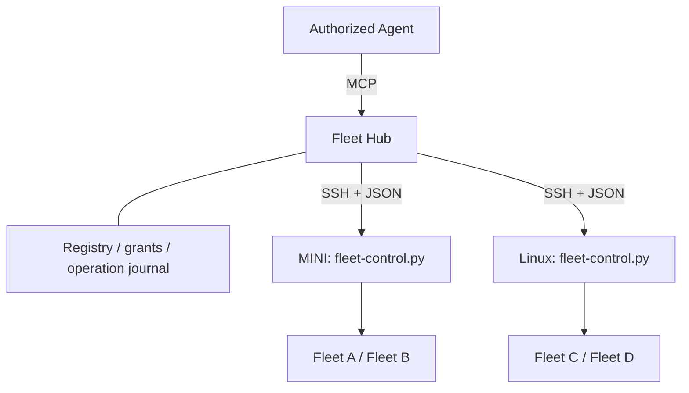

# Fleet Hub: one MCP endpoint for registered machines

Fleet Hub is an optional control service for managing several machines' Fleets
through one MCP connection. It keeps a machine/Fleet registry, expiring caller
grants, an operation journal and an audit trail. Each machine continues running
its own workers. The Hub invokes a fixed JSON control entry point over SSH;
nodes do not need a new network listener or the MCP SDK.

The Hub supports discovery, status, issue-worker starts, three explicitly
allowed configuration keys, and — on a durable worker identity — messaging,
graceful stop and resume. It is opt-in: installing the files does not start a
service, register machines or grant anyone access.

> **Single machine / offline use.** For several machines, use the cloud hub
> instead: `ccquota hub` with `CCQUOTA_FLEET=1` (`tokenledger/`, issue #1409)
> keeps the same registry, fleet UUIDs and worker_ids (derived by the same rules,
> checked value for value), fed by each machine's own outbound control channel
> rather than by SSH from the hub — and serves `fleet_list` / `fleet_status` /
> `config_get` / `operation_get` (plus `fleet_sessions`) over its MCP endpoint,
> and every write tool below with the same journal semantics (issue #1410). Its
> `worker_start` can also omit `fleet_id`: `node=auto` places the start on the
> caller's least-loaded machine — the tighter of CPU and memory idle; account
> quota is shared by every machine and never scored (issue #1994) — under a
> per-person cap per machine only where one is set (`fleet.node_cap.<machine>`,
> no default), and journals why.
> This Python hub is kept as is for one machine, or when the cloud hub is out of
> reach. See `tokenledger/README.md`, "Sessions on every machine".

Here, **Fleet Hub** means the cross-machine control service. The existing `plan`
hub window remains the per-Fleet dashboard; it is not this service.


```mermaid
flowchart TD
    Agent[Authorized Agent] -->|MCP| Hub[Fleet Hub]
    Hub --- Registry[Registry / grants / operation journal]
    Hub -->|SSH + JSON| Mini[MINI: fleet-control.py]
    Hub -->|SSH + JSON| Linux[Linux: fleet-control.py]
    Mini --> A[Fleet A / Fleet B]
    Linux --> B[Fleet C / Fleet D]
```

## Interfaces and identity

`bin/fleet-hub.py` provides the administrator CLI and the MCP server.
`bin/fleet-control.py rpc` handles one JSON request on stdin and returns one JSON
response on stdout. Diagnostics must never be written into either protocol's
stdout. `fleet-control-read.sh` adapts the existing Fleet helpers.

Each node persists a random machine UUID in
`$FLEET_CONF_DIR/control/state.sqlite3`. Its Fleet IDs are UUIDs derived from that
machine UUID, the configured session name, repository and checkout. Restarting
the Hub or a tmux server preserves IDs. Changing a Fleet's name, repository or
checkout produces a new ID and requires a new grant. Copying a node's control
database to a different machine is not a supported enrollment procedure.

Names such as `MINI` are display names. MCP operations use a Fleet UUID, never a
hostname supplied by an Agent. SSH aliases and local configuration directories
are administrator-owned registry data. Registration pins the node UUID; later
responses from a different node identity are refused. OpenSSH host-key checking
is required independently of this application-level identity check.

### Worker identity

A node's own request (`/v1/node/*`, a relay) speaks for the machine and login. One
made **for one of its sessions** — the session's tool service verified its worker
credential first — also carries a node-signed worker assertion (`X-Fleet-Worker`
on `/v1/node/place`, `worker` on a relay; issue #1810): the hub verifies it
against the node's token hash (401 if it does not hold), keeps the call to that
session (404 otherwise), and writes its `worker_id` into `fleet_audit` and the
operation journal. Spec: [FLEET-MCP.md](FLEET-MCP.md) «The hub route».

`fleet_status` returns two kinds of value per worker, side by side:

- `worker_id` — the **durable identity**: `<fleet UUID>/issue-<N>` for a worker
  bound to an Issue, `<fleet UUID>/scratch-<N>` for a raw scratch session. It is
  built from the binding the fleet itself keys every `/fleet-history` row and
  ledger-watch snapshot on (`@issue`, or the scratch worktree slug), so it
  survives a `/fleet-handoff` (same window, new native session), an account
  migration (new window, `@issue` re-bound), `renumber-windows` and a tmux server
  restart. A window whose scratch worktree cannot be resolved has `worker_id`
  `null` and cannot be addressed. In a fleet hosting **two or more repos** the key
  carries the window's repo slug — `<fleet UUID>/<owner-name>:issue-<N>` (issue
  #1018; the `<slug>:issue-<N>` spelling of #789) — because two hosted repos can
  both have an issue-12; each worker also reports its `repo`. A window whose repo
  is unknown there gets `worker_id` `null`, never a guessed one. A one-repo
  fleet's keys stay bare. A bare `issue-<N>` sent to a multi-repo fleet matches
  every repo's window and is refused as `AMBIGUOUS` when more than one holds it.
- `identity` — the session's **lifelong** identity (issue #1646): its window's
  `@fleet_id`, a UUID minted once when the session is spawned and carried
  verbatim by every restore, migration and move (local or through the hub, in
  the transcript bundle as `<sid>.fleet-id`); never re-minted, untouched by
  `/clear` and a handoff. A key can change under a live session — a scratch bound
  to an issue (`fleet-bind.sh`) stops answering to `scratch-<N>` — the identity
  cannot. `<fleet UUID>/<identity>` is a worker_id too, accepted wherever one is
  (`worker_*`, relays, `origin_wid`), and the worker map lists every worker
  under both. A spawn records its parent's as `@origin_fid` (and
  `@origin_wid` = `<fleet UUID>/<parent identity>`); `fleet-report-parent.sh`,
  `fleet_worker_locate`, the peer channel and the inbound relay resolve the
  identity first and fall back to the key, and `fleet_origin_heal` re-points a
  child's `@origin` at its parent's current key, so everything that joins on keys
  follows. The key form stays an alias for one version (EPIC #1645 rule 2);
  `worker_id` in the inventory is still the key form, and a lease, a placement
  and a move still name a key.
- `window_id`, `handle` — **observations** of where that identity lives right
  now. They are re-minted by every migration, restore and warm-pool claim and are
  never accepted as a target.

`worker_message`, `worker_stop`, `worker_resume`, `worker_answer` and
`worker_reap` take the `worker_id`. The
node re-resolves it against the fleet's live windows at the moment it acts and
refuses (`NOT_FOUND`, `AMBIGUOUS`) unless exactly one window holds it — a window
that merely has the number a caller last saw is never touched. `lifecycle`
reports hibernation (`awake`, `preparing`, `sleeping`, `waking`, `failed`); a
sleeping worker is refused (`INVALID_STATE`) rather than typed at, because the
sleep controller owns its pane. Transfer between machines is still deferred.

**Inside a fleet** (issue #1420) the same identity is the cross-machine address.
`fleet_worker_locate` (`bin/fleet-lib.sh`) answers `local <window> <sess>`,
`remote <node>` or `unknown` for a `worker_id` (or a bare key, meaning this
fleet); `fleet_uuid` mints the same fleet UUID as the controller, read-only.
`fleet-peer-send.sh`, `fleet-await.sh` and `fleet-answer.sh` take a
`wid:<worker_id>` target, and every spawn stamps the parent's worker_id as
`@origin_wid` beside `@origin` for `fleet-report-parent.sh`. A local hit runs the
existing path unchanged; `remote` and `unknown` refuse with the reason and never
fall back to a local window that shares the number. Only with `CCQUOTA_FLEET=1`
does a miss consult the hub, and then only through the local cache
`$FLEET_CONF_DIR/control/hub-workers.tsv` (`<worker_id>\t<node>`, fresh for
`FLEET_HUB_CACHE_SECS`, 30 s, refreshed by `FLEET_HUB_STATUS_CMD`); with no fresh
cache the fleet behaves as a one-machine fleet and says so on stderr.

**Across machines** (issue #1421, EPIC #1419 C2) the cloud hub carries what the
remote branches above used to refuse. Nothing in `bin/` dials the network: the
ccquota agent's control channel is this machine's only door to the hub.

- **The map.** After heartbeats the hub pushes each relay-capable node its owner's
  worker map — every worker on every machine, with its machine (`m4`, or `m4:lost`)
  and its parent's worker_id (the inventory's `@origin_wid` column, #1423) — and the
  agent writes it as `hub-workers.tsv` (`<worker_id>\t<node>\t<parent wid>`).
- **The outbox.** `fleet-report-parent.sh` (a parent elsewhere) and
  `fleet-peer-send.sh` (`wid:` of a worker elsewhere) drop a relay —
  `{id, kind, from, to, payload}`, id = `<sender worker_id>#<n>` — in
  `$FLEET_CONF_DIR/control/hub-outbox/` (`fleet_hub_put`). The agent sends it as a
  control-channel `relay`; the hub checks the sender's fleet is that node's and the
  target's belongs to the same owner, STORES it (the id is the key: a resend is a
  no-op) and acks, and the agent deletes the file. A refusal is kept in `refused/`.
- **Delivery.** The hub pushes the relay down the target node's channel — at once,
  or when that node reconnects (pending relays expire after 7 days) — and that
  agent runs `bin/fleet-hub-node.sh deliver`: a `child_report` is appended to the
  parent's ledger there with `node` + `rid` (one row however often it arrives) and
  delivered like a local report (tier, batch mode, `children_send`); a `message`
  goes to the worker through `fleet-peer-send.sh`, prefixed `[from <key> on <node>]`.
- **Queued for the recipient** (issue #1647). A recipient not live on its machine
  makes `deliver` answer «not now» (75): the hub keeps the relay and pushes it again
  only on a beat whose inventory lists that worker — by `<fleet>/<key>` or its
  lifelong `<fleet>/<fleet_id>` — never on a timer alone. A recipient whose window is
  there but cannot take it (no live Claude, an inbox that will not answer) gets it
  through that machine's peer queue (`bin/fleet-peer-queue.sh`, drained by the
  cleanup tick and a sleeper's wake). The sender hands a full worker_id over even
  when its map is stale — the hub routes on the fleet UUID — and says
  `queued → …` (exit 3) unless the hub's **receipt** says delivered within
  `FLEET_HUB_RECEIPT_WAIT` (4 s): once a relay settles (delivered / failed /
  expired after 7 days) the hub pushes a `receipt` relay back down the SENDER's
  channel, and its `deliver` writes the row into that fleet's delivery book,
  `fleets/<sess>/delivery.ndjson` (`QUEUED` → `DELIVERED` / `FAILED` / `EXPIRED`).
  `reported` / `sent` therefore always means it arrived; a receipt that says the
  target's machine merely holds it stays `QUEUED`.
- **One progress stream per parent** (issue #1648). The hub appends, under the
  parent's worker_id, every state of a placement it made for it (the `worker_start`
  operation: `accepted` → `running` → `done` / `refused` / `failed`) and every
  `child_report` relayed to it (table `fleet_progress`, 30 days; a report's `rid` is
  its relay id, an operation's `op:<id>:<state>`). The parent's machine pulls it —
  `fleet-hub-node.sh progress` (`GET /v1/node/progress?since=<seq>[&ops=…]`, the
  node token; the cleanup tick, and `fleet-children.sh` at most every
  `FLEET_PROGRESS_MAX_AGE` s) — into its book, deduped on `rid`: a report the push
  already delivered is one row, a placement's later state a new `.dispatch` row,
  and the placements a book still holds open ride along as `ops=` so the hub asks
  their machine once more (an `--async` start reaches its final state too). The
  pull only APPENDS — delivery into a pane stays the push's. `fleet-children.sh`
  folds the three sources into ONE row per child with a `progress` word
  (accepted / starting / running / pr / merged / reaped / failed / blocked /
  refused); a placement with no report yet is that row, not a `↗` line of its own;
  and a later STOPPED / IDLE / WAITING never un-lands a MERGED (nor a PR the
  dash's cache calls merged). Hub off, no node token, `FLEET_HUB_PROGRESS=0` or a
  hub without the endpoint ⇒ exit 3, nothing asked, nothing written.
- **Waiting and holding.** `fleet-await.sh wid:<child elsewhere>` (a child whose
  parent is you) waits on your ledger, which the hub feeds, and calls it GONE when
  the map drops it. `fleet-children.sh` lists a remote child as `m4 remote` (or
  `gone · m4`), and `fleet_window_waiting_children` — the reaper's
  `retained:children` — counts a remote child until its MERGED report arrives,
  skipping a lost node and any map older than `FLEET_HUB_RETAIN_SECS` (600 s).

Switch it on with `CCQUOTA_FLEET=1` in the fleet's conf (the agent needs the same
variable, which it already has when it reports to a fleet hub). Off, or with no
running agent, every script behaves as it did before. The switch is read **per
fleet** (issue #1539, `fleet_hub_on`): a fleet conf's own line wins over the
login-wide `export CCQUOTA_FLEET=1`, both ways, and a conf without the line
follows the login — see [LOCAL-AND-HUB.md](LOCAL-AND-HUB.md) for which switch
lives at which level.

**The sidebar sees every machine** (issue #1423). With `CCQUOTA_FLEET=1` and
`CCQUOTA_HUB_URL` set, the collector keeps `bin/fleet-hub-sessions.sh` refreshing
the hub's `fleet_sessions` into `global/remote_<sess>` (and the
`control/hub-workers.tsv` cache above) — every 2 s while a client is attached to
a fleet session on this machine (`FLEET_HUB_SESSIONS_WATCHED_EVERY`), every 10 s
when nobody is looking (`FLEET_HUB_SESSIONS_EVERY`). `tmux-dashboard-rows.sh` only reads that
file: your sessions on other machines — your login, a `worker_id`, a fleet that is
not this machine's — render mixed in with the local windows, nested by
`@origin_wid` (or the issue's sub-issue parent), and **look exactly like the
local rows** (issue #1475, the operator's call: no `[m4]` prefix, no machine
tag — the machine is the row menu's title, `侧边栏 · 在 m4`, and the status line
on top). Their window id is `wid:<worker_id>`, so reap, rename, pin and fold
find no window: remote rows are read-only; Enter (or the menu's `e`) opens the
proxy window below. Their red `?` / `⊘` (asking you, waiting for a
permission) is the local one: the inventory's column 12 carries `@claude_needs`.
The **machine status line** heads the sidebar (and the hub list):
`● m5 22 · ● m4 3` — one entry per machine, `●` online / `◐` 维护中 (the
operator's flag before a planned outage, issue #1427: heard, no new work sent
there, rows unchanged) / `○` lost with `N 分钟没联系`, and your session count there; the local count is the frame's own
rows, the others come from the cache's `#node` lines (the hub's `nodes` list,
derived from the sessions on an older hub). A machine the hub calls lost, or a
cache older than `FLEET_HUB_SESSIONS_STALE` (60 s), keeps its rows — dimmed,
un-nested, in their own group at the foot under a `─ m4 失联 3 分钟 ─` heading —
never vanishes — and since #1483 the same holds when the HUB is the silent one
(`global/hub_ok`, below). Machine labels come from `FLEET_NODE_ALIASES`
(`macmini=m5 mini2=m4`). To feed the nesting, the controller's worker inventory
carries each window's `name`, `origin_wid` and `needs` (columns 10–12 of
`fleet-control-read.sh workers`, optional).

**…and can be the whole list** (issue #1480, EPIC #1479 C1). The cache now holds
this machine's own rows too — two fields appended to each line: `local` (1 for a
row of this fleet on this machine) and `wid` (the tmux window id that holds it
right now, mapped once per refresh from `fleet-control-read.sh workers` through
the same `worker_key` rule the node agent reports with, never from the hub's
observation) — and a local row goes only into its own fleet's cache. With
`FLEET_SIDEBAR_SOURCE=hub` (per fleet, default `local`) `tmux-dashboard-rows.sh
--sidebar` takes its row SET from the cache alone, so every machine shows one
list in one order with one set of marks; a local row is still rendered off its
own tmux line (state, needs, glyph, fold, pin, Enter: today's row, and its id is
its `@<n>` window, never a `wid:`), a local window the hub does not list is not a
row — the sidebar's own window, a pinned window and a `@norepo` session excepted
(issue #1643: the hub never lists those, a no-repo session has no worker_id and a
pin is this machine's own mark, so the pinned guide vanished with the switch) —
and a cached local row whose window is gone is not one either. On the default source the cache's local rows are skipped
and nothing changes; the hub list (prefix+F9) always keeps its local rows.

**The status bar reads the session you are on, and draws only what wants your
hand** (issues #1482, #1616; EPIC #1479 C3, EPIC #1615 C1). In hub mode —
`CCQUOTA_FLEET=1`, the fleet's `FLEET_SIDEBAR_SOURCE=hub`, and a `remote_<sess>`
cache on disk — the bar's right side is about THE WINDOW YOU ARE ON, not this
machine, and it is EMPTY while all is well. Each segment appears on its own
condition, in this order: the machine of a proxy window (`@remote`,
`fleet-remote-view.sh`) by name, `○ 失联 3m` after it when the hub calls it
lost; `旧` when a machine's live install is behind stable (this machine's own
row too); the window's `@cc_account` once max(5h, 周) reaches
`FLEET_STATUS_QUOTA_PCT` (80 %; off the hub's limits, else the window's own
`@rl5h`/`@rl7d`); the alert counts; `○ 入口 Nm` once `global/hub_ok` (#1483,
below) is older than `FLEET_HUB_SESSIONS_STALE`. Below 60 columns the account's
label goes and only the higher window stays. Load and memory are no longer drawn
— `fleet-alerts.sh` raises `▲ machine · load high` / `memory high` when they turn
red. Colours from `conf/fleet-palette.conf`. The window list
(`window-status-format`) goes blank in hub mode and is restored on leaving
(saved in `@status_wsf_saved` / `@status_wscf_saved`, flag `@status_wlist_saved`).
The conf's `status-right` passes the client's current window as `k=v` args
(`sess= win= remote= acct= wsf= wscf= wsaved= cw= rl5= rl7=`), so tmux re-runs the bar the
moment you switch windows. Data: the same refresh loop writes, every
`FLEET_HUB_SUMMARY_EVERY` (10 s, whatever the sessions' pace), `global/hub_nodes` (`/v1/nodes`: `node online|lost load1 ncpu mem_pct sessions
fleet_version age mem_used_mb mem_total_mb ver_state`) and `global/hub_limits`
(`/v1/limits?account=all`: `label pct5h pctweek account_uuid hub_label`, the
label being this login's `accounts/<label>.conf` whose `CCQUOTA_ACCOUNT` is that
uuid, else the hub's). Beside `hub_nodes` it writes `global/hub_repos` (#1927):
every machine's `repos` — the repos its registered fleets host, narrowed like the
machines — one `owner/name` per line, which the client's list offers as the repo
of a first session while it shows no repo heading yet (no file from a hub older
than `repos`). Both are viewer routes; a login whose identity (the
#1475 ladder) is a connection certificate asks the hub's cert door instead —
`POST /v1/fleet/summary` (#1502), signed under `fleet-summary@claude-fleet` like
the session list, ONE body carrying both `machines` and `per_account`, narrowed
by the hub to the machines of the person's ACTIVE logins and the subscriptions
those logins report under (no `endpoint_shares`), audited as `fleet_summary`. So
a colleague who only did `fleet login` gets the machine's word and their own
account's quota. Only a refusal (401/403, or 404 from a hub not yet redeployed)
falls back to the viewer routes with the token; no answer spends nothing.
`bin/fleet-status-lib.sh` holds the one rule (`fleet_status_node`: `@remote` →
that machine, else here) and the readers; the shell (C5) reuses it. Off hub mode
the bar draws the account past the line (off the window's own reading), the
alert counts and nothing else.

**The hub gone is not a blank screen** (issue #1483, EPIC #1479 C4). 入口通不通
is ONE word: `global/hub_ok`, the epoch of the last `fleet_sessions` round that
stood (a 200 taken, a 304 restamped), written by `fleet-hub-sessions.sh` and
nothing else — a failed round leaves it, so its age IS the silence (the loop's
stderr says `hub unreachable for Ns`). Every reader goes through
`fleet_status_hub_ok` / `fleet_status_hub_lost` (`bin/fleet-status-lib.sh`; a
cache from before the file is judged by its own `#ts`, as it always was), none
probes the hub: older than `FLEET_HUB_SESSIONS_STALE` (60 s) ⇒ 失联. Then the
sidebar keeps the last list — the other machines' rows dimmed where they
stand, each ending in `@m4!` (issue #1882: no group of their own, the list
does not move) — and on the hub
source this machine's rows come from tmux again (the local-source code, so a
window opened or closed meanwhile shows at once, and a row's state is its live
state as always: the hub's word on WHICH local rows exist is as old as its
silence, this machine's tmux is not); the bar reads `入口 ○ 失联 Nm`, a proxy
window's machine `m4 ○ 失联 Nm` (nothing here can hear it; a machine the hub had
already called lost keeps its own, longer silence) and a local window's chip its
live readings; a remote row's menu is titled `… · 入口失联 Nm`, «新建到 m4…» is
greyed with the reason, and every action on a remote row refuses with a toast
(`fleet-sidebar-remote.sh`: 「入口失联 Nm，稍后再试」) instead of a 40-second
timeout — Enter on the row (the proxy, a direct ssh) still works. The next
round that stands rewrites `hub_ok` and everything flips back on its own;
nothing is restarted. Off hub mode nothing changes; with the hub off the file is
never written. `dash-remote-rows-selftest.sh` leg L, `tmux-status-selftest.sh`
legs E/G and `fleet-sidebar-selftest.sh` pin it.

**One person, several clients** (issue #1715, EPIC #1710 C5; #1932, EPIC #1906
C13). The hub keeps a client lease per CLIENT, in memory, at most 4 a person
(`FLEET_CLIENT_MAX` in the hub's environment): `POST /v1/fleet/client` `{action:
acquire|renew|input|release|list|revoke|get, lease, device, terminal, version,
last_input, viewing, target}`, signed under `fleet-client@claude-fleet` like the
session list (a viewer door may GET). `fleet-shell.sh` takes one when it opens
(`client_open`, through `bin/fleet-client-lease.py`) and its keeper renews it
every 15 s; 45 s without a renewal and it lapses. A second client of the same
person — a MacBook, then an iPhone, then an iPad — takes a lease of its OWN, with
its own action key: nobody goes to standby. The **primary** is the client typed
into or tapped last: the keeper reads tmux's `#{client_activity}` every 5 s
(`FLEET_CLIENT_INPUT_EVERY`) and, when it moved, sends `input` (≤ 1 per 5 s) with
that client's where; a client with no input for `FLEET_CLIENT_IDLE` (10 min) is
not primary while another is in use (all idle → the latest input still wins);
opening a client counts as input. `get` — and `GET /v1/node/client`,
`ClientLeaseOf` — answers the primary as `lease` with `clients` (every live one,
the primary marked) and `primary` beside it, so a reader of one lease reads what
it always did. Actions (`/v1/node/client/actions`) go to the primary; a `notify`
with `all` goes to every client. Past the limit, an acquire asks the client used
least recently to leave (a lapsed lease goes first, quietly): it reads
`taken_over` with `reason: evicted` on its next renewal and its screen says
「客户端已开满…（最久没用）· 按回车重新连上」. `revoke {target}` — the client's
「我的客户端」 menu (`bin/fleet-client-menu.sh`) — drops another of your clients'
lease and action key at once (an action signed with it is refused 401), and that
client reads `taken_over` / `revoked`: 「这台已在「我的客户端」里被断开」. In
standby the list's refresh loop asks the hub nothing, `fleet-hub-write.sh`
refuses, the warm loop opens nothing and the keeper stops renewing; Enter is an
acquire again. On one machine a second `fleet` attaches to the running server
(never a second one) and both clients simply work; the one typed into last is
that server's where. A renewal also carries `viewing` (the worker id the stage
shows), so the top line says 「也在 iPhone 上打开」 when another of your clients
looks at the same session. A lapsed lease (a MacBook asleep) carries on when it
wakes unless it was asked to leave. A server that ends releases its lease. An
older hub (one lease a person) still answers `taken_over` with no reason, and the
old screen 「正在 <device> 上使用 · 按回车接回」 shows. A hub restart forgets
every lease and each live client's next renewal re-adopts its own id while there
is room — and, since every renewal carries the where in use on that server
(`client.where.json`: device, terminal, os, via, host, caps, plus the version),
the re-adopted lease knows its device again at once, each client its own (#1995;
`TestClientLeaseRenewRefillsAfterRestart`, BREAK-IT `hub-restart-where`); no hub URL (or a hub without the route, a 404) → no lease.
`TestFleetClientLeaseByCertificate` / `TestClientLeaseTableSeveral` and
`bin/fleet-client-lease-selftest.sh` pin it.

**Where the person is** (issue #1716, EPIC #1710 C6). The lease also carries
`os`, `via` (`local` · `tailnet` · `lan` · `public`), `host` (the machine the
client runs on) and `caps` (`open_url` `show_file` `notify` on the device itself;
`link` for a device at the far end of an ssh; `iterm2` added in an iTerm2), all
worked out ONCE when the client opens (`fleet-client-lease.py device`, saved per
tty as `<cache>/tmp/client.where/<tty>.json`) off the connection itself — no key,
no name anyone gave it: a tailnet source address → `tailscale whois` (device +
system); a LAN one → matched against the LAN endpoints tailnet devices report
(`tailscale status`); a public one (port 22022) → 未知设备. The terminal:
`LC_TERMINAL[_VERSION]` (macOS's ssh sends `LC_*`; iTerm2 sets it), else
`TERM_PROGRAM`, else an XTVERSION query (`CSI > q`, 200 ms, bounded by a DA1),
else 通用终端 (`TERM`). A node reads its OWNER's lease with its own token at
`GET /v1/node/client` (owner = `PrincipalForLogin`, unowned = the operator's).
**`bin/fleet-client-where.sh` is the one reader** (EPIC rule 7): the hub's lease,
or with no hub the fleet-shell client attached here (`client.where.json`, the
client in use); one line, or `--json` `{state device os terminal caps since via
host source}`; exit 0 named · 3 nobody connected · 1 could not tell. Nothing is
cached, so a takeover shows on the next call. The fleet mod (`mod/fleet/hooks/where.ts`)
reads it at session start and every 15 s and keeps it as the last `session`
section of the system prompt (「操作者此刻在：…」); Codex reads the same script
through the agent-defaults block. `TestNodeClientReadsOwnersLease`,
`bin/fleet-client-where-selftest.sh` and `mod/fleet/tests/where.test.ts` pin it.

**Open it on the device in your hands** (issue #1717, EPIC #1710 C7). A session
anywhere that runs `fleet-open.sh` / `fleet-show.sh` first asks
`fleet-client-where.sh`. A client holding the lease → the page or file goes to
THAT client through the hub, never through the session's terminal: the node
`POST /v1/node/client/actions` `{kind: open_url|show_file|notify, url | rport
path scheme, file name size inline, title body, links {tailnet, hub}, wait}` with
its own token (to its owner's lease, the C6 rule; `bin/fleet-client-actions.py
send`), and the client's action loop (`fleet-shell.sh actions` →
`fleet-client-actions.py run`) long-polls `POST /v1/fleet/client/actions`
`{action: poll|done, lease}` with its connection certificate and does it on its
own device: `open` / `xdg-open` (caps `open_url` / `show_file`); a page on the
session's machine's loopback (`rport`) first forwarded over the client's ssh
master to that machine (the warm one, else its own); a file fetched from that
machine (`cat` over the master) into `~/Downloads`; an iTerm2 at the far end of
an ssh (caps `iterm2`, no `open_url`) through `fleet-open.sh` / `fleet-show.sh` /
OSC 9 on that terminal; a phone (caps `link` only) never opens anything — a line
at the bottom of the client with a link to tap: the page's tailnet address
(`tailscale serve` / doc-preview, worked out by `fleet-open-addr.py`) for a
device on the tailnet, the hub's (`links.hub`) for one that is not, the URL
itself for a page elsewhere, or 「回到电脑上再看」 with the link kept in
`links.pending`. **Anti-forgery** — open.secret's rule on this road: every action
is signed (HMAC-SHA256 over the payload) under its lease's action key, which the
hub hands only to the lease's own client on acquire / renewal (`action_key`,
written 0600 to `<cache>/tmp/client.key`, never on a read or to a node), and
carries the lease id; the client runs one only when the signature checks, the
lease is its own, it is under 5 minutes old and not a replay — anything else is
logged `refused: …` and dropped. The machine an action came from is the hub's
word (the node's roster name), not the body's. A takeover drops what was queued
for the old lease. Every action is one line in `<cache>/tmp/actions.log`. No hub
and the one client here runs on this computer's own screen → `open` right here
(`sent:local`); nobody connected → the terminal road, unchanged. There is no
hub page proxy yet, so a loopback page on a phone off the tailnet gets
「回到电脑上再看」. `TestClientActionsReachTheOwnersLeaseSigned` and
`bin/fleet-client-actions-selftest.sh` pin it.

**Who the hub shows you** (issue #1475). `fleet-hub-sessions.sh` asks as **you**:
your connection certificate (`~/.ssh/fleet-cert` + `-cert.pub`, from
`fleet login`, `FLEET_CERT` to name another) signs `fleet-sessions <ts>` under
`fleet-sessions@claude-fleet` — the `/v1/fleet/routes` protocol of #1414 — and
POSTs it to `/v1/fleet/fleet_sessions`, which now sits outside the viewer gate
(`handleFleetSessions`) and admits a certificate the way the routes do; the
holder is then a fleet principal, scoped by `FleetScope` to the machines of their
ACTIVE accounts. So a colleague's sidebar fills in right after `fleet login`, no
token anywhere. No certificate, or one past its validity (`ssh-keygen -L`'s
window, checked locally), falls back to the viewer token (the operator's); a
certificate the hub refuses (401) falls back too; neither ⇒ nothing is fetched,
no remote row, and `fleet-doctor`'s `hub` line WARNs.
`fleet-hub-sessions.sh --identity` prints which it is. The hub URL is
`CCQUOTA_HUB_URL`, else `FLEET_HUB_URL`, else `hub.json`'s `url`.

**A state change is reported at once** (issue #1481, EPIC #1479 C2). The node
agent's heartbeat stays at 5 s — that is the liveness signal — but a window that
just went 「在问你 / 等授权 / 做完了」 no longer waits for it: every writer of
`@claude_state` / `@claude_needs` calls `fleet_hub_nudge` (`bin/fleet-lib.sh`;
`bin/set-claude-state.sh` and `bin/tmux-spinner.sh` carry an inline copy) right
after a write that *changes* them, which touches `$FLEET_CONF_DIR/global/hub-nudge`
— one file per login, the agent's scope. The agent polls that file's mtime every
250 ms (no fsnotify) and sends an extra heartbeat: 100 ms debounce (300 ms before #1526), so a burst
of writes is one beat, and at most two nudge beats a second per node, so no
writer can flood the hub. Off without `CCQUOTA_FLEET=1`: the function is empty.
On the fetch side `fleet_sessions` carries a validator: `ETag` =
`"<newest observed_at, ms>-<rows>-<rows on a lost machine>"` (also `etag` in
the body), so any heartbeat moves it; a `GET` with a matching `If-None-Match` is
answered `304` with no body. `fleet-hub-sessions.sh` sends the validator it
stored (`global/hubsess.etag`) whenever every cache it vouches for is on disk,
and treats a 304 as «the rows stand»: it re-stamps the cache's `#ts` line (and
`hub-workers.tsv`'s mtime) so nothing reads 失联 while the hub is answering. A
hub without ETags is fetched in full every time, as before.

**…and the watcher is told at once** (issue #1526, EPIC #1524 C7). While someone
is looking and a validator is held, the ask also carries `wait` (seconds, ≤ 25 —
under an ingress's 60 s idle timeout): `?wait=` on the token's `GET`, a `"wait"`
field in the certificate's `POST` body. With a matching `If-None-Match` the hub
holds the request (`fleetSessionsWait`, `tokenledger/internal/api/fleet_longpoll.go`)
and answers `200` the moment a recorded heartbeat moves the validator — every
`recordFleets` fires a broadcast that wakes the held asks, which re-read and go
back to waiting if *their* answer did not move; a 5 s recheck catches a machine
going lost by silence — or `304` at the deadline. `fleet-hub-sessions.sh --loop`
asks again at once after a 200 or a held 304; an immediate 304 or a failure (an
older hub ignores `wait`) keeps the 2 s cadence. No `wait`, no validator, nobody
looking, or `FLEET_HUB_SESSIONS_LONGPOLL=0`: the request and its answer are
what they were. Budget: a change on machine A reaches machine B's list in ≈ 0.5 s
(≈ 0.125 mean poll + 0.1 debounce + the beat + the held answer + the cache
write; it was ≤ 3 s with the 2 s cadence); `bin/fleet-hub-latency.sh --observer m4`
measures it from a fleet pane on A (ten rounds, median), with the watcher half
over one ssh to B.

**…and acts on them** (issue #1487, EPIC #1479 C8). A remote row's menu (`.` /
a second tap; `fleet-sidebar-menu.sh`) offers what a local row's does — 发消息 ·
答授权 / 回答 · 停 · 继续 · 回收 — and every one is a hub WRITE: the item runs
`bin/fleet-sidebar-remote.sh <action>` (the asking: a popup for the message text
and for the answer — `[y]` 批准 / `[n]` 拒绝 on a `⊘` row, the option number on a
`?` row; a `confirm-before` on reap, naming the machine; a toast with the
outcome, the node's refusal verbatim), which calls **`bin/fleet-hub-write.sh
<tool> <json>`** — the ONE client that writes to the hub, from a node or from
the C5 shell. It fills in an idempotency key (`--idem` to name one; a retry is
the same operation), posts, and `--wait` reads `operation_get` back until the
operation is terminal. Who writes, in order: `FLEET_HUB_WRITE_CMD` (a seam),
the viewer token (`POST /v1/fleet/<tool>` — the operator's door on a node), else
**this device's connection certificate**: `POST /v1/fleet/write {cert, sig, ts,
tool, args_json}` with `ssh-keygen -Y sign -n fleet-write@claude-fleet` over
`fleet-write <ts> <tool> <sha256(args_json)>` (`handleFleetWrite`, outside the
viewer gate like `fleet_sessions`) — the signature binds THIS write, so a
captured one is good for nothing else, and the hub then acts as the
certificate's person: their own workers only (`FleetScope`; another person's is
`NOT_FOUND`), their grant (`DefaultPersonScopes` holds `worker:answer` and
`worker:reap`), their principal in the journal and the audit row. The same door
takes `operation_get`, so the shell reads its outcome with no token anywhere. A
local row's items are untouched, and with the hub off none of this exists: the
menu offers these only on `wid:` rows, which only the hub's cache produces.
Both menus also list **「新建到 m4…」** — one item per other machine the cache's
`#node` lines say is online — which files the issue and spawns its worker THERE
(`dash-issue-new.sh --node=<m>` → `dash-issue-session.sh --node`, #1475); no
cache, no item.

**The shell on your own computer** (issue #1484, EPIC #1479 C5) — **the `fleet`
client, the ONLY way in** (issue #1628). `fleet` / `fleet m4` (`bin/fleet` →
`bin/fleet-shell.sh`) always opens the client; there is no fallback to ssh-ing
into a machine's own list. No tmux / tmux < 3.2 → one line on installing it,
exit 1; no terminal (a pipe, a script) → exit 2; a client that fails before its
attach → one line `客户端起不来：<why>` (fail_start), exit 1 — nothing else opens.
`fleet connect` is route + ssh only: what the client runs inside, and a
debugging aid (`fleet connect m4 --print`); `fleet m4 --print` is refused,
naming it. An iPad / iPhone ssh's into any machine with the fleet installed and
runs `fleet` there: the same client, on that machine, and its bar says
`客户端在 m5 上运行` (`client_where` stamps `@fleet_client_remote` =
`<tty>|<machine>` when `SSH_CONNECTION` is set; `tmux-status.sh`'s `cr=` draws it
for that tty's client alone).
The client's right pane always rides the fastest line: every reconnect
re-measures every route (`FLEET_CONNECT_RETEST=1`, never the 600 s memory), and
while it is on the hub relay the window carries `@remote_route relay` — the bar's
machine chip reads `m4 · 中转` — and one direct handshake runs every
`FLEET_CONNECT_UPGRADE_SECS` (15; `fleet connect --probe-direct`, ~0.1–0.2 s);
when one answers, the pane waits for the keys to rest `FLEET_REMOTE_IDLE_SECS`
(2), closes the relay's ControlMaster and reconnects direct in about a second —
≤ 20 s from the line coming back. `bin/fleet-client-route-selftest.sh` pins all
of it. The shell opens the
same three things a fleet pane shows, without a fleet on that computer: LEFT the
hub's list, BOTTOM the hub's bar, RIGHT a direct ssh into the session you look
at. Nothing is rendered anew — the shell is a composition: its own tmux server
`-L fleet-shell` (the socket label is the session name, as a fleet's is) holding
ONE window, `home`: the list pane (`fleet-sidebar.py`, drawn by the conf's hooks,
`conf/tmux-shell.conf`) on the left, and on the right a nested client of the
shell's STAGE — a second server, `-L fleet-shell-stage`
(`conf/tmux-shell-stage.conf`), holding ONE proxy window per machine (`m4 <name>`,
`@remote=<node>:<wid>`, `fleet-remote-view.sh run --shell`, so the far end
registers a shell client and hides its own list and bar, #1485). Switching
machines is a `select-window` on the stage (issue #1759): tmux repaints every
client of the server a window op runs on, so only the right pane is redrawn —
the list, the borders and the bar never are (#1702's window per machine on the
shell's own server repainted the whole screen on every switch;
`bin/shell-switch-repaint-selftest.sh` measures the bytes). The stage's own top
line is the right pane's title — the session, and the machine's 中转 / 失联 / 旧
(`tmux-status.sh part=title`); the bar is `tmux-status.sh` in hub mode. The data is `fleet-hub-sessions.sh --loop` in **client mode**
(`FLEET_HUB_SESSIONS_CLIENT=<session>`): one pseudo-fleet, every row remote
(`local`=0, `#me` empty — this computer is a node at most by coincidence, and
the shell reaches even its own sessions through a nested attach), signed by the
device's certificate (`fleet-sessions@claude-fleet` — the hub answers only that
person's rows, `TestFleetSessionsByDeviceOwnRowsOnly`), into a cache of the
shell's own (`$TMPDIR` = `~/.cache/claude-fleet/shell/tmp`, so `$FLEET_C` never
touches a node's). Writes are the row menu's, through `fleet-hub-write.sh`.
Scripts run from a conf-free mirror of `bin/` (`~/.cache/claude-fleet/shell/bin`,
one symlink per file — the selftest-shadow-root idea), so on a machine that is
itself a node the operator's `fleet.conf` cannot override the shell's view. A
row on the SAME machine as the right pane is selected over that pane's own ssh
connection — `fleet-remote-view.sh select <wid>` through the ControlMaster the
pane holds (`@remote_ctl`), no reconnect — and a row on another machine switches
to that machine's window; the far end of every connection is `fleet connect
<machine> -o ControlPath=…` (the measured routes, this device's certificate,
renewed by `--enter` first), or a nested attach when the machine is this
computer. `fleet connect --pick [MACHINE]` is the certificate + machine-pick
half of `fleet` as one JSON line, which the shell starts from. Keys: ↑↓ / ↵ / `.`
/ `?` on the list as in a fleet; `prefix q` (and `prefix h`) the previous
machine; `prefix E` (or `g` / `Space`) the keyboard onto the list; `prefix z` /
`[` zoom / scroll the session; `prefix ?` every key; F9 zooms the right pane (this
computer's, never sent on). These are the ONLY person's keys in the fleet (issue
#1714): a node's fleet session binds none, draws no bar of its own (one static
`请用 fleet` hint a direct attach sees) and opens no popup. `~/.config/claude-fleet/shell.conf` holds the knobs
(`FLEET_SHELL_PREFIX`, `FLEET_NODE_ALIASES`, `FLEET_SHELL_WIDTH`, …).
`bin/fleet-shell-selftest.sh` is the check: a fake hub, a fake `fleet connect`,
an ssh shim, an isolated socket. The bar's machine chip reads the sessions
cache's `#node` line when `hub_nodes` has no row (a certificate identity on a
hub that predates #1502's `/v1/fleet/summary`): `m4 ●` rather than `?`.

**Which machine's install is old** (issue #644, EPIC #1524 R4). Every node's
heartbeat carries its live install's HEAD (`fleet-install-version.sh --json`,
read by the agent every 5 minutes; `/v1/nodes` lists it as `fleet_version`).
The refresh loop judges that version, once a round and with local git only,
against the stable mark this login's install-sync daemon keeps fetched as the
live install's `refs/tags/stable` (`FLEET_LIVE_DIR`, default `~/.claude/fleet`),
and writes the word as `hub_nodes`' `ver_state`: `ok`, `old:<n>` (n commits
behind stable), `ahead:<n>`, `off` (not on stable's line), `?` (a commit this
checkout has not fetched) or empty — no version reported, no live checkout, no
local tag: unknown, never drawn as current (the #635 rule). Only `old:<n>`
shows: the bar's machine chip ends in `· 旧` for the machine the current
window is on — this one included, a lost one too, at every width — and
`fleet-doctor`'s `install` row lists every machine (`machines (hub): m4 at
a1b2c3d — 3 behind stable (OLD) · m5 at bc4e8e1 — at stable`), a WARN when
any is old. No cache (hub off, a certificate identity) draws and prints
nothing; a cache from before #644 has no word and draws nothing.
`tmux-status-selftest.sh` G/K and `install-version-selftest.sh` H pin it.

**The one-line install carries the shell** (issue #1486, EPIC #1479 C7; it
is the ONE install line and asks 只看只派 / 承载 and 接 / 不接, everything in
`~/.claude/fleet` — issue #1804; with no hub at all, the same script from
GitHub's `stable`, answered 「不接」 — issue #1712,
[LOCAL-AND-HUB.md](LOCAL-AND-HUB.md#一条安装命令issue-1804)).
`curl -fsSL <hub>/install | sh` fetches `/install/manifest` — the list the hub's
image embeds (`tokenledger/internal/api/fleetclient/manifest`, the ONE place the
client's file set is maintained) — then `/install/<path>` for each, SHA-256
checked, into `~/.claude/fleet/<path>` (the one directory, #1804): `bin/fleet`,
`fleet-login.py`, `fleet-connect.py`, and everything the shell runs on that
computer (`fleet-shell.sh`, `fleet-remote-view.sh`, `fleet-hub-sessions.sh`,
`fleet-hub-write.sh`, the sidebar scripts, `tmux-dashboard-rows.sh`,
`tmux-status.sh` with the libs they source — `fleet-lib.sh` whole, since the
row producer and the hub loop source it unconditionally and a shell-only lib
would be a second code path in the render loop — and `conf/tmux-shell.conf`),
in the repo's own `bin/` + `conf/` layout so a script's `$BIN/../conf/…`
resolves as in a checkout. `~/.local/bin/fleet` is a two-line runner of the
real one (a script, not a symlink: `fleet` finds its siblings in its own `$0`
directory, which the conf-free mirror relies on). A file the manifest no longer
lists is removed, so running the line again is the update. The set was fixed by
running `fleet-shell-selftest.sh` from a root holding only those files; what a
node needs (spawning, reaping, the daemons, gh) stays off it, and the shell's
row menu still lists a few node-only items (新建 / 恢复 / 加仓库) that do
nothing there — #1518. The repo keeps ONE copy of each file (#1803): a hub
build first runs `bin/fleet-client-pack.sh`, which copies the manifest's files
into the gitignored embed dir `fleetclient/pack/` (the Dockerfile refuses an
empty one), so `bin/fleet-client-pack.sh && docker build -t ccquota tokenledger/`;
`bin/fleet-client-mirror.sh` only keeps the manifest current (`--check`: every
path in the repo, no copy committed). `TestFleetClientMatchesBin` and
`fleet-install-selftest.sh` leg A pin it from both sides, and leg E drives the installed `fleet`: a (fake) tmux ≥ 3.2 →
`fleet-shell.sh` starts its server from the install root's `bin/` and `conf/`;
no tmux → the one hint and `fleet-connect.py`. The hub image is deployed by
hand — but a client does NOT wait for it (issue #1805): every computer follows
`refs/tags/stable`. The hub looks up what stable names on GitHub (every 5
minutes, `CCQUOTA_FLEET_STABLE_REPO`, default `verkyyi/claude-fleet`; `off` turns
it off) and reports it on `/version` as `client_version` + `stable` +
`client_url` (`<hub>/install/stable/<sha>`, the repo's client files at that
commit fetched once from GitHub's raw host and kept — only shas stable has
named, only the client's paths), and `/install` serves stable's own installer
when it carries the `fleet-install: stable-aware` line. A client compares, stages
in the background and switches when idle, as before; with no hub it asks
GitHub's API directly. A hub that never reached GitHub hands out the image's
packed client, exactly as before. So moving stable is the whole release; the
image is redeployed only for the hub's own changes. `fleet update` on any
computer says where it stands.
Which commit the deployed image was built from is public on `GET /version`
(`{"version":"prod-<sha>","commit":"<sha>"}`, issue #1696 — the commit is the
hex run that ends the Dockerfile's `VERSION` build arg, so build with
`VERSION=prod-$(git rev-parse --short HEAD)`), and `fleet-doctor`'s `hub-image`
row compares it with `refs/tags/stable` (`bin/fleet-hub-image.sh`): WARN with the
count when the hub hands out a client older than stable, INFO otherwise — no
cluster access, no token.

**…and steps into them** (issue #1424, EPIC #1419 C5). Enter on a remote row (the
dash's `dash-enter.sh`, the sidebar's `jump`) runs `bin/fleet-remote-view.sh open`:
a **proxy window** `m4 <name>` (its pane header carries the same `m4`, so a
glance says the keys go elsewhere; issue #1475 — the machine's name alone, no ⇄
since #1621: a proxy window is known by `@remote`, never its name), marked `@remote=<node>:<worker_id>`, whose pane
is `ssh -tt <host> fleet-remote-view.sh attach <worker_id>` — on the other machine
that resolves the worker through `fleet_worker_locate`, selects its window and
attaches to its fleet session. It is a plain **client** of that session, never a
grouped or linked session of its own: a second session holding the window would
list it twice in every `list-windows -a`, and `fleet-peer-send` would call the
worker AMBIGUOUS while the proxy is open. So there is **one proxy window per
machine** — Enter on another row of the same machine retargets it. Closing
the window only drops the connection; a drop reconnects (backing off, and
alternating with the hub relay `fleet connect --proxy` when one is configured;
in the shell, `fleet connect` re-measures every route instead, #1628).
The ssh host is the machine label unless `FLEET_REMOTE_SSH` (`m4=m4-lan`) maps it.

**The machine has no list of its own to get out of the way** (issue #1713, EPIC
#1710 C3 — #1475/#1485's make-way rule retired). The task list is the CLIENT's:
`fleet-sidebar.sh` draws it only on the shell's server (`FLEET_SHELL=1`); a node's
fleet session draws none, and its next sync reaps a list an older version drew.
Every proxy (`attach <wid> <view>`) and every shell (`attach --shell`, the `fleet`
shell of EPIC #1479 C5 — over ssh, or nested on the machine itself in the shell's
own tmux) still registers its client tty under `$FLEET_CONF_DIR/remote-views/<id>`
as `<tty> <session> <kind=view|shell> <since> <pid>` (fleet-open reads it), and
attaches to a view session of its own with status line and prefix off — but a
client arriving or leaving changes nothing on the node: no status line, prefix,
marker or hook is touched, and no pane is added, removed or moved. The one thing
a viewed window gives up is its own top header (#1549, `pane-border-status off`),
ONE WAY: taken at the attach (and at `select` for a window born since), never
given back, so the viewer's `m4 …` header is the one title line and no client
change resizes a pane. The first attach after the upgrade undoes what the retired
rule left (`@remote_view_saved` / `@remote_view_solo`, the hidden status line and
prefix, the global `client-attached[77]` / `client-detached[77]` hooks, a
session-level hook array that shadowed the fleet's `[71]`–`[73]`); `reconcile` /
`restore <sess>` do the same, for one version. A registration whose attach shell
is gone (SIGKILLed before its cleanup) never counts and is pruned at the next
attach, so a tty the next login reuses is not mistaken for a shell. Never `resize-pane -Z`. The local sidebar
treats a window with `@remote` as a task window, so Enter on a remote row lands
in the proxy window with the list still on the left and the other machine's pane
on the right, one list, never the whole window gone remote. ↑↓ in the list leave
it like any task; `prefix h` returns to the last local window. Every local rail
skips a proxy window: no dash row (the remote row stands for it), no session in
either cap tally, no fleet-restore row, no sleep, failover or rate-limit scrape.
**fleet-open from the remote session** cannot reach the operator's iTerm2
directly (it trusts this machine's secret only), so `fleet-open.sh` there sees
its newest client is a registered view with a spool (`<id>.d`, made only when
`attach` was given a view id — a shell without one has no spool), drops the
request in it and prints `sent:proxy`, and a second ssh session on the proxy's own
connection (ControlMaster) streams it back here, where the local `fleet-open.sh`
re-issues it — a url as is, a page on that machine's loopback through an
`ssh -O forward` on the same connection.

**One issue, one machine** (issue #1422, EPIC #1419 C3). With `CCQUOTA_FLEET=1`,
`dash-issue-session.sh` takes the cloud hub's lease on `(repo, issue)` before its
GitHub claim check (`fleet_hub_lease`, through `FLEET_HUB_LEASE_CMD`, default
`ccquota lease`). Held elsewhere → exit 3 and `已被 <node> 认领` on stderr; a
refusal after the grant gives the lease back; `--force` takes it and the hub
records the takeover. The lease is keyed by the session's worker_id, renewed by
the node's heartbeats while the window lives, released when it goes, and lapses
30 minutes after its node goes silent — released, not re-dispatched. A hub that
cannot be asked leaves one stderr note and the spawn runs exactly as without one.

**The node token** (issue #1491). `ccquota lease|place|move` act as this
machine's agent and need its enrollment — `CCQUOTA_HUB_URL` + `CCQUOTA_TOKEN` —
or they exit 1 「no hub configured」. A fleet pane has the URL (fleet conf) but
never the token: `fleet-node-join.sh` keeps it in `$FLEET_CONF_DIR/node.env`
(0600), and `fleet_hub_lease` / `fleet_hub_place` / `fleet_hub_move` read it
there **per call, inside the subshell that runs the command** — the token never
enters the pane's environment, so a worker spawned from it carries no node
credential (a `CCQUOTA_TOKEN` already exported wins; the file only fills the
gap). With neither, the default command is not even run: the stderr note reads
`no node token (CCQUOTA_TOKEN unset and …/node.env missing)` plus the fix, never
「hub unreachable」. A login whose agent predates `node.env` (its token only in
the launchd plist's `EnvironmentVariables`) writes the file once with
`bin/fleet-hub-node.sh env --write` — from its gui LaunchAgent, else the system
LaunchDaemon (`sudo -n` when unreadable), else `--plist <file>`; values are
never printed. `fleet-sync-logins.sh` runs that for every other login it
reaches, and `fleet-doctor`'s `node` line WARNs on a login that has
`CCQUOTA_FLEET=1` and `ccquota` but no token — or a token exported into its
shell. A `FLEET_HUB_*_CMD` seam is never held to the token. The same issue
fixed the worker_id's fleet half: `fleet_uuid` hashes the fleet conf's OWN
`[session, FLEET_REPO, FLEET_MAIN]` (what the inventory minted and the hub
registered) — from a pane whose window belongs to a hosted repo it used to
take that repo's overlay (issue #788) and mint a UUID the hub had never seen,
so every lease / place / move from such a pane was 403 「fleet … is not
registered to this node」.

**A session moves with its lease** (issue #1426, EPIC #1419 C7).
`fleet-move.sh --via hub --to <machine>` (and `--rebalance`) moves an idle
session through the cloud hub: the transcript is uploaded there, the hub hands
the issue's lease to the target fleet's worker and journals a `worker_move_in`
on it, the target's agent downloads the transcript and `fleet-move-remote.sh
movein` lands the branch and resumes the session; only then is the source window
closed. A failed move gives the lease back. A `working` session is never moved.

**Where a new session opens, and which machines are READY** (issue #1475).
`FLEET_SPAWN_NODE=auto|local|<machine>` (global, default `auto`) is what every
spawn on the login follows when nothing names a machine — `dash-issue-session.sh`
reads it in place of its old bare `auto`; `FLEET_AUTOFILL_NODE` stays auto-fill's
own override and the operator's `FLEET_HUB_PLACE_CMD` pin is no longer needed.
`local` never asks the hub. The node's heartbeat carries `ready` + `not_ready`
(`control.Heartbeat`): `fleet-control.py`'s `ready` method →
`fleet-control-read.sh ready` — a gh login, a usable Claude/Codex credential (a
pool token, a pool account's hub credential, Claude Code's own credential file
or keychain item, Codex's `auth.json`), every hosted repo's checkout — re-asked
by the agent at most once a minute. `pickNode` marks a node that says `false`
`not ready: <what is missing>` for an `auto` placement; `--node <name>` still
sends work there (you asked by name), and an agent older than #1475 says nothing
and is treated as ready.

**A full machine is never chosen** (issue #1587). The heartbeat also carries
`max_sessions` (the login's `FLEET_GLOBAL_MAX_SESSIONS`, its spawn gate's cap)
and `cap_sessions` (the awake count that gate reads), from `discover`'s
`capacity`; `pickNode` excludes a login at its cap as `full (N/M …)`, and with
every candidate full refuses `AT_CAPACITY` `all-full: …` — the spawn says
「都满了」. A beat without the fields filters nothing. See
`tokenledger/README.md`, "Sessions on every machine".

**Which subscription a placed session runs on** (issue #1540). A spawn's
`--account local|pool|any` (or the fleet conf's `FLEET_ACCOUNT_CLASS`) rides
the placement as `ccquota place --account <c>` → `account_class` on the
journalled `worker_start` → `fleet-control-read.sh start … --account <c>` on
the machine that opens it, so a session asked to stay on «my own subscription»
does so wherever it lands. `any` / absent adds nothing to the request; the hub
and the node both refuse any other word (`INVALID_ARGUMENT`). See
[MULTI-ACCOUNT.md](MULTI-ACCOUNT.md) for what each class means.

**A scratch session is placed the same way** (issue #1541, EPIC #1529 R3).
`dash-raw-session.sh --node <m>` means what it means for an issue session: with
the hub on, `--node` ▸ `FLEET_SPAWN_NODE` ▸ `auto`, and `fleet_hub_place … scratch`
asks `POST /v1/node/place` with `kind=scratch`, the asking fleet's UUID and the
scratch's optional `name` — no issue, so **no lease** is taken or handed over;
the `scratch-<N>` is minted on the machine that opens it. REMOTE sends that fleet
a `worker_start` of `kind=scratch` (`parseWrite` / `validate_write` hold it to the
same rule: no `issue`, a `name` of ≤ 64 characters with no control characters or
`#`); its node runs `fleet-control-read.sh start <sess> scratch <agent> <repo>
<origin_wid> <name>` → `dash-raw-session.sh <sess> --origin hub --print …`, and
the `--print` receipt (`<window_id>\t<name>\t<worktree>`) is the window the
outcome reports. A seeded (`--prompt`) or no-repo scratch never travels; the
hub's `worker_start(kind=scratch, repo, node?, name?)` opens one from the MCP side
too. `ccquota place … <repo> scratch <fleet UUID>` is the CLI form.

## Tools

| MCP tool | Behavior | Required grant |
|---|---|---|
| `fleet_list(refresh=true)` | Discover changes on the caller's registered nodes; return only granted Fleets | `fleet:read` |
| `fleet_status(fleet_id)` | Read current workers on the named socket, each with its durable `worker_id` | `fleet:read` on that Fleet |
| `config_get(fleet_id)` | Read managed values and the Fleet-overlay revision | `fleet:read` on that Fleet |
| `worker_start(fleet_id, issue, idempotency_key, agent?, repo?, kind?, name?)` | Start an existing Issue through the headless Fleet launcher; `repo` (owner/name or a hosted repo's name) is REQUIRED when the Fleet hosts several repos, and an unhosted one fails `INVALID_ARGUMENT` before any gate runs (#984). `kind=scratch` (#1541) opens a raw scratch session instead — no `issue`, an optional `name` — through `dash-raw-session.sh` | `worker:start` on that Fleet |
| `worker_message(worker_id, text, idempotency_key)` | Post `text` as the worker's next turn through the fleet's issue bridge (a `--to-worker` comment on its Issue; never keystrokes) — or, on a fleet without the bridge, straight to the live session through the node's peer channel (`fleet-peer-send.sh`, #1554) | `worker:message` on the worker's Fleet |
| `worker_stop(worker_id, idempotency_key)` | Graceful `/exit` of the live session; the fleet's own exit policy closes the window and records the `/fleet-history` row | `worker:stop` on the worker's Fleet |
| `worker_resume(worker_id, idempotency_key)` | Reopen a stopped worker from its `/fleet-history` row in a new window (`dash-restore-session.sh`) | `worker:resume` on the worker's Fleet |
| `worker_answer(worker_id, answer, idempotency_key)` | Answer what the worker's pane is asking (#1487): `answer` = `yes` / `no` presses the plain Yes / the No of an open **permission prompt** in the caller's name (`fleet-permission.sh --allow` / `--deny --by <actor>`; never a "don't ask again" row); option numbers (`2`, `1,3`; one per question, space-separated) answer an `AskUserQuestion` (`fleet-answer.sh --answer`). Refused — the script's own reason verbatim — when nothing is pending or the screen does not show the row | `worker:answer` on the worker's Fleet |
| `worker_reap(worker_id, idempotency_key)` | The dash's confirmed reap (#1487): `dash-reap.sh <key> --yes` — close the window, remove the worktree when clean (a dirty one is KEPT); an unlanded Issue stays open with its claim released (#1542); a live or too-young agent is refused with the reason (`skip:live`) | `worker:reap` on the worker's Fleet |
| `config_set(fleet_id, key, value, expected_revision, idempotency_key)` | Compare-and-set one allowed configuration key | `config:write` plus an explicit key grant |
| `operation_get(operation_id)` | Reconcile a caller's own operation with its node | `fleet:read` on the target Fleet |
| `gh_issue_view(fleet_id, number, repo?, fields?)` | One Issue through the node's `fleet-gh.sh`: the daemons' local copy when fresh, else `gh`, else REST — the `gh --json` fields plus `_source` (`cache`/`gh`/`rest`) and `_age` seconds (#1274) | `gh:read` on that Fleet |
| `gh_pr_view(fleet_id, number, repo?, fields?)` | One PR, same path and shape | `gh:read` on that Fleet |
| `gh_pr_checks(fleet_id, number, repo?, fields?)` | A PR's CI rollup `bucket`; `fields` (e.g. `name,state`) adds per-check rows, which the cache does not hold | `gh:read` on that Fleet |
| `gh_comment(fleet_id, issue, body, idempotency_key, repo?)` | Post a **record-only** comment (`fleet-comment.sh --note --from hub`) through the per-token write queue (#1264); a live worker on that issue does NOT see it — `worker_message` is the channel for that. No merge, close or label tool exists | `gh:comment` on that Fleet |

All callers need `fleet:read`. Each lifecycle tool has its own scope; none of
them is implied by `worker:start`. Tools do not expose shell commands, raw tmux
commands, arbitrary paths, environment overrides, `--force`, registration or
grant administration. A visible tool is not an authorization decision: the Hub
checks the live grant on every call. HTTP access-token scopes further restrict
the grant; they cannot enlarge it.

Writes return an `operation_id`. Read it with `operation_get` until it reaches a
confirmed terminal state. Submission is not proof that a worker has started.
`fleet_list` is an inventory, not a worker-health check: its `fresh` availability
means the node recently answered discovery. Use `fleet_status` for live workers.

## Registering machines

Update the Fleet installation on each participating machine using
[the installation procedure](INSTALL.md). The controller and its Python helper
files must be installed alongside the other `bin/` files. Nodes need Python 3
and their existing Fleet/tmux/GitHub/provider setup; they do not need an MCP
package. The default SSH command is fixed:

```sh
export PATH="$HOME/.local/bin:/opt/homebrew/bin:/usr/local/bin:/usr/bin:/bin:/usr/sbin:/sbin"
exec python3 "$HOME/.claude/fleet/bin/fleet-control.py" rpc
```

`fleet-control.py rpc` completes its own PATH with the same dirs (issue #1460),
so a caller that inherits launchd's default `/usr/bin:/bin:/usr/sbin:/sbin` — the
ccquota agent reading `fleet_status` for its heartbeat — still finds a Homebrew
tmux. A fleet it cannot read is reported `state: unknown`, never as 0 windows,
with the adapter's own error in the fault; the agent logs that reason once per
distinct failure.

On the Hub machine, use the existing SSH aliases and trusted host keys:

```sh
python3 ~/.claude/fleet/bin/fleet-hub.py register MINI --ssh MINI
python3 ~/.claude/fleet/bin/fleet-hub.py register BUILD --ssh build
python3 ~/.claude/fleet/bin/fleet-hub.py nodes
python3 ~/.claude/fleet/bin/fleet-hub.py sync
```

For a Fleet on the Hub's own machine, use `register MINI --local` instead.
`--conf-dir /absolute/path` is available for a local registration with a
nondefault Fleet configuration directory. Remote registrations use the remote
account's normal configuration directory. Registration discovers configured
Fleets even when their tmux sessions are down; it does not start them.
`register NAME --ssh ALIAS --ssh-config /absolute/path` uses a dedicated OpenSSH
configuration, allowing a controller-only key and a separately pinned known-hosts
file without modifying the operator's general SSH setup.

The Hub's default state directory is `~/.config/claude-fleet/hub`.
`--state-dir /absolute/path` before the subcommand selects another registry.
Directories are private and databases contain no SSH private keys or provider
credentials. The Hub relies on the administrator's SSH configuration/agent and
each node's local provider login. Hub access tokens are not forwarded to nodes.

## Local stdio access

Only the Hub's `serve` command needs the optional SDK. Install it into a dedicated
Python 3.10+ environment:

```sh
python3 -m venv ~/.claude/fleet-mcp-venv
~/.claude/fleet-mcp-venv/bin/python -m pip install -r ~/.claude/fleet/requirements-mcp.txt
```

Create a grant using a Fleet UUID from registration. Without `--scope` a grant
is read-only (`fleet:read`), and without `--ttl-hours` it expires in 24 hours;
every write scope, key and longer life is added explicitly:

```sh
python3 ~/.claude/fleet/bin/fleet-hub.py grant scheduler \
  --fleet '<fleet UUID>' --scope worker:start \
  --scope config:write --config-key FLEET_MAX_SESSIONS --ttl-hours 24
```

Lifecycle scopes are granted the same way and separately — `--scope
worker:message`, `--scope worker:stop`, `--scope worker:resume` — so a caller
that may nudge workers need not be able to end them.

GitHub access is the same: `--scope gh:read` for the three read tools,
`--scope gh:comment` for `gh_comment` (issue #1274). `fleet:read` alone reads
no Issue or PR. The node answers with ITS `gh` login, through its local copy,
rate-limit fallback and write queue — so a claude.ai or desktop session on an
iPad gets the same rails a worker does, without the official GitHub connector.
`repo` must be one the Fleet hosts, and is required when it hosts several.

The result includes a `principal_id` and a token, printed once. Store the token
in the MCP client's private environment as `FLEET_HUB_TOKEN`. One grant serves
one Agent for one purpose; see [Grants](#grants-one-per-agent-one-per-purpose)
before issuing a second one. Configure the client to run the venv's Python with
arguments:

```text
/absolute/path/to/.claude/fleet/bin/fleet-hub.py serve --transport stdio
```

The token is checked on every tool call, including after initialization. Its
hash, permitted Fleet IDs, scopes, writable keys and expiry are stored in the
Hub database. Remove a grant immediately with:

```sh
python3 ~/.claude/fleet/bin/fleet-hub.py revoke '<principal UUID>'
python3 ~/.claude/fleet/bin/fleet-hub.py audit
python3 ~/.claude/fleet/bin/fleet-hub.py principals
```

Revocation prevents subsequent calls; an already accepted operation may still
complete. Tokens do not isolate callers that independently have the same OS
user's shell/database access. Use a separate service account and appropriate OS
permissions when that boundary matters.

## Grants: one per Agent, one per purpose

A grant is the Hub's only notion of a caller. The audit trail and the operation
journal record the principal UUID, `revoke` acts on one principal, and every
tool call is checked against one policy. Two Agents that share a token are
therefore one caller: the audit trail cannot tell their actions apart, they can
only be revoked together, and each holds whatever scope the wider one needed.
Issue one grant per Agent and per purpose, and never place one token in two
client configurations. A read-only inventory client and a scheduler that starts
workers are two grants even when the same person runs both.

**Naming.** The grant name is the only human-readable handle `principals`
shows, so name the holder and the job, not the scope list:
`<machine>-<agent>-<purpose>`, for example `macbook-claude-read`,
`macbook-claude-start` or `ci-nightly-config`. Names match
`[A-Za-z0-9][A-Za-z0-9_.-]{0,127}`.

**Minimum scope.** Every grant carries `fleet:read`; the CLI adds it and grants
nothing else by default. Add `--scope worker:start` only for a caller that
starts workers, `--scope config:write --config-key KEY` only for the exact keys
it changes, and `--fleet` only for the Fleets it operates. A grant that covers
every Fleet with every scope is a break-glass credential: issue it for hours,
not months, and revoke it when the task ends.

**Expiry.** The default is 24 hours and the maximum is one year. An interactive
or one-off caller gets a day. An unattended Agent that must keep working gets
at most 30 days (`--ttl-hours 720`) and is renewed; a year-long grant outlives
the reason it was issued and the person who remembers it. An expired grant is
refused on its next request, and `principals` keeps listing it as `expired`
until it is revoked, so an abandoned caller stays visible.

**Renewal is a new grant, not an extension.** Issue the replacement with the
same minimum policy, store its token in the client, confirm with `principals`
that the new principal shows calls and the old one shows none since the swap,
then revoke the old one. A short overlap is fine; a token that lives on after
its replacement is not.

**Leaked or suspected leaked token.** Revoke it first, by principal UUID; the
refusal takes effect on the next request, while an already accepted operation
may still complete. Then read `audit` for that actor since the suspected time
and check the journal for writes it made. Issue a replacement with the minimum
scope, and treat any other secret kept in the same client store as exposed.

**Reviewing grants.** List every grant, its policy and its usage:

```sh
python3 ~/.claude/fleet/bin/fleet-hub.py principals        # active and expired
python3 ~/.claude/fleet/bin/fleet-hub.py principals --all  # also revoked
```

Each row gives `principal_id`, `name`, `state` (`active`, `expired` or
`revoked`), `auth` (`token` or `oauth`), `scopes`, `config_keys`, `fleets` (a
count) with `fleet_ids`, `expires_at`, `calls` and `last_call_at` (UTC, from the
audit trail; `null` for a grant that has never called). Neither the token nor
its hash is listed. Rows are ordered by expiry, so the grants about to lapse
come first. Revoke a grant that is `active` with `calls: 0` long after it was
issued, or whose `last_call_at` is older than its purpose warrants.

## Persistent private HTTP service on a Mac mini

For a private deployment, the Hub can accept the same pre-issued grants through
HTTP Authorization headers. This explicit `--auth grant-token` mode requires a
loopback listener and an HTTPS reverse proxy. It does not advertise an OAuth
authorization server or offer automatic client consent. Each Agent receives its
own expiring, revocable grant through the administrator CLI, following
[Grants](#grants-one-per-agent-one-per-purpose) above.

Install a launchd service after installing the optional SDK:

```sh
python3 ~/.claude/fleet/bin/fleet-hub-service.py install \
  --python ~/.claude/fleet-mcp-venv/bin/python \
  --resource-url https://macmini.example.ts.net:8450/mcp --port 8766
```

The installer creates `~/Library/LaunchAgents/com.claude-fleet.hub.plist`, backs
up an existing changed plist, and bootstraps only that service. `RunAtLoad` and
`KeepAlive` start it at login and restart it after an exit. It listens on
`127.0.0.1:8766`. The plist has explicit interpreter/tool paths and contains no
access tokens. Registry and grants persist in the state directory across
restarts. Logs live in `<state-dir>/logs/`.

For an existing Tailscale installation, inspect the current Serve configuration
and choose an unused HTTPS port before adding the route:

```sh
tailscale serve status --json
tailscale serve --bg --https=8450 http://127.0.0.1:8766
```

Use the machine's actual tailnet DNS name in the resource URL. Tailscale Serve
makes the HTTPS endpoint available inside the tailnet; this setup does not use
Funnel. Existing routes should be preserved. Any other trusted HTTPS reverse
proxy that preserves the public Host header is also supported.

Configure the MCP client with that `/mcp` URL and
`Authorization: Bearer <issued grant token>`. Keep the credential in a private
client configuration or secret store. Requests without an active token return
401; grants are checked again for every tool action. Revoke by principal UUID
as with stdio. Registration and granting remain administrator CLI actions.

```sh
python3 ~/.claude/fleet/bin/fleet-hub-service.py status
python3 ~/.claude/fleet/bin/fleet-hub-service.py restart
python3 ~/.claude/fleet/bin/fleet-hub-service.py stop
```

`stop` unloads the running job and leaves its plist available for a later
bootstrap/login. For permanent removal, unload it and remove that specific
plist; remove only the Hub's HTTPS route (`tailscale serve --https=8450 off`)
and revoke its client grants. The Fleet workers and other Serve routes have
independent lifecycles.

## OAuth HTTP endpoint

The Hub also supports Streamable HTTP as an OAuth resource server. Token
issuance, user consent and MCP-compatible client authorization belong to an
existing authorization server. Configure its HTTPS issuer, JWKS endpoint and
the Hub's public HTTPS resource URL. Access tokens must have a verified
RS256/ES256 signature and valid `iss`, `aud`, `exp`, `iat`, `sub`, `client_id` and
space-separated `scope` claims. The audience must include the Hub resource URL.

First map the issuer/subject/client combination to a Fleet grant:

```sh
python3 ~/.claude/fleet/bin/fleet-hub.py grant remote-scheduler \
  --fleet '<fleet UUID>' --scope worker:start \
  --oauth-issuer https://login.example.com \
  --oauth-subject '<operator subject>' --oauth-client '<Agent client ID>'
```

Then start the Hub behind a TLS reverse proxy on its default loopback listener:

```sh
~/.claude/fleet-mcp-venv/bin/python ~/.claude/fleet/bin/fleet-hub.py serve \
  --transport streamable-http \
  --issuer https://login.example.com \
  --jwks-url https://login.example.com/.well-known/jwks.json \
  --resource-url https://fleet.example.com/mcp
```

The client connects to `https://fleet.example.com/mcp`. The proxy must preserve
the public Host header. Host and Origin checks are enabled; requests without an
Origin are allowed, and a supplied Origin must match the public origin. The
listener defaults to `127.0.0.1:8765`; the application itself does not terminate
TLS. No unauthenticated HTTP mode is provided. The OAuth mode never falls back
to local grant tokens. Private pre-authorized
tokens require selecting `--auth grant-token` explicitly as described above.
Configure the OAuth client to request `fleet:read` and whichever of
`worker:start` / `config:write` it needs. A Hub grant alone does not add scopes to
an issuer's access token. Automatic incremental scope consent is not implemented.

The SDK handles protocol negotiation, tool schemas and protected-resource
metadata. Domain authorization remains in the shared Hub operation layer.
OAuth tokens expire according to the issuer; revoking the Fleet grant is
checked immediately on subsequent requests. This implementation accepts JWT
access tokens; opaque-token introspection is not implemented.

## Writes, concurrency and disconnected machines

The Hub stores a write before sending it. Each node independently stores the
same operation ID before starting a detached, bounded executor. A repeated ID
with the same request returns its existing record; a changed request is refused.
Idempotency keys are scoped to the caller and persist across Hub restarts.

The operation states are `pending` (Hub), `accepted`, `running`, `succeeded`,
`failed` and `unknown`. Lost acknowledgements, interrupted executors and
unconfirmed side effects stay unknown. Reading an operation attempts to recover
the node's record. A failed connection never becomes a successful empty result,
and it never automatically replays a write. A crash between recording acceptance
and launching its executor can leave an operation unexecuted/unknown; it needs
operator reconciliation. The journal does not claim exactly-once execution
across SQLite, tmux, Git and GitHub.

Inventory refresh retains the last successful snapshot and its timestamp when
a node is unreachable. An offline Fleet is not removed or treated as idle.
There is no automatic write queue for disconnected nodes. Nodes continue
running their existing workers if the Hub goes down.

A machine has three words, not two (issue #1427): `online`, `maintenance`
(维护中) and `lost`. The first and last are the heartbeat's; 维护中 is the
operator's — set from the machine (`bin/fleet-node-maintenance.sh enter`, its
node token, `POST /v1/node/maintenance`) or for any machine (`PUT
/v1/fleet/settings` key `fleet.node_maintenance.<machine>`, the `/nodes` card's
button) — and stored as a fleet setting, so it survives the outage and a hub
restart. While a machine is 维护中 the hub places nothing new on it (auto or
named), `fleet-move.sh --rebalance` on it finds every idle session a better
home, and `fleet connect` sends people elsewhere; its sessions run on, and lost
still wins (a flagged machine that stops reporting is lost, leases lapse on the
30-minute TTL). `docs/MULTI-MACHINE-OPS.md` is the runbook — planned outage,
unexpected outage, recovery, the drill.

### Worker lifecycle tools

The three lifecycle writes go through the same journal — recorded on the Hub
and on the node before anything runs, deduplicated per caller by idempotency
key, `unknown` when the outcome could not be confirmed — and each refuses
before acting when its precondition does not hold, which is a plain `failed`
with a code, never `unknown`:

- `worker_message` requires a live worker; otherwise `NOT_FOUND`, and nothing
  is posted. On a fleet WITHOUT the issue bridge (`FLEET_ISSUE_BRIDGE` off for
  the worker's repo, issue #1554) the node delivers it itself: the node is the
  worker's machine, so the text goes to the live session through
  `fleet-peer-send.sh` — the local inbox channel SendMessage uses (queued while
  the worker is mid-turn, wake-delivered to a sleeper, a Codex queue for Codex),
  never keystrokes. That send leaves no GitHub record, so it needs exactly one
  live window (`AMBIGUOUS` otherwise) and a refused send is `EXECUTION_FAILED`
  with peer-send's reason; a confirmed one is `succeeded` with `channel:
  "direct"` and peer-send's `sent →` line as `how`. With the bridge on, it posts through `fleet-comment.sh --to-worker --from
  hub`, so the comment is both the audit record and the delivery: the bridge
  relays it as the worker's next idle turn (subject to the bridge's association
  gate), typically within its ~15 s tick. A scratch session has no Issue and
  cannot be messaged. Text is limited to 4000 characters and may not contain
  HTML comments or control characters — a forged `<!-- fleet:… -->` marker
  could suppress or misattribute the relay. A confirmed post is `succeeded`
  with the comment URL; a post whose `gh` call failed after it was attempted is
  `unknown`.
- `worker_stop` is what the operator's own `/exit` does, from the outside
  (`fleet-worker-stop.sh`): Escape, `/exit`, Enter — the only keys ever typed —
  then wait for the agent process to be gone, then let the SessionEnd hook close
  the window and record the closed-unlanded `/fleet-history` row. The stop runs
  no git command: the worktree, branch and Issue are left exactly as they were
  and the session is resumable. The hook applies the fleet's ordinary exit
  policy to the worktree (it removes one only when its branch is already merged
  or a strict ancestor of base; uncommitted or unmerged work is always kept) —
  a stop is not exempt from that policy, and it is not a reap. When no hook
  closes the window (`FLEET_CLOSE_ON_EXIT=0`, or a pane already sitting at a
  bare shell) the script records the row itself and closes the shell-only
  window. An agent that does not exit within `FLEET_STOP_EXIT_WAIT` (30 s) is
  left as it is and the operation is `unknown`; a stop that lands is confirmed
  by re-reading the fleet — the identity must no longer be held by any window.
- `worker_resume` refuses while any live window holds the identity
  (`ALREADY_RUNNING`), reads the `/fleet-history` verdict (`REVIEW-ONLY` ⇒
  `NOT_RESUMABLE`), pays the same disk/quota gates a start pays
  (`RESOURCE_GATE`) and the session cap (`AT_CAPACITY`), then runs the headless
  `dash-restore-session.sh` — the same path as the dash's ⌃o — which reuses the
  worktree if it is still on disk, otherwise rebuilds it off the recorded SHA,
  and reopens the surviving transcript with `--resume`. The new window carries
  the same `@issue`, so the same `worker_id` is live again; its window id and
  handle are new. A resumed session holds a slot and spends tokens like a start.

- `worker_answer` (issue #1487, EPIC #1479 C8) is the sidebar on ANOTHER
  machine answering a row here. `answer` is `yes` / `no` for a **permission
  prompt** — `fleet-permission.sh --allow` / `--deny`, run `--by <actor>` (the
  journal's actor: the person's principal, or `operator`), which is the only
  thing that arms a Yes (no knob ever does; `FLEET_ALLOW_AUTO_DENY` still arms an
  unattended No). It presses exactly the row the SCREEN shows — the plain `Yes`
  (never "Yes, and don't ask again": one Yes answers one prompt) or the `No` —
  and the verdict is the transcript's `tool_result`. Anything else is the
  option number(s) of an `AskUserQuestion` — `fleet-answer.sh --answer`'s own
  grammar, one pick per question, `1,3` toggling several — and nothing else
  passes `validate_write` (each word becomes an argv word of a script that
  types into a pane). The scripts' refusals are a clean `failed`, their last
  stderr line the reason: nothing pending / no live pane (`INVALID_STATE`), a
  screen gate that did not see the row (`INVALID_STATE`, nothing sent), a
  malformed pick (`INVALID_ARGUMENT`), no named human (`FORBIDDEN`); keys sent
  but never confirmed are `unknown`. A hibernating worker asks nothing
  (`INVALID_STATE`).
- `worker_reap` is the dash's confirmed ⌃x, unasked: `dash-reap.sh <key>
  --yes` on the fleet's own server (the adapter points bare `tmux` at it through
  `TMUX`, as `fleet-remote-view.sh` does with no pane). Its result token on
  stdout is the verdict (issue #869), never the exit code: `reaped:full` /
  `reaped:keep` (a dirty worktree is KEPT — the same one-key rule as ⌃x) are
  confirmed by re-reading the fleet (the identity must be gone), `skip:live` /
  `skip:needs-confirm` / `refused:*` touched nothing and are a clean `failed`
  carrying the token and dash-reap's own reason, `failed:*` (the gate passed,
  a disposal did not) is `unknown`. A repo-qualified key (`<slug>:issue-N`) is
  resolved to its window first — the reaper's grammar has no repo prefix.
  Every outcome also carries #1586's terminal fields (issue #1589): `token`,
  `exit` (dash-reap's own status) and `stderr1` (its reason), plus `window` —
  in `result` on success, in `result.error` on a refusal or an unknown. The
  asking side is `dash-reap.sh` itself: with the hub on, a key no window here
  holds that the worker map places on another machine
  (`fleet_worker_locate` → `remote <node>`) is reaped THERE through this tool
  (`fleet_hub_reap`, `bin/fleet-lib.sh`), and the caller gets the token, the
  reason and the exit status a local reap would have printed — `reaped:*` 0,
  `skip:*` 3, `refused:*` 4 (`refused:hub` = the hub said no or could not be
  asked), `failed:*` 5 for an unknown outcome, never counted as reaped. That
  reap is the confirmed one, so without `--yes` it is `skip:needs-confirm`
  and nothing is sent; the node's adapter sets `FLEET_REAP_LOCAL=1` so its
  own run never bounces back. So `/fleet-epic-run`'s per-tick
  `dash-reap.sh <key> --yes` and the sidebar's 回收 on a remote row
  (`fleet-sidebar-remote.sh reap`, the same toast as a local row's) reap
  another machine's merged window the way they reap one here. An older node
  that writes no fields back is read off its error message. Hub off: the
  branch never runs (`bin/dash-reap-hub-selftest.sh` leg A).

Worker starts reuse `dash-issue-session.sh` with an explicit target session and
provider. They preserve its capacity and Issue-claim checks; the bridge also
checks disk and configured provider quota gates. Existing fail-open quota/claim
policies remain as configured in Fleet. GitHub's claim check is not a distributed
mutex. Requests with different idempotency keys are separate operations;
cross-node Issue leases and per-principal aggregate worker budgets are future
work. Existing machine/Fleet capacity limits still apply.

Remote configuration writes are limited to:

| Key | Accepted integer values | Effect |
|---|---|---|
| `FLEET_MAX_SESSIONS` | 0–256 | Per-Fleet launch cap; 0 retains Fleet's unlimited-per-Fleet meaning, subject to the machine cap |
| `FLEET_AUTOFILL` | 0 or 1 | Enable/disable dispatch for eligible labelled Issues |
| `FLEET_AUTOFILL_MAX_PER_TICK` | 1–16 | Bound one Fleet's autofill batch |

A key needs an explicit caller grant as well as `config:write`. Enabling
autofill delegates future automatic launches according to the Fleet's labels
and local caps. Global settings, credentials, launch prompts, executable paths
and authorization policy are not writable through MCP.

`expected_revision` hashes the Fleet overlay, not the inherited global config.
The dashboard and controller use the same kernel-held lock and atomic writer;
one wins and a stale compare-and-set fails without changing the file. Backups
remain at `<conf>.bak`. Effective values include current inherited defaults.
Arbitrary external file editors do not participate in this lock. Changes affect
future scheduling decisions and do not terminate existing workers.

## Credentials: the vault refreshes, a node carries the request

Long-lived credentials (a Claude or Codex refresh token, a Claude setup token)
live only in the hub's vault (claude-fleet#1415); a machine leases the
short-lived half from `POST /v1/node/credentials` and never holds anything that
can mint more. The hub is the one refresher per account, serialised per
account, and saves the rotated refresh token before any node receives the
result.

**The refresh itself runs through a node when the hub's own network is refused
(claude-fleet#1490).** The production hub is in Shenzhen; the OpenAI token
endpoint answers a mainland IP with `403 unsupported_country_region_territory`,
so with `CCQUOTA_FLEET_OAUTH_REFRESH_VIA=node` the hub sends the ONE token
request — provider plus the form it would have posted itself — down the control
channel to an admin node (`oauth_refresh`), the node posts it once from its own
network to the endpoint it fixes itself for that provider, and returns the
provider's answer verbatim (`oauth_refresh_result`). The hub unseals, saves and
issues exactly as before.

- The node chosen is a connected admin agent that offered the capability, online
  by heartbeat, not a SPOT pod, least loaded per core; it is asked once, never
  twice (a refresh token is single-use).
- The node keeps nothing: form and answer stay in memory, and its log carries
  only provider, HTTP status and duration — no token text, ever.
- The hub's `fleet_cred_audit` refresh row says `refresh_via=<login>@<host>`.
- No admin node online → the leasing machine gets `refresh_unavailable`, not
  the provider's 403; a still-valid cached access token is issued meanwhile.

**A hub-leased Codex home is refreshed by nobody on the machine
(claude-fleet#1666).** Its `auth.json` carries the `hub-managed` placeholder in
place of a refresh token; `ccquota codex list --json` reports it as
`login.source: hub` (a self-managed home: `local`), its login stays `valid`
until the lease itself lapses, and `ccquota codex refresh` / the agent's
auto-refresh refuse it before the official CLI runs — a Codex refresh token is
single-use, and two refreshers lock each other out. The fleet's account gate
(`bin/.fleet-account.py`) carries that source through: a lapsed lease is named
as the node agent's, never as a re-login.

**Only a trusted machine leases (claude-fleet#1968).** Each machine is
`trusted` or `untrusted` on the hub — the fleet setting
`fleet.node_trust.<machine>`, written only by the operator
(`bin/fleet-node-trust.sh set <machine> trusted|untrusted`, `status`; the
viewer token is read from `CCQUOTA_VIEWER_TOKEN` and never written down). No
key reads untrusted, so a machine that joins later, or a computer holding only a
connection certificate, leases nothing until the operator says so. When this
shipped, every machine with an active fleet account was marked trusted once (the
`fleet.node_trust_migrated` stamp), so their leases did not change. After the
principal and revocation checks, an untrusted machine's lease is
`403 untrusted_node` plus a `fleet_cred_audit` deny row. The roster and
`GET /v1/node/self` carry `trust`. The doctor's `可信` row shows it for this
machine (`fleet-node-trust.sh self`).

**An untrusted machine's session borrows a pass (claude-fleet#1969).** Instead
of a credential, a session asks `POST /v1/fleet/session-cred` (the node's
enrollment token + the session's own `X-Fleet-Worker` assertion, #1810; body
`{providers?, ttl_seconds?}`) for an `fcp-h1.` pass: one person, one session
(`worker_id`), `claude`/`codex`, 24 h by default, signed with a key only the hub
holds (`CCQUOTA_FLEET_SESSION_CRED_KEY[_FILE]`, 32 bytes base64; unset = every
route `503 session_cred_off`). It is issued only when the assertion verifies
under this node's token, names a fleet this node runs, and the login is an
active, unrevoked person. `POST …/renew {cred}` (the issuing node, from
`renew_after` = 2 h before expiry) hands back the same pass id with a new
expiry; `DELETE …/<id>` (the issuing node — the session wrapper at exit — or the
operator) revokes it; `GET …` is the operator's list (`?all=1`). The cluster
credential proxy and the relay call `POST …/verify {cred, principal?, provider?}`
with `CCQUOTA_FLEET_SESSION_CRED_VERIFY_TOKEN[_FILE]` (or the operator's token)
→ `{valid, reason, principal, worker_id, machine, providers, exp, revoked}`;
verify caches a pass's row ≤ 30 s, and a revocation through the hub — the pass's
DELETE, or a machine / person revoke — is seen at once. Every issue, renewal and
revocation is a `fleet_audit` row (`session_cred`) carrying the `worker_id`. A
trusted machine may ask for one too; by default it leases as before.

**The cluster credential proxy** (claude-fleet#1973, EPIC #1967 C6) is what
takes those passes: `ccquota credproxy`, the hub's image as its own stateless
Deployment (`deploy/k8s/credproxy`, ≥ 2 replicas, applied by a person — its
README is the runbook), behind the same front door at `/v1/proxy/anthropic/…`
and `/v1/proxy/codex/…` (an untrusted machine's `FLEET_CRED_CENTRAL_URL`
defaults to the hub URL, so nothing on the machine changes). It asks the hub
one question per pass, `POST /v1/fleet/credproxy/resolve {cred, provider}`
with `CCQUOTA_FLEET_CREDPROXY_TOKEN[_FILE]` (unset = `503 credproxy_off`; the
verifier's token is not enough — resolve hands out an access token) →
`{valid, reason, principal, worker_id, owner, account, bind_rev, access_token,
account_id, expires_at}`: verify as above, then the session's account binding
(`fleet_session_binds`, by `worker_id`: the first resolve picks the person's
own account for the provider, else a shared-pool one, and keeps it), then the
vault's lease of that account. `GET|PUT /v1/fleet/session-cred/bind
{worker_id, provider, account, owner?}` (the node that issued the session a
live pass, or the operator) lists / rebinds — a `fleet_audit` `session_bind`
row; the proxy sees it within its ≤ 30 s cache. The proxy swaps the pass for
the token (Claude: `Authorization` + the oauth beta, `x-api-key` dropped; Codex:
`Authorization` + `chatgpt-account-id`), forwards the session's pass to the
Singapore relay as `X-Fleet-Relay`, passes the body byte for byte, streams the
answer, and writes one audit line per request (principal, worker_id, account,
status, bytes — never a header). A refused pass or no account is a 403; a hub
that cannot answer is ridden out on the cached answer for up to `--stale`
(15 min, never past the token's expiry), and only a pass it has never seen gets
a 503.

Importing: `bin/fleet-creds-import.sh` for Claude setup tokens,
`bin/fleet-creds-import.sh --codex [profile]` for a Codex refresh token (reads
`~/.codex/auth.json`, or the home a ccquota-registered profile name points at —
one living in `~/.codex` imports as the hub label `default`); neither changes
a file on the importing machine, and the Codex form ends by saying that THIS
machine must now stop refreshing the account. Details
and the environment table: `tokenledger/README.md`, "Credentials live at the
entrance".

## Validation and next increments

Run the hermetic regression suite through the normal shadow-root gate:

```sh
bin/run-selftests.sh fleet-hub fleet-worker-stop tmux-config dash-agent-toggle
```

`fleet-worker-stop-selftest.sh` drives the real stop script against fake
agents on an isolated tmux socket: a stop by key exits that agent and closes
only that window, an unheld / doubly held / hibernating key is refused, an
agent that will not exit is left alone, and a window number is not a key.

The stdlib tests use temporary registries, fake SSH/spawn endpoints and real
SQLite/config writers. When tmux is installed, an isolated server also verifies
worker metadata under the non-UTF-8 locale common in SSH forced commands.
With the optional SDK on Python's path, the same suite
also starts a real stdio MCP subprocess and exercises the HTTP authentication
boundary in process. No test contacts a real SSH host, changes a live Fleet or
starts a model session.

Next increments, in order: add cross-node scheduling reservations and caller
budgets; worker transfer between machines on the same identity; add outbound
node connections for machines unreachable by SSH. High availability and automatic routing to the
best machine are outside this first version.

Protocol references: [official Python SDK](https://github.com/modelcontextprotocol/python-sdk),
[MCP authorization](https://modelcontextprotocol.io/specification/2025-11-25/basic/authorization),
[MCP transports](https://modelcontextprotocol.io/specification/2025-11-25/basic/transports).
