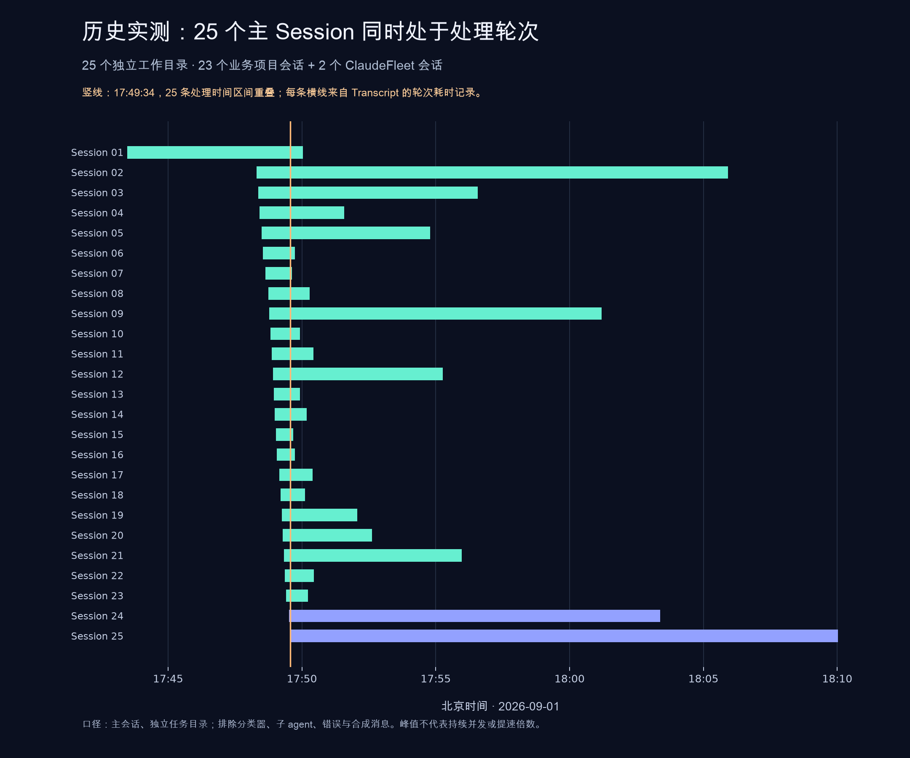

# Usage evidence / 使用实证

These are observations from the maintainer's development history, not a controlled
benchmark or a capacity guarantee. The local transcript audit was captured on
September 17, 2026. Raw conversations, account details, session IDs and private
project paths are not published; the concurrency figures are a maintainer-reported
audit, while the PR activity below can be checked on public GitHub.

## What was observed

| Observation | Result | Scope |
|---|---:|---|
| Historical peak of overlapping recorded processing turns | **25 main sessions / 25 task directories** | All Claude; September 1, 2026, 09:49:33.999 UTC |
| Sustained overlap in a separate interval | **At least 15 task directories for 14.46 minutes** | September 12, 2026, 00:34:10–00:48:37 UTC |
| Public repository activity in a separate reporting period | **84 merged PRs in 7 days** | September 10–16, 2026, UTC; includes features, fixes, performance work and docs |

The 25-way common overlap lasted **3.425 seconds**. “Historical peak” is the
appropriate description; it does not mean 25 continuously busy sessions or 25
models generating tokens on a server at the same instant. Parallel work includes
time spent executing tools. It does not establish a 25× speedup, savings, team
size, or a causal link to the separate 84-PR total.

The chart uses Beijing time (UTC+8). Mint rows are 23 sessions in one business
project; the final two rows are ClaudeFleet sessions. Labels are anonymous.

## Counting method

1. Scan relevant top-level Claude transcript files; skip nested subagents and
   sidechain records. Exclude the fleet's classifier and legacy summarizer
   transcripts using the existing `fleet_internal_transcript` rules.
2. Keep records belonging to the current file's session ID. Exclude API errors
   and synthetic assistant messages from output-activity counts. Require an
   actual tool-using main session in an `issue-N` or `scratch-N` task directory.
3. Reconstruct each recorded turn as the interval
   `[turn_duration timestamp − durationMs, turn_duration timestamp)`. These are
   the CLI's reported processing turns, which can include tool execution.
4. Normalize aliases and nested paths to the same task worktree, then merge
   overlapping intervals for that directory. A resume or context handoff cannot
   make one task count as two concurrent tasks. Sweep the resulting intervals to
   count distinct task directories.
5. Independently check real assistant output in trailing 60-second and 5-minute
   windows. Those activity-window peaks were **25** and **27**, respectively;
   **27 in five minutes is not an instantaneous concurrency claim**.
6. Re-read the 25 peak members: 25 distinct worktrees, no duplicated model
   message IDs or transcript-record UUIDs across members near the peak. Of those
   members, 24 had model output within 60 seconds of the peak; the remaining
   member was executing a Bash tool call spanning that instant.

The scan covered 26,861 relevant top-level Claude files and excluded 19,904
internal helper files. The final worker sample contained 1,131 session IDs across
812 canonical task directories (1,117 Claude and 14 Codex session IDs). Those are
cumulative sample counts. The **25-session peak contains only Claude sessions**.
Codex CLI records were parsed separately; no Codex quota or rotation capability
is implied by this result. Retained record dates span July 27–September 17, 2026.

## Concrete problems from use

- **One subscription was busy while another had short-window headroom.** In
  [issue #598](https://github.com/verkyyi/claude-fleet/issues/598), account A's
  5h/7d usage was 77%/51%, versus account B's 0%/80%. The old strategy preferred A
  because its maximum usage was lower. [PR #617](https://github.com/verkyyi/claude-fleet/pull/617)
  changed selection to weight 5-hour headroom twice, while checking both windows
  against the account ceiling. This demonstrates a routing problem and its fix;
  it does not measure a cost saving.
- **A model limit interrupted a group of workers.**
  [Issue #569](https://github.com/verkyyi/claude-fleet/issues/569) records nine
  workers across two fleets and a 30–60-second per-window restart path. An
  in-place `/model` change took about five seconds per window in that manual
  observation. [PR #570](https://github.com/verkyyi/claude-fleet/pull/570) added
  the in-place fallback path. These are incident observations, not an automated
  recovery SLA or the concurrency peak.

## 中文说明

**定位：用 AI 订阅，让小团队多任务并行、快速迭代。** 核心工作流使用
Claude Code / Codex CLI 的订阅登录；多个 Claude 账号可组成订阅池。
Codex 共用任务工作流，账号轮换和额度管理尚未接入。

- **25 个主 Session 并行峰值：** 2026 年 9 月 1 日北京时间 17:49:33.999，
  25 份独立任务目录的 Claude 主会话处理轮次重叠，公共重叠区间约 3.425 秒。
  其中业务项目 23 个、ClaudeFleet 2 个。它是历史峰值，不代表持续容量。
- **至少 15 个任务持续并行约 14.46 分钟：** 另一段记录发生于 9 月 12 日
  北京时间 08:34:10–08:48:37，同样按记录的处理轮次、不同任务目录计数。
- **7 天合并 84 个 PR：** ClaudeFleet 公共仓库 9 月 10–16 日（UTC）的独立
  统计，包含功能、修复、性能和文档。不能将其写成“25 个 Session 在这 7 天
  产出 84 个 PR”，也不能据此推算人数、耗时缩短比例或订阅成本。

统计排除内部分类器、摘要器、子 agent、闲置会话和重复历史，同一任务恢复、
换上下文或进入子目录时只计一份工作目录。最近 60 秒和 5 分钟有真实模型输出
的任务数峰值分别为 25 和 27；5 分钟的 27 不能改写成瞬时并发。

原始 Transcript 留在本机，只公开汇总、方法和匿名图。以上会话数字来自维护者
的本机核算，公开图本身不构成独立复现数据。统计的是处理轮次重叠，不是服务端
同时生成 token，也不推导线性提速倍数。

典型场景可直接对照公开 Issue/PR：[#598](https://github.com/verkyyi/claude-fleet/issues/598)
与 [#617](https://github.com/verkyyi/claude-fleet/pull/617) 记录了一个账号 5 小时
用量已达 77%、另一个仍为 0% 时的调度改进；[#569](https://github.com/verkyyi/claude-fleet/issues/569)
与 [#570](https://github.com/verkyyi/claude-fleet/pull/570) 记录了模型限额打断一组
worker 后，从重启恢复改为优先原地切换备用模型的场景。

## Public PR activity / 公开 PR 明细

Count unique merged PRs with `mergedAt` in `[2026-09-10T00:00:00Z,
2026-09-17T00:00:00Z)`. Retrieved with `gh pr list --state merged --search
'merged:2026-09-10..2026-09-16' --limit 1000` and independently checked against
GitHub's search count. Recorded total: **84**. PRs vary in size and are not a
standardized unit of productivity.

| UTC date | Merged PRs |
|---|---:|
| 2026-09-10 | 1 |
| 2026-09-11 | 6 |
| 2026-09-12 | 10 |
| 2026-09-13 | 15 |
| 2026-09-14 | 6 |
| 2026-09-15 | 42 |
| 2026-09-16 | 4 |

- **2026-09-10:** [#538](https://github.com/verkyyi/claude-fleet/pull/538).
- **2026-09-11:** [#537](https://github.com/verkyyi/claude-fleet/pull/537), [#539](https://github.com/verkyyi/claude-fleet/pull/539), [#540](https://github.com/verkyyi/claude-fleet/pull/540), [#542](https://github.com/verkyyi/claude-fleet/pull/542), [#546](https://github.com/verkyyi/claude-fleet/pull/546), [#549](https://github.com/verkyyi/claude-fleet/pull/549).
- **2026-09-12:** [#553](https://github.com/verkyyi/claude-fleet/pull/553), [#555](https://github.com/verkyyi/claude-fleet/pull/555), [#557](https://github.com/verkyyi/claude-fleet/pull/557), [#560](https://github.com/verkyyi/claude-fleet/pull/560), [#562](https://github.com/verkyyi/claude-fleet/pull/562), [#564](https://github.com/verkyyi/claude-fleet/pull/564), [#568](https://github.com/verkyyi/claude-fleet/pull/568), [#570](https://github.com/verkyyi/claude-fleet/pull/570), [#572](https://github.com/verkyyi/claude-fleet/pull/572), [#573](https://github.com/verkyyi/claude-fleet/pull/573).
- **2026-09-13:** [#576](https://github.com/verkyyi/claude-fleet/pull/576), [#577](https://github.com/verkyyi/claude-fleet/pull/577), [#581](https://github.com/verkyyi/claude-fleet/pull/581), [#583](https://github.com/verkyyi/claude-fleet/pull/583), [#585](https://github.com/verkyyi/claude-fleet/pull/585), [#590](https://github.com/verkyyi/claude-fleet/pull/590), [#591](https://github.com/verkyyi/claude-fleet/pull/591), [#592](https://github.com/verkyyi/claude-fleet/pull/592), [#593](https://github.com/verkyyi/claude-fleet/pull/593), [#595](https://github.com/verkyyi/claude-fleet/pull/595), [#597](https://github.com/verkyyi/claude-fleet/pull/597), [#604](https://github.com/verkyyi/claude-fleet/pull/604), [#606](https://github.com/verkyyi/claude-fleet/pull/606), [#615](https://github.com/verkyyi/claude-fleet/pull/615), [#616](https://github.com/verkyyi/claude-fleet/pull/616).
- **2026-09-14:** [#617](https://github.com/verkyyi/claude-fleet/pull/617), [#618](https://github.com/verkyyi/claude-fleet/pull/618), [#619](https://github.com/verkyyi/claude-fleet/pull/619), [#621](https://github.com/verkyyi/claude-fleet/pull/621), [#626](https://github.com/verkyyi/claude-fleet/pull/626), [#627](https://github.com/verkyyi/claude-fleet/pull/627).
- **2026-09-15:** [#630](https://github.com/verkyyi/claude-fleet/pull/630), [#632](https://github.com/verkyyi/claude-fleet/pull/632), [#634](https://github.com/verkyyi/claude-fleet/pull/634), [#638](https://github.com/verkyyi/claude-fleet/pull/638), [#641](https://github.com/verkyyi/claude-fleet/pull/641), [#643](https://github.com/verkyyi/claude-fleet/pull/643), [#645](https://github.com/verkyyi/claude-fleet/pull/645), [#646](https://github.com/verkyyi/claude-fleet/pull/646), [#649](https://github.com/verkyyi/claude-fleet/pull/649), [#650](https://github.com/verkyyi/claude-fleet/pull/650), [#652](https://github.com/verkyyi/claude-fleet/pull/652), [#654](https://github.com/verkyyi/claude-fleet/pull/654), [#655](https://github.com/verkyyi/claude-fleet/pull/655), [#657](https://github.com/verkyyi/claude-fleet/pull/657), [#659](https://github.com/verkyyi/claude-fleet/pull/659), [#661](https://github.com/verkyyi/claude-fleet/pull/661), [#664](https://github.com/verkyyi/claude-fleet/pull/664), [#665](https://github.com/verkyyi/claude-fleet/pull/665), [#666](https://github.com/verkyyi/claude-fleet/pull/666), [#667](https://github.com/verkyyi/claude-fleet/pull/667), [#669](https://github.com/verkyyi/claude-fleet/pull/669), [#673](https://github.com/verkyyi/claude-fleet/pull/673), [#676](https://github.com/verkyyi/claude-fleet/pull/676), [#685](https://github.com/verkyyi/claude-fleet/pull/685), [#686](https://github.com/verkyyi/claude-fleet/pull/686), [#687](https://github.com/verkyyi/claude-fleet/pull/687), [#688](https://github.com/verkyyi/claude-fleet/pull/688), [#692](https://github.com/verkyyi/claude-fleet/pull/692), [#694](https://github.com/verkyyi/claude-fleet/pull/694), [#695](https://github.com/verkyyi/claude-fleet/pull/695), [#700](https://github.com/verkyyi/claude-fleet/pull/700), [#705](https://github.com/verkyyi/claude-fleet/pull/705), [#707](https://github.com/verkyyi/claude-fleet/pull/707), [#708](https://github.com/verkyyi/claude-fleet/pull/708), [#710](https://github.com/verkyyi/claude-fleet/pull/710), [#712](https://github.com/verkyyi/claude-fleet/pull/712), [#713](https://github.com/verkyyi/claude-fleet/pull/713), [#714](https://github.com/verkyyi/claude-fleet/pull/714), [#716](https://github.com/verkyyi/claude-fleet/pull/716), [#717](https://github.com/verkyyi/claude-fleet/pull/717), [#718](https://github.com/verkyyi/claude-fleet/pull/718), [#719](https://github.com/verkyyi/claude-fleet/pull/719).
- **2026-09-16:** [#721](https://github.com/verkyyi/claude-fleet/pull/721), [#722](https://github.com/verkyyi/claude-fleet/pull/722), [#723](https://github.com/verkyyi/claude-fleet/pull/723), [#726](https://github.com/verkyyi/claude-fleet/pull/726).
